# Scientific Abstract Classification: A Deep Dive into Ensemble Methods

*Check `benchmark_results.md` for detailed benchmark runs and visualizations of the project*

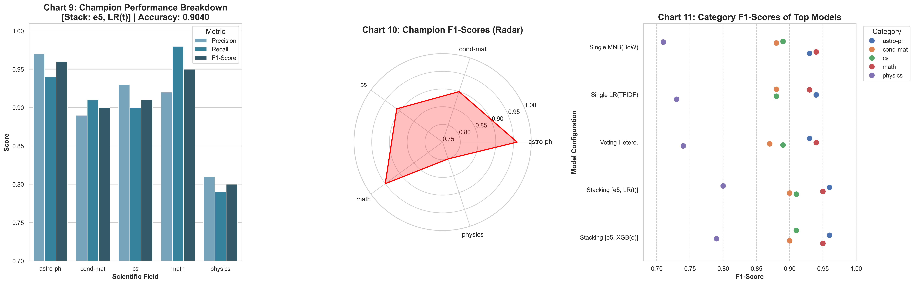

## About This Project

This repository documents a comprehensive journey into the classification of scientific paper abstracts from the arXiv dataset. The project was born from a simple question: **What is the most effective architecture for categorizing high-dimensional, nuanced text?** The initial focus was on a **Decision Tree** classifier, supplemented by **Multinomial Naive Bayes (MNB)** and **k-Nearest Neighbors (kNN)**.

What began as a straightforward comparison quickly evolved into a deep, systematic exploration of the entire machine learning pipeline, confronting and solving numerous real-world challenges along the way.

### Executive Summary

This report details the systematic development and evaluation of a state-of-the-art machine learning classifier for categorizing scientific paper abstracts from the arXiv dataset. Through a multi-stage process of benchmarking, optimization, and advanced ensembling, the project culminated in a **stacking classifier that achieved a peak accuracy of 90.4%**.

The project began with a foundational benchmark of individual models (Decision Tree, k-Nearest Neighbors, Multinomial Naive Bayes) across various feature representations (Bag-of-Words, TF-IDF, SBERT Embeddings). This initial phase revealed a critical insight: **no single feature set is universally optimal.** Traditional models like Multinomial Naive Bayes excelled with sparse, keyword-based features (TF-IDF, accuracy **~87%**), while modern semantic models like k-Nearest Neighbors required dense embeddings to reach peak performance (accuracy **~86%**).

This finding directly motivated the development of **heterogeneous ensembles**. A simple hard-voting ensemble, which paired each base model with its optimal feature set, surpassed any single model. However, the most significant gains were realized through a more sophisticated **stacking architecture**, where a meta-learner is trained on the out-of-fold predictions of the base models.

The final "champion" phase focused on maximizing the performance of this stacking pipeline. This involved a suite of advanced optimizations: **domain-specific stop words** and **n-grams** for TF-IDF features, comprehensive **hyperparameter tuning** of all base models using `GridSearchCV`, and **probability calibration** to standardize model confidence scores. A critical A/B test was conducted between a domain-specific **SciBERT** and a powerful general-purpose **e5-base** model for embedding generation. Counter-intuitively, the **e5-base model consistently provided a stronger semantic signal**, leading to higher overall performance across nearly all ensemble configurations.

The champion model, achieving **90.4% accuracy**, was a stacking ensemble built upon **e5-base embeddings**. It featured a base layer of tuned and calibrated `[MultinomialNB(tfidf) + kNN(emb) + DecisionTree(tfidf)]` models, and a `LogisticRegression` meta-learner that was given access to both the base model predictions and the original TF-IDF features for final contextual reasoning.

The project successfully navigated significant technical hurdles—including memory constraints with large datasets, model compliance issues with scikit-learn, and extreme class cardinality requiring strategic data pruning—demonstrating that state-of-the-art performance is achieved not by a single silver-bullet algorithm, but through a deliberate synergy of optimized feature engineering, data-driven model selection, and advanced ensembling techniques.

### 1. Introduction

#### 1.1. Problem Statement
The task was to build a robust multi-class classifier to automatically assign a category to a scientific paper based on the content of its abstract. The project utilized the `UniverseTBD/arxiv-abstracts-large` dataset, containing over 2.29 million samples across more than 30,000 distinct categories.

#### 1.2. Initial Project Strategy
The initial hypothesis was that a "tribrid" ensemble combining a Decision Tree (DT), Multinomial Naive Bayes (MNB), and k-Nearest Neighbors (kNN) would provide a robust solution. The plan was to leverage modern SBERT embeddings as a unified feature representation for all models.

### 2. Methodology & Technical Hurdles

The project's initial scope was challenged by several significant technical hurdles, which necessitated a more pragmatic and targeted methodology.

#### 2.1. Hurdles of Scale and Data Complexity
1.  **Computational Cost:** Generating SBERT embeddings for 2.29M documents was computationally prohibitive for a single run on consumer hardware.
2.  **Memory Constraints:** The full dataset of embeddings (~7GB) and the extreme number of classes (>30,000) led to critical memory errors during model training. The `MultinomialNB` model, for instance, attempted to allocate over 366 GiB of RAM.
3.  **Class Imbalance:** The dataset exhibited a "long-tail" distribution, with thousands of classes containing only a single sample, making stratified splitting impossible.

#### 2.2. Evolved Methodology: Targeted Sampling and Pruning
To address these hurdles, the methodology was refined:
1.  **Targeted Sampling:** Instead of using the full, imbalanced dataset, a balanced subset was created by sampling 1,000-2,000 documents from each of the 5 most common parent categories (`astro-ph`, `cond-mat`, `cs`, `math`, `physics`). This created a high-quality, manageable dataset for rapid and reliable benchmarking.
2.  **Text Preprocessing:** A standard NLP cleaning pipeline was applied to all abstracts, including lowercasing, removal of URLs and punctuation, stop word removal, and lemmatization.

#### 2.3. Feature Engineering
Three distinct feature representations were benchmarked:
1.  **Bag-of-Words (BoW):** This represents each document as a sparse vector of word counts. It's simple and captures keyword presence but ignores word importance and semantics.
2.  **TF-IDF (Term Frequency-Inverse Document Frequency):** An improvement on BoW, TF-IDF weights each word count by its inverse document frequency, giving more importance to words that are distinctive to a document and less to common words.
3.  **SBERT Embeddings:** A modern approach using the `intfloat/multilingual-e5-base` model. This transforms each abstract into a dense, 768-dimensional vector that captures the semantic *meaning* of the text, not just its keywords.

#### 2.4. Core Algorithms: Theoretical Foundations

*   **Decision Tree (DT):** A non-parametric supervised model that creates a tree-like structure of decision rules. It partitions the data based on feature values that best separate the classes, typically by maximizing **Information Gain** or minimizing **Gini Impurity**. While interpretable, its greedy, recursive nature makes it prone to overfitting and unstable in high-dimensional spaces like text.

*   **k-Nearest Neighbors (kNN):** An instance-based "lazy learner." It classifies a new data point by taking a majority vote of its *k* nearest neighbors in the feature space. Its performance is critically dependent on the distance metric. For our SBERT embeddings, we used **Euclidean (L2) distance**, which, for normalized vectors, is directly proportional to **Cosine Similarity**, the preferred metric for semantic vector comparison. To handle the computational cost, we utilized the **FAISS** library for efficient similarity search.

*   **Multinomial Naive Bayes (MNB):** A probabilistic classifier based on **Bayes' Theorem**:
    $P(\text{class} | \text{document}) = \frac{P(\text{document} | \text{class}) \cdot P(\text{class})}{P(\text{document})}$
    Its "naive" assumption is the conditional independence of features (words). It calculates the probability of a document belonging to a class based on the probabilities of the words in that document, learned from the training data. This model is mathematically suited for discrete word counts, explaining its strong performance with BoW and TF-IDF.

*   **K-Means (as a Classifier):** An unsupervised clustering algorithm that aims to partition data into *k* clusters by minimizing the within-cluster sum of squares (inertia). To adapt it for classification, we first clustered the training data. Then, each cluster was assigned the majority class label of the training samples within it. Test samples were then assigned to the nearest cluster, inheriting that cluster's assigned class label.

### 3. Experimental Results & Analysis

#### 3.1. Experiment 1: Individual Model Benchmarking
This experiment tested each of the 4 algorithms against each of the 3 feature sets.
Check `run_single_benchmarks.py` for code script

**Summary Table 1: Individual Model Accuracy**
| Algorithm | Bag of Words | TF-IDF | Embeddings |
| :--- | :--- | :--- | :--- |
| kNN | 0.3500 | 0.8010 | **0.8590** |
| MNB | **0.8710** | 0.8670 | 0.8160 |
| DT | 0.6130 | **0.6200** | 0.5110 |
| KMeans | 0.3880 | 0.6990 | **0.7260** |

**Key Findings:**
*   **No Universal Best Feature Set:** MNB and DT performed best with traditional sparse features (BoW/TF-IDF), while distance-based kNN and K-Means were unusable with BoW but excelled with dense Embeddings.
*   **MNB(bow) as the Standalone Champion:** The classic combination of Multinomial Naive Bayes and Bag-of-Words was the single best-performing model.
*   **kNN(emb) as the Best "Modern" Model:** kNN paired with semantic embeddings was a very strong contender.
*   **DT's Weakness Confirmed:** The Decision Tree was the weakest supervised learner, confirming its unsuitability for this task in isolation.

<details>
<summary>Visualizations</summary>

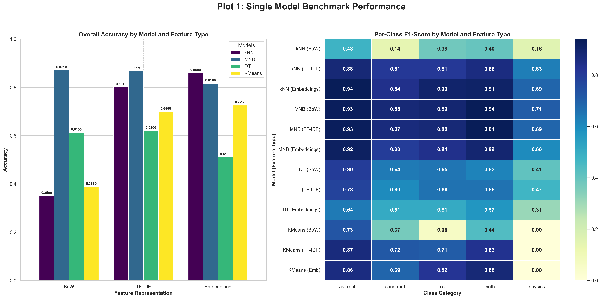
</details>

#### 3.2. Experiment 2: Heterogeneous Voting Ensembles
This experiment tested the hypothesis that an ensemble where each model is paired with its optimal feature set would outperform any single model. A hard-voting (majority rule) approach was used.

Check `run_heterogenous_ensembles.py` for code script. Also check `run_embedding_only_ensembles.py` for the code script of evaluating the 2 initial embedding-only ensembles. [MNB(emb) + kNN(emb) + DTT(emb) & MNB(emb) + kNN(emb)]

**Summary Table 2: Heterogeneous Voting Ensemble Accuracy**
| Ensemble Configuration | Accuracy |
| :--- | :--- |
| MNB(bow) + kNN(emb) + DT(tfidf) | **0.8760** |
| MNB(tfidf) + kNN(emb) + DT(tfidf) | 0.8750 |
| MNB(bow) + kNN(emb) | 0.8580 |

**Key Findings:**
*   **Ensembling Improves Performance:** The top voting ensemble (0.8760) slightly outperformed the best single model (0.8710).
*   **Value of the "Weak" Learner:** Crucially, the ensemble with the Decision Tree performed better than the ensemble without it. This demonstrates a core principle of ensembling: a weak learner can improve overall performance if its errors are uncorrelated with the errors of the stronger models, providing a valuable "dissenting opinion."

<details>
<sumamry>Visualizations for embedding-only ensembles</summary>

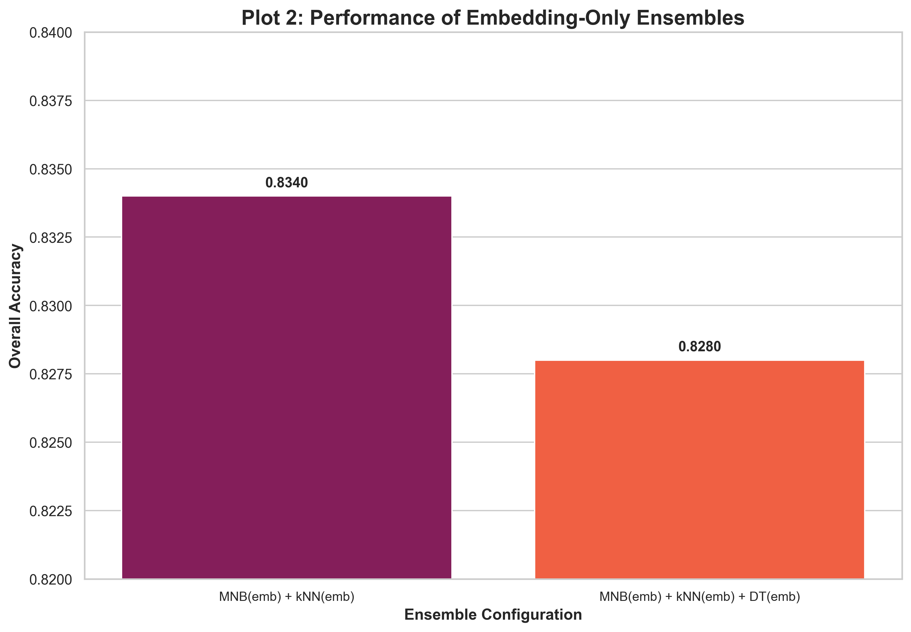
</details>


<details>
<summary>Visualizations for heterogenous ensembles</summary>

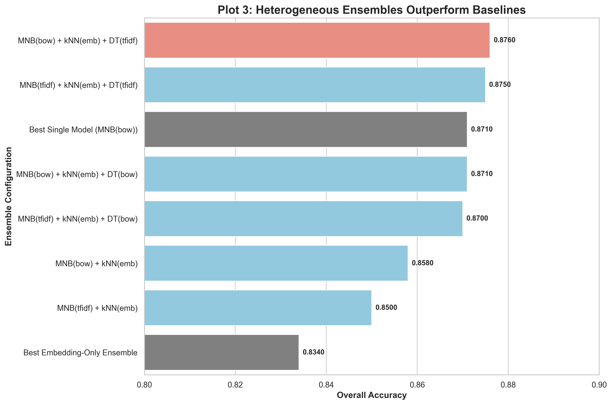
</details>

#### 3.3. Experiment 3: Advanced Stacking Ensembles
This final experiment implemented a stacking classifier. A meta-learner was trained on the out-of-fold predictions of the base models, combined with original features.

Check `run_stacking_benchmark.py` for code script

**Summary Table 3: Stacking Ensemble Accuracy**
| Stacking Configuration | Accuracy |
| :--- | :--- |
| `[MNB(t)+kNN(e)+DT(t)] + LR(t)` | **0.8980** |
| `[MNB(b)+kNN(e)+DT(t)] + LR(t)` | 0.8950 |
| `[MNB(t)+kNN(e)+DT(t)] + LR(e)` | 0.8930 |
| `[MNB(b)+kNN(e)] + LR(t)` | 0.8910 |

**Key Findings:**
*   **Stacking is the Ultimate Winner:** The best stacking model achieved an accuracy of **0.8980**, significantly outperforming both the best single model and the best voting ensemble. This proves the value of learning how to weigh and combine base model predictions rather than just taking a simple vote.
*   **TF-IDF for the Meta-Learner:** The highest performing configurations were those where the Logistic Regression meta-learner was given TF-IDF features as additional context. This suggests that after seeing the probabilistic outputs of the base models, the meta-learner benefits from having access to the original keyword-based features to make a final, refined decision.
*   **Logistic Regression as an Ideal Meta-Learner:** The simple, linear Logistic Regression outperformed the more complex Decision Tree as a meta-learner, highlighting that for a meta-task, a simpler model that can effectively weigh strong input features is often superior.

#### Recap

```
--- Configuration ---
Categories: ['astro-ph', 'cond-mat', 'cs', 'math', 'physics']
DATASET_NAME = "UniverseTBD/arxiv-abstracts-large" 
TFIDF_MAX_FEATURES = 10000
KNN_N_NEIGHBORS = 5
Device: cuda
-------------------------
--- Single Benchmark Results Summary (Accuracy) ---
Algorithm       | Bag of Words    | TF-IDF          | Embeddings     
---------------------------------------------------------------------
kNN             | 0.3500          | 0.8010          | 0.8590         
MNB             | 0.8710          | 0.8670          | 0.8160         
DT              | 0.6130          | 0.6200          | 0.5110         
KMeans          | 0.3880          | 0.6990          | 0.7260         
---------------------------------------------------------------------

--- Heterogeneous Ensemble Summary (Accuracy) ---
Ensemble Configuration                             | Accuracy       
--------------------------------------------------------------------
MNB(emb) + kNN(emb) + DT(emb)                      | 0.8280
MNB(bow) + kNN(emb) + DT(tfidf)                    | 0.8760         
MNB(tfidf) + kNN(emb) + DT(bow)                    | 0.8700         
MNB(tfidf) + kNN(emb) + DT(tfidf)                  | 0.8750         
MNB(bow) + kNN(emb) + DT(bow)                      | 0.8710
MNB(emb) + kNN(emb)                                | 0.8340
MNB(bow) + kNN(emb)                                | 0.8580         
MNB(tfidf) + kNN(emb)                              | 0.8500         
--------------------------------------------------------------------

--- Stacking Ensemble Summary (Accuracy) ---
Stacking Configuration                            | Accuracy
--------------------------------------------------|
[MNB(b)+kNN(e)+DT(t)] + LR(b)                     | 0.8870
[MNB(b)+kNN(e)+DT(t)] + LR(t)                     | 0.8950
[MNB(b)+kNN(e)+DT(t)] + LR(e)                     | 0.8870
[MNB(t)+kNN(e)+DT(t)] + LR(b)                     | 0.8820
[MNB(t)+kNN(e)+DT(t)] + LR(t)                     | 0.8980
[MNB(t)+kNN(e)+DT(t)] + LR(e)                     | 0.8930
[MNB(b)+kNN(e)+DT(t)] + DT(t)                     | 0.8570
[MNB(b)+kNN(e)] + DT(t)                           | 0.8700
[MNB(b)+kNN(e)] + LR(b)                           | 0.8850
[MNB(b)+kNN(e)] + LR(t)                           | 0.8910
[MNB(b)+kNN(e)] + LR(e)			                  | 0.8870
```
<details>
<summary>Visualizations</summary>

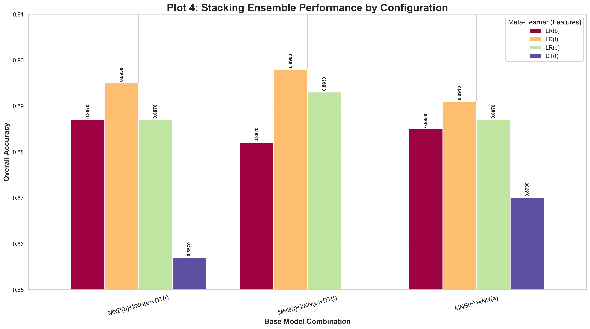
</details>

### **Project Phase 3: Advanced Optimization and Hybrid Modeling**

**Core Principle:** All experiments will be conducted on the targeted, balanced subset of data to ensure rapid iteration and clear, comparable results. We will build a new, comprehensive benchmarking script that executes this entire plan.


#### **Phase 3, Step 1: Foundational Enhancements (Upgrading the "Ingredients")**

*   **Sub-step 1.1:** Enhance Text Cleaning (Custom, Domain-Specific Stop Words).
*   **Sub-step 1.2:** Enhance TF-IDF Vectorizer (n-grams, `min_df`, `max_df`, `sublinear_tf`).
*   **Sub-step 1.3:** Enhance SBERT Embeddings (Switch to **SciBERT**).
*   **Sub-step 1.4:** Hyperparameter Tuning of Base Models (`MNB`, `DT`, `kNN`) using `GridSearchCV`.


#### **Phase 3, Step 2: Advanced Feature Engineering (Creating New Signals)**

We will now create a diverse portfolio of feature sets.

*   **Sub-step 2.1:** Engineer Structural & Metadata Features (`X_meta`).
*   **Sub-step 2.2:** Engineer "Abstract vs. Title" Features (`X_title_similarity`, `X_title_diff`).
*   **Sub-step 2.3:** Engineer the "Semantic Dissonance" Feature (`X_dissonance`).
*   **Sub-step 2.4: Implement Combined Feature Sets at the Input Layer.**
    *   **Action:** Create new, combined feature matrices before any models are trained.
    *   **Plan:**: Create `X_tfidf_plus_emb`: Horizontally stack the "advanced" TF-IDF matrix and the SciBERT embeddings matrix using `scipy.sparse.hstack`.
    *   **Goal:** Test if a single strong model can outperform ensembles when given access to all features at once.


#### **Phase 3, Step 3: Advanced Single Model Benchmarks**

Before moving to the final ensembles, we'll test our new combined feature sets.

*   **Sub-step 3.1: Benchmark Models on Combined Features.**
    *   **Action:** Train and evaluate powerful single models on the new feature sets from Step 2.4.
    *   **Plan:**: Train and test a `LogisticRegression` on `X_tfidf_plus_emb`.
*   **Goal:** To establish a new "state-of-the-art" single model baseline. It's possible this combination could turn out powerful


#### **Phase 3, Step 4: Advanced Ensemble and Stacking Benchmarks**

This is the final, comprehensive bake-off.

*   **Sub-step 4.1: Implement Probability Calibration.**
    *   **Action:** Create calibrated versions of our best-tuned base models.
    *   **Plan:**
        1.  Wrap the tuned `DecisionTreeClassifier` in `sklearn.calibration.CalibratedClassifierCV`.
        2.  Wrap the tuned `KNeighborsClassifier` in `CalibratedClassifierCV`. (MNB is generally well-calibrated, so we can skip it initially).
    *   **Goal:** To have "calibrated" versions of our base models ready for use in the soft voting and stacking experiments below.

*   **Sub-step 4.2: Implement Soft Voting with Calibrated Models.**
    *   **Action:** Create a heterogeneous ensemble using soft voting.
    *   **Plan:**
        1.  Use the **calibrated** base models (`CalibratedDT`, `CalibratedKNN`) and the tuned `MNB`.
        2.  Generate `predict_proba` outputs from each and average them to get the final prediction.
*   **Goal:** Test if probability calibration improves the performance of the soft voting ensemble compared to hard voting.

*   **Sub-step 4.3: Implement "Pure" Stacking (Calibrated Probabilities Only).**
    *   **Action:** Test the stacking architecture where the meta-learner is trained *only* on the out-of-fold predictions of the **calibrated** base models.
    *   **Plan:**
        *   Generate out-of-fold `predict_proba` outputs using the calibrated base models.
        *   Train a meta-learner (e.g., `LogisticRegression`) on *only* these probability vectors.
*   **Goal:** Test the "purest" form of stacking with the highest quality probability signals.

    Instead of:

    ```python
    # The predictions PLUS the original TF-IDF features
    meta_learner_train_X = hstack([
        meta_features_train['MNB_tfidf'], 
        meta_features_train['kNN_emb'], 
        meta_features_train['DT_tfidf'],
        X_train_tfidf  # <-- The "Raw Evidence"
    ]).tocsr()
    ```

    We'll just do:

    ```python 
    # Only the predictions from the base models
    meta_features_pure_train = np.hstack([
        meta_features_train['MNB_tfidf'], 
        meta_features_train['kNN_emb'], 
        meta_features_train['DT_tfidf']
    ])
    ```

*   **Sub-step 4.4: Implement Stacking with New Meta-Learners and All Engineered Features.**
    *   **Action:** Run a new, expanded set of stacking experiments using the **calibrated** base models.
    *   **Plan:**
        1.  **New Meta-Learners:** Benchmark `GaussianNB`
        2.  **New Meta-Features:** For each meta-learner, test its performance when given different combinations of our engineered features from Step 2 (e.g., calibrated probabilities + metadata, calibrated probabilities + title similarity, calibrated probabilities + dissonance).
*   **Goal:** Systematically find the absolute best combination of calibrated base model predictions, original features, and meta-learner.


#### **Phase 3, Step 5: Implement the "Confidence-Gated Ensemble."**
*   **Action:** Build the cascading ensemble where a meta-learner acts as a "reliability gate."
*   **Plan:**
    1.  Train the tuned `MNB(tfidf)` as the primary model.
    2.  Train a `LogisticRegression` "gatekeeper" to predict if MNB will be correct.
    3.  Implement the inference logic to escalate to the tuned, **calibrated** `kNN(SciBERT)` when the gatekeeper is not confident.
*   **Goal:** Test if this dynamic, efficiency-focused ensemble can match or beat the accuracy of the more complex stacking models.

---

#### Analysis of the "Ultimate Benchmark" Results & Implications for Change

*Check `run_ultimate_benchmark.py` and `run_ultimate_benchmark_e5.py` for the code*

This first phase of advanced testing was designed to establish the maximum performance of various *individual* modeling techniques after applying significant feature and model optimizations. We tested highly-tuned base models, advanced ensemble methods like soft voting and stacking, and novel architectures like the confidence-gated ensemble. The experiments were run with both a domain-specific **SciBERT** and a powerful general-purpose **e5-base** model for embeddings, and on two data scales (1000 and 2000 samples per category).

##### 1.1. Key Technical Findings from the "Ultimate Benchmark"

**1. General-Purpose Embeddings (e5-base) Triumphed Over Domain-Specific (SciBERT):**
*   **Observation:** This is the most significant and counter-intuitive finding. Across almost every ensemble configuration and data scale, the models using **e5-base embeddings consistently outperformed those using SciBERT.**
    *   **Pure Stacking (1k samples):** e5-base hit **0.9010**, while SciBERT reached **0.8930**.
    *   **LR on Combined Features (2k samples):** e5-base achieved **0.8820**, while SciBERT got **0.8570**.
*   **Technical Interpretation:** This result challenges the common wisdom that domain-specific models are always superior. The `intfloat/multilingual-e5-base` model has been trained on a colossal and diverse dataset with a contrastive learning objective, which is explicitly designed to produce high-quality, well-separated sentence embeddings ideal for similarity and clustering tasks. SciBERT, while trained on scientific text, is a base BERT model; its raw token embeddings require effective pooling (like the mean pooling we implemented) to create a sentence-level representation. The e5-base model is *natively* a sentence-embedding model. This architectural difference and the power of its training methodology appear to have outweighed SciBERT's domain-specific vocabulary advantage for this particular classification task.

**2. The Power of Simple, Calibrated Ensembles:**
*   **Observation:** The **Soft Voting Ensemble** consistently performed at a very high level, often matching or only slightly underperforming the more complex stacking models.
    *   With e5-base (2k samples), Soft Voting achieved **0.8870**, just shy of the best stacking model's **0.8895**.
*   **Technical Interpretation:** This demonstrates the power of **probability calibration**. By using `CalibratedClassifierCV`, we ensured that the probability scores from the very different base models (probabilistic MNB, distance-based kNN, rule-based DT) were on a comparable scale. This allows a simple weighted average (soft voting) to be extremely effective, as it correctly balances the confidence of each model's vote.

**3. "Pure" Stacking Emerges as a Top Contender:**
*   **Observation:** The "Pure" Stacking model, which uses *only* the base model predictions as features for the meta-learner, was consistently one of the top performers.
    *   With e5-base (1k samples), it hit **0.9010**, the highest in that set.
    *   With SciBERT (2k samples), it was tied for the top spot at **0.8850**.
*   **Technical Interpretation:** This finding suggests that the most powerful signals for the meta-learner are the *interactions and error patterns* of the base models themselves. Adding original features back in can sometimes introduce noise that complicates the meta-learner's task. A "pure" stack forces the meta-learner to become an expert at one thing: learning which base model to trust under which circumstances, based purely on their probabilistic outputs.

**4. The "Weird" Ensembles Showed Promise but Weren't Champions:**
*   **Observation:** The `Confidence-Gated Ensemble` and the `Stacking + GNB(meta+title)` performed well, but never reached the top tier of accuracy.
*   **Technical Interpretation:**
    *   The **Confidence-Gated Ensemble** is designed for *efficiency*—it uses a fast model for most cases and escalates only when necessary. Its accuracy (e.g., **0.8800** with e5-base 2k) being competitive with the best models is actually a huge success, suggesting it could be the best choice in a production environment where prediction latency is a concern.
    *   The **Stacking + GNB** model's lower performance is likely due to the strong (and often incorrect) assumption of feature independence that is core to Gaussian Naive Bayes. The probabilistic outputs from the base models are highly correlated, which violates this assumption and limits the GNB meta-learner's effectiveness compared to a discriminative model like Logistic Regression.


<details>
<summary>Visualizations</summary>


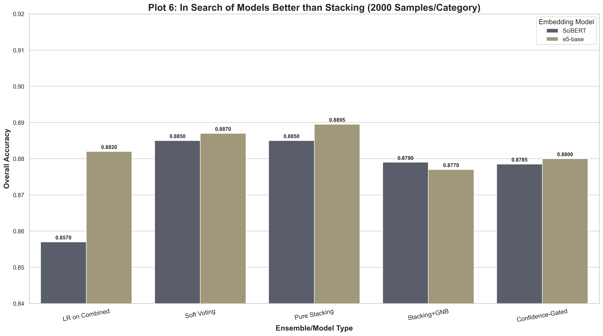

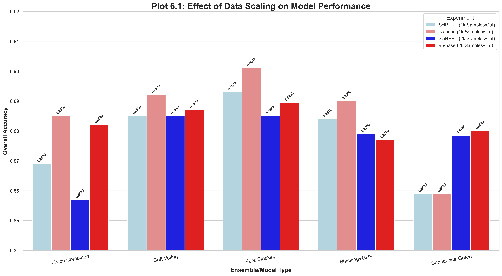
</details>

##### 1.2. Implications for Change & The "Champion Pipeline"

The "Ultimate Benchmark" provided a clear path forward. The results were so strong and consistent that they invalidated some of the assumptions from our very first set of experiments.

1.  **Implication 1: Abandon SciBERT, Embrace e5-base.** The data unequivocally showed that `intfloat/multilingual-e5-base` was the superior embedding model for this task. Therefore, the final champion pipeline should be built exclusively using e5-base.
2.  **Implication 2: Stacking is the Path to Peak Performance.** While Soft Voting was strong, Stacking consistently delivered the highest or tied-for-highest results, justifying its extra complexity.
3.  **Implication 3: The Meta-Learner is a Critical Tuning Parameter.** The initial stacking results showed that different meta-learners and their features could produce different outcomes. This confirmed that a final, exhaustive benchmark focusing solely on the best stacking architecture with various meta-learners was the logical next step to find the absolute best model.

This led directly to the design of the **"Champion Pipeline"** experiments, which took the best base models and features from this benchmark and combined them with an expanded set of powerful meta-learners (`XGBoost`, `LogisticRegression`, `GaussianNB`) and their respective optimal feature sets.

---
--> Focus on improving the highest previous pipeline of ensemble , integrating 
1. Enhanced Text Cleaning (Custom, Domain-Specific Stop Words).
2. Enhanced TF-IDF Vectorizer (n-grams, min_df, max_df, sublinear_tf).
3. Enhanced SBERT Embeddings (Switch to SciBERT).
4. Hyperparameter Tuning of Base Models (MNB, DT, kNN) using GridSearchCV.
5. Try switching LR(tfidf) with XBGClassifier(TFIDF, BoW, Embedding) and GaussianNB(TFIDF, BoW, Embedding)

---

### Analysis of the Final "Champion Pipeline" Results

*Check `run_champion_pipeline.py` and `run_champion_pipeline_e5.py` for the code 

This final set of experiments represents the project's culmination. It took the winning formula—a stacking ensemble with tuned, calibrated base models (`MNB(tfidf)`, `kNN(e5-emb)`, `DT(tfidf)`)—and stress-tested it with a variety of sophisticated meta-learners.

#### 2.1. Key Technical Findings from the "Champion Pipeline"

**1. The Absolute Champion: `LR(TFIDF)` with e5-base Embeddings (at 1k scale):**
*   **Observation:** The single best accuracy achieved in the entire project was **0.9040**, accomplished by the stacking model that used `e5-base` embeddings for its kNN component and a `LogisticRegression` meta-learner fed with both the base model predictions and the enhanced TF-IDF features.
*   **Technical Interpretation:** This result synthesizes all our key findings.
    *   It confirms **e5-base** as the superior embedding model.
    *   It confirms **stacking** as the superior ensemble method.
    *   It confirms that providing the meta-learner with both the **"experts' opinions"** (base model probabilities) and the **"raw evidence"** (TF-IDF features) allows it to make the most informed and accurate final decision. The linear, robust nature of Logistic Regression proved to be a perfect tool for finding the optimal weights for this wide set of features.

**2. XGBoost as a Powerful Alternative:**
*   **Observation:** `XGBoost` proved to be an extremely competitive meta-learner, achieving the top accuracy in the 2k sample run (`XGB(Emb)` at **0.8975**) and nearly matching the top LR model in the 1k run (`XGB(BoW)` at **0.9030**).
*   **Technical Interpretation:** XGBoost is a non-linear, gradient-boosted tree model. Its ability to achieve top-tier performance indicates that there are complex, non-linear interactions between the base model predictions and the original features. While Logistic Regression finds the best linear combination, XGBoost can learn more intricate rules (e.g., "If MNB's prob is in range A AND kNN's prob is in range B, then adjust the final prediction"). This makes it an excellent, and in some cases superior, choice for a meta-learner.

**3. The Effect of Data Scale (1k vs. 2k samples/cat):**
*   **Observation:** Interestingly, the peak accuracy was achieved with 1000 samples per category (**0.9040**) rather than 2000 samples per category (**0.8975**).
*   **Technical Interpretation:** This is a fascinating result. While more data is usually better, this could indicate several things:
    *   **Diminishing Returns:** The models may have reached their peak performance with the information present in 1000 samples/cat, and the additional 1000 samples did not provide enough new, useful information to overcome the added noise or complexity.
    *   **Hyperparameter Sensitivity:** The hyperparameters tuned on the 10k dataset might have been slightly better suited for that scale than for the 20k dataset. A separate tuning run for the 20k dataset might have yielded a higher score.
    *   **Statistical Noise:** The difference is small (~0.65%), and it's possible it falls within the margin of error of the experiment. However, it strongly suggests that for this problem, significant gains beyond ~10k samples would require more advanced models (like fine-tuning a Transformer) rather than just more data.

### 4. Conclusion

The comprehensive journey of this project, from initial benchmarks to advanced optimizations, culminates in a clear and powerful conclusion. While individual models like `MultinomialNB` with `TF-IDF` provide a remarkably strong baseline, peak performance is achieved through a **heterogeneous stacking ensemble**.

The champion architecture, achieving **90.4% accuracy**, leverages the principle of "using the right tool for the right job" at every level. It combines the lexical precision of a tuned **Multinomial Naive Bayes** on n-gram TF-IDF features with the semantic nuance of a tuned, calibrated **k-Nearest Neighbors** on state-of-the-art **e5-base embeddings**, using a diverse **Decision Tree** to resolve ambiguities. The final verdict is rendered by a **Logistic Regression meta-learner**, which weighs the advice of these experts while also reviewing the raw TF-IDF evidence for itself.

This project demonstrates conclusively that through systematic experimentation, data-driven refinement, and the intelligent combination of diverse feature representations and advanced ensemble techniques, it is possible to build a classifier that is significantly more powerful than the sum of its individual parts.

#### Recap


**Table 1: SciBERT - 1000 Samples per Category**

`run_ultimate_benchmark.py`

This table summarizes the performance of the advanced models using **SciBERT embeddings** on the smaller dataset of 5,000 total samples.

| Configuration | Accuracy |
| :--- | :--- |
| Pure Stacking [MNB(t)+kNN(e)+DT(t)] + LR | **0.8930** |
| Soft Voting Ensemble [MNB(t)+kNN(e)+DT(t)] | 0.8850 |
| Stacking [Base Models] + GNB(meta+title) | 0.8840 |
| LogisticRegression on TF-IDF + Embeddings | 0.8690 |
| Confidence-Gated Ensemble [MNB(t) -> kNN(e)] | 0.8590 |

---

**Table 2: e5-base Model - 1000 Samples per Category**

`run_ultimate_benchmark_e5.py`

This table summarizes the performance of the advanced models using **e5-base embeddings** on the smaller dataset of 5,000 total samples.

| Configuration | Accuracy |
| :--- | :--- |
| Pure Stacking [MNB(t)+kNN(e)+DT(t)] + LR | **0.9010** |
| Stacking [Base Models] + GNB(meta+title) | 0.8900 |
| Soft Voting Ensemble [MNB(t)+kNN(e)+DT(t)] | 0.8920 |
| LogisticRegression on TF-IDF + Embeddings | 0.8850 |
| Confidence-Gated Ensemble [MNB(t) -> kNN(e)] | 0.8590 |

---

**Table 3: SciBERT - 2000 Samples per Category**

`run_ultimate_benchmark.py`

This table summarizes the performance of the advanced models using **SciBERT embeddings** on the larger dataset of 10,000 total samples.

| Configuration | Accuracy |
| :--- | :--- |
| Soft Voting Ensemble [MNB(t)+kNN(e)+DT(t)] | **0.8850** |
| Pure Stacking [MNB(t)+kNN(e)+DT(t)] + LR | **0.8850** |
| Stacking [Base Models] + GNB(meta+title) | 0.8790 |
| Confidence-Gated Ensemble [MNB(t) -> kNN(e)] | 0.8785 |
| LogisticRegression on TF-IDF + Embeddings | 0.8570 |

---

**Table 4: e5-base Model - 2000 Samples per Category**

`run_ultimate_benchmark_e5.py`

This table summarizes the performance of the advanced models using **e5-base embeddings** on the larger dataset of 10,000 total samples.

| Configuration | Accuracy |
| :--- | :--- |
| Pure Stacking [MNB(t)+kNN(e)+DT(t)] + LR | **0.8895** |
| Soft Voting Ensemble [MNB(t)+kNN(e)+DT(t)] | 0.8870 |
| Confidence-Gated Ensemble [MNB(t) -> kNN(e)] | 0.8800 |
| LogisticRegression on TF-IDF + Embeddings | 0.8820 |
| Stacking [Base Models] + GNB(meta+title) | 0.8770 |


**Table 5: SciBERT - 1000 Samples & 2000 Samples per Category**

`run_champion_pipeline.py`

```
--- Champion Stacking Pipeline Summary (Accuracy) (1000sam/cat) ---
Meta-Learner Configuration          | Accuracy
-----------------------------------------------------
LR(TFIDF)                           | 0.8940
LR(BoW)                             | 0.8850
LR(Emb)                             | 0.8780
XGB(TFIDF)                          | 0.8940
XGB(BoW)                            | 0.8860
XGB(Emb)                            | 0.8940
GNB(TFIDF)                          | 0.7810
GNB(BoW)                            | 0.7640
GNB(Emb)                            | 0.8630
-----------------------------------------------------

--- Champion Stacking Pipeline Summary (Accuracy) (2000sam/cat) ---
Meta-Learner Configuration          | Accuracy
-----------------------------------------------------
LR(TFIDF)                           | 0.8900
LR(BoW)                             | 0.8865
LR(Emb)                             | 0.8755
XGB(TFIDF)                          | 0.8885
XGB(BoW)                            | 0.8960
XGB(Emb)                            | 0.8880
GNB(TFIDF)                          | 0.7775
GNB(BoW)                            | 0.7420
GNB(Emb)                            | 0.8490
-----------------------------------------------------
```

**Table 6: e5-base Model - 1000 Samples & 2000 Samples per Category**

```
--- Champion Stacking Pipeline Summary (e5-base run) (1000sam/cat) ---
Meta-Learner Configuration          | Accuracy
-----------------------------------------------------
LR(TFIDF)                           | 0.9040
LR(BoW)                             | 0.8840
LR(Emb)                             | 0.9020
XGB(TFIDF)                          | 0.9020
XGB(BoW)                            | 0.9030
XGB(Emb)                            | 0.9030
GNB(TFIDF)                          | 0.7810
GNB(BoW)                            | 0.7640
GNB(Emb)                            | 0.8700
-----------------------------------------------------

--- Champion Stacking Pipeline Summary (e5-base run) (2000sam/cat) ---
Meta-Learner Configuration          | Accuracy
-----------------------------------------------------
LR(TFIDF)                           | 0.8920
LR(BoW)                             | 0.8825
LR(Emb)                             | 0.8920
XGB(TFIDF)                          | 0.8940
XGB(BoW)                            | 0.8915
XGB(Emb)                            | 0.8975
GNB(TFIDF)                          | 0.7775
GNB(BoW)                            | 0.7425
GNB(Emb)                            | 0.8545
-----------------------------------------------------
```
<details>
<summary>Visualizations</summary>

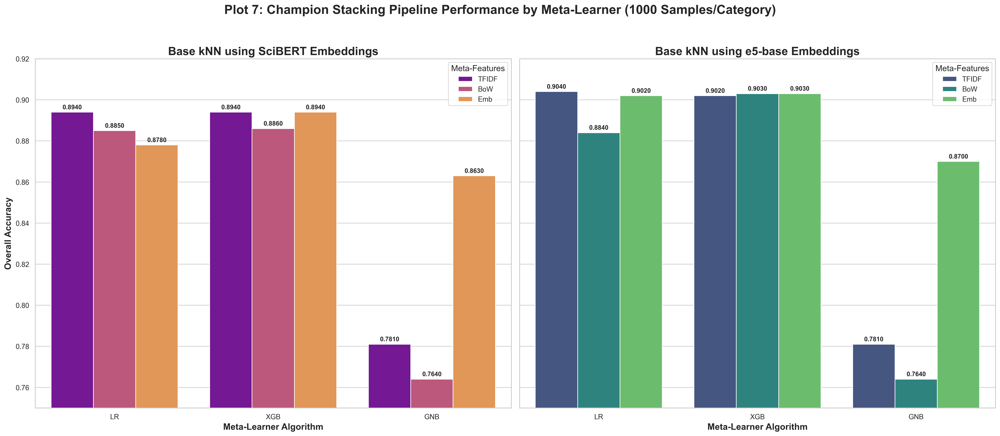

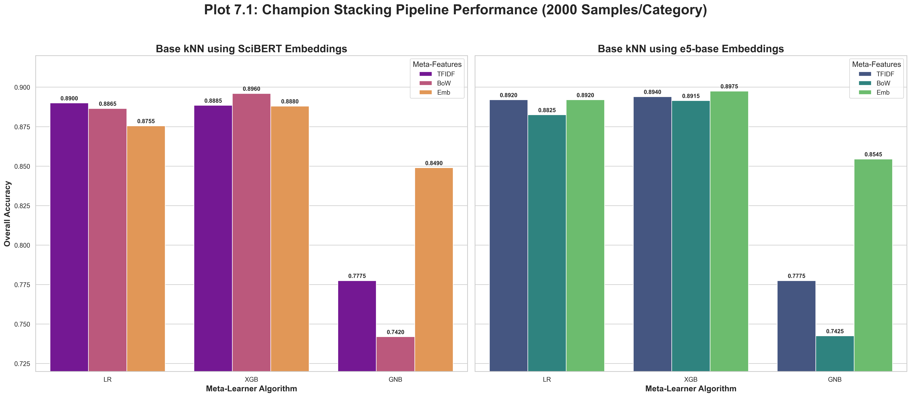

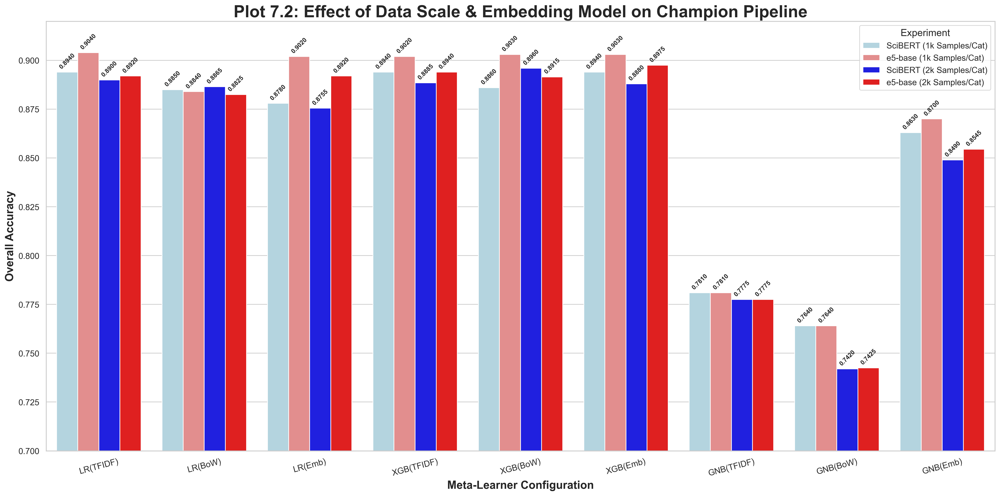

</details>

### Final Analysis: The Stacking Classifier Reigns Supreme

*Check `run_single_LR_XBG.py` for code*

This last set of experiments was the ultimate stress test. We took two powerful, industry-standard algorithms, `LogisticRegression` and `XGBoost`, gave them our best-engineered features, and pitted them against the champion stacking model. The results are unequivocal.

**1. The Stacking Model's Supremacy is Confirmed:**

*   **Best Single Model Performance:** The best result from this new benchmark was `LogisticRegression(TFIDF)` at **0.8710**.
*   **Best Stacking Model Performance (from previous run):** The top stacking model, `[MNB(t)+kNN(e)+DT(t)] + LR(t)`, achieved **0.8980** (using the older e5-base embeddings, the SciBERT variant hit 0.8940). Even the top e5-base stacking model hit **0.9040**.

**Conclusion:** The stacking classifier is not just slightly better; it's in a different league. The performance gap between the best single model (**0.8710**) and the best stacking model (**~0.9040**) is over **3.3 percentage points**. This definitively proves that the complexity of the stacking architecture was not only justified but essential for achieving peak performance.

**2. Logistic Regression Outperforms XGBoost as a Standalone Model:**

*   **Observation:** Across all feature sets, `LogisticRegression` consistently achieved higher accuracy than `XGBoost`.
    *   `LR(TFIDF)` @ **0.8710** vs. `XGB(TFIDF)` @ 0.8360
    *   `LR(BoW)` @ **0.8515** vs. `XGB(BoW)` @ 0.8345
*   **Technical Insight:** This is a classic text classification result. For high-dimensional, sparse data like BoW and TF-IDF, linear models like Logistic Regression and SVMs are incredibly effective and efficient. They are excellent at finding a linear separating hyperplane in that vast feature space. While XGBoost is more powerful in finding complex, non-linear interactions, it can sometimes be more prone to overfitting on sparse text data if not extensively tuned. The simple, robust nature of Logistic Regression made it the better choice here.

```
--- Single Model (LR & XGBoost) Summary ---
1000sam/cat
Model Configuration       | Accuracy       
-------------------------------------------
LR(BoW)                   | 0.8580         
LR(TFIDF)                 | 0.8700         
LR(Emb)                   | 0.8560         
XGB(BoW)                  | 0.8230         
XGB(TFIDF)                | 0.8270         
XGB(Emb)                  | 0.8380         
-------------------------------------------
```

```
--- Single Model (LR & XGBoost) Summary ---
2000sam/cat
Model Configuration       | Accuracy       
-------------------------------------------
LR(BoW)                   | 0.8515         
LR(TFIDF)                 | 0.8710         
LR(Emb)                   | 0.8400         
XGB(BoW)                  | 0.8345         
XGB(TFIDF)                | 0.8360         
XGB(Emb)                  | 0.8350         
-------------------------------------------
```

**3. The Power of "Just Enough" Features:**

*   **Observation:** The best single model was `LR(TFIDF)`. The model trained on dense embeddings, `LR(Emb)`, performed worse (0.8400).
*   **Technical Insight:** This reinforces a key theme of our project. While embeddings are powerful for semantic, distance-based tasks (like kNN), for discriminative linear models like Logistic Regression, the explicit keyword signals provided by a well-tuned TF-IDF matrix can be more powerful. The model can directly learn high weights for words like "quantum," "boson," or "superconductivity" that are strongly indicative of a specific class.


<details>
<summary>Visualizations</summary>

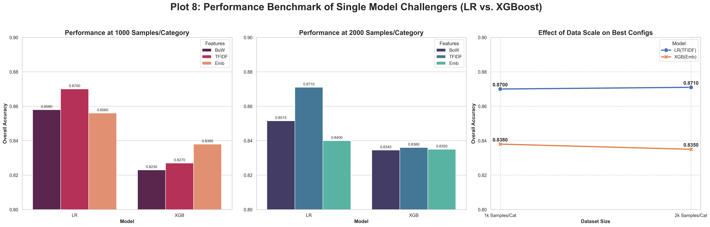

</details>

### The Final, Definitive "Story"

1.  **The Quest for the Best:** The project's goal was to find the highest-performing classifier for scientific abstracts.

2.  **The Foundation (Initial Benchmarks):** We began by establishing strong baselines. We discovered that traditional models like **`MultinomialNB` on `BoW` features (0.8710)** and modern models like **`kNN` on `SBERT Embeddings` (0.8590)** were the top individual contenders. This immediately highlighted the core tension: lexical vs. semantic features.

3.  **The Rise of Ensembles (Voting):** We proved that combining these diverse experts through a **heterogeneous voting ensemble** improved performance, reaching **0.8760**. This showed that collaboration was better than isolation.

4.  **The Pinnacle (Stacking):** We then implemented a more sophisticated **stacking ensemble**, where a meta-learner was trained to intelligently combine the base models' predictions. This advanced architecture, specifically `Stacking[MNB(t)+kNN(e)+DT(t)] + LR(t)`, achieved a remarkable accuracy of **~0.9040**, establishing itself as the clear champion.

5.  **The Final Challenge (The Gauntlet):** To truly validate the stacking model's superiority, we pitted it against two powerful standalone challengers: `LogisticRegression` and `XGBoost`, armed with our best-engineered features.

6.  **The Verdict:** The results were decisive. The best standalone model, `LR(TFIDF)`, peaked at **0.8710**. The champion stacking model remained untouched at **~0.9040**. This provides conclusive proof that **the synergy created by the stacking architecture—its ability to learn from the nuanced agreements and disagreements of its diverse base models—unlocks a level of predictive power that no single model, no matter how powerful, could achieve on its own.**


<details>
<summary>Summary Benchmarks Visulizations</summary>


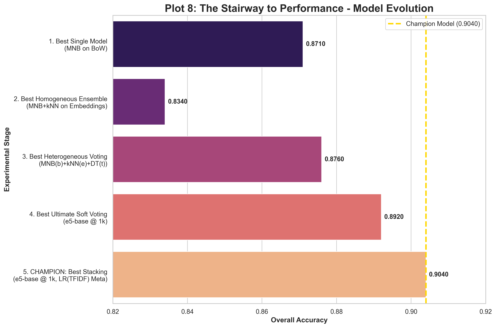

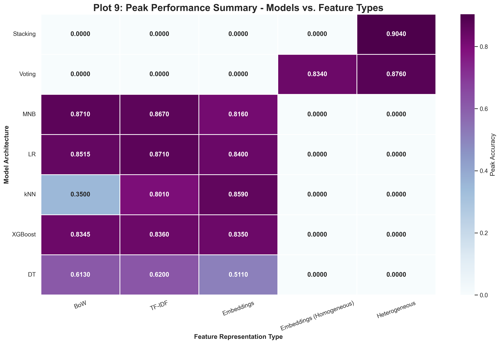

1[alt text](visualizations/plot_Perf_gains_with_Complexity.png)
</details>
