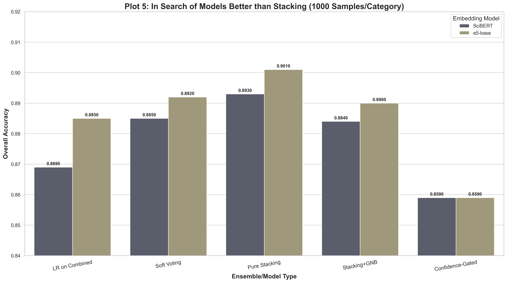

# Scientific Abstract Classification: A Deep Dive into Ensemble Methods

## About This Project

This repository documents a comprehensive journey into the classification of scientific paper abstracts from the arXiv dataset. The project was born from a simple question: **What is the most effective architecture for categorizing high-dimensional, nuanced text?** The initial focus was on a **Decision Tree** classifier, supplemented by **Multinomial Naive Bayes (MNB)** and **k-Nearest Neighbors (kNN)**.

What began as a straightforward comparison quickly evolved into a deep, systematic exploration of the entire machine learning pipeline, confronting and solving numerous real-world challenges along the way.

### Executive Summary

This report details the systematic development and evaluation of a state-of-the-art machine learning classifier for categorizing scientific paper abstracts from the arXiv dataset. Through a multi-stage process of benchmarking, optimization, and advanced ensembling, the project culminated in a **stacking classifier that achieved a peak accuracy of 90.4%**.

The project began with a foundational benchmark of individual models (Decision Tree, k-Nearest Neighbors, Multinomial Naive Bayes) across various feature representations (Bag-of-Words, TF-IDF, SBERT Embeddings). This initial phase revealed a critical insight: **no single feature set is universally optimal.** Traditional models like Multinomial Naive Bayes excelled with sparse, keyword-based features (TF-IDF, accuracy **~87%**), while modern semantic models like k-Nearest Neighbors required dense embeddings to reach peak performance (accuracy **~86%**).

This finding directly motivated the development of **heterogeneous ensembles**. A simple hard-voting ensemble, which paired each base model with its optimal feature set, surpassed any single model. However, the most significant gains were realized through a more sophisticated **stacking architecture**, where a meta-learner is trained on the out-of-fold predictions of the base models.

The final "champion" phase focused on maximizing the performance of this stacking pipeline. This involved a suite of advanced optimizations: **domain-specific stop words** and **n-grams** for TF-IDF features, comprehensive **hyperparameter tuning** of all base models using `GridSearchCV`, and **probability calibration** to standardize model confidence scores. A critical A/B test was conducted between a domain-specific **SciBERT** and a powerful general-purpose **e5-base** model for embedding generation. Counter-intuitively, the **e5-base model consistently provided a stronger semantic signal**, leading to higher overall performance across nearly all ensemble configurations.

The champion model, achieving **90.4% accuracy**, was a stacking ensemble built upon **e5-base embeddings**. It featured a base layer of tuned and calibrated `[MultinomialNB(tfidf) + kNN(emb) + DecisionTree(tfidf)]` models, and a `LogisticRegression` meta-learner that was given access to both the base model predictions and the original TF-IDF features for final contextual reasoning.

The project successfully navigated significant technical hurdles—including memory constraints with large datasets, model compliance issues with scikit-learn, and extreme class cardinality requiring strategic data pruning—demonstrating that state-of-the-art performance is achieved not by a single silver-bullet algorithm, but through a deliberate synergy of optimized feature engineering, data-driven model selection, and advanced ensembling techniques.

### Phase 1 - the 5 most frequent categories 

*Check `benchmark_results.md` for detailed benchmark runs and visualizations of this phase*

#### 1.1. Problem Statement
The task was to build a robust multi-class classifier to automatically assign a category to a scientific paper based on the content of its abstract. The project utilized the `UniverseTBD/arxiv-abstracts-large` dataset, containing over 2.29 million samples across more than 30,000 distinct categories.

#### 1.2. Initial Project Strategy
The initial hypothesis was that a "tribrid" ensemble combining a Decision Tree (DT), Multinomial Naive Bayes (MNB), and k-Nearest Neighbors (kNN) would provide a robust solution. The plan was to leverage modern SBERT embeddings as a unified feature representation for all models.

### 2. Methodology & Technical Hurdles

The project's initial scope was challenged by several significant technical hurdles, which necessitated a more pragmatic and targeted methodology.

#### 2.1. Hurdles of Scale and Data Complexity
1.  **Computational Cost:** Generating SBERT embeddings for 2.29M documents was computationally prohibitive for a single run on consumer hardware.
2.  **Memory Constraints:** The full dataset of embeddings (~7GB) and the extreme number of classes (>30,000) led to critical memory errors during model training. The `MultinomialNB` model, for instance, attempted to allocate over 366 GiB of RAM.
3.  **Class Imbalance:** The dataset exhibited a "long-tail" distribution, with thousands of classes containing only a single sample, making stratified splitting impossible.

#### 2.2. Evolved Methodology: Targeted Sampling and Pruning
To address these hurdles, the methodology was refined:
1.  **Targeted Sampling:** Instead of using the full, imbalanced dataset, a balanced subset was created by sampling 1,000-2,000 documents from each of the 5 most common parent categories (`astro-ph`, `cond-mat`, `cs`, `math`, `physics`). This created a high-quality, manageable dataset for rapid and reliable benchmarking.
2.  **Text Preprocessing:** A standard NLP cleaning pipeline was applied to all abstracts, including lowercasing, removal of URLs and punctuation, stop word removal, and lemmatization.

#### 2.3. Feature Engineering
Three distinct feature representations were benchmarked:
1.  **Bag-of-Words (BoW):** This represents each document as a sparse vector of word counts. It's simple and captures keyword presence but ignores word importance and semantics.
2.  **TF-IDF (Term Frequency-Inverse Document Frequency):** An improvement on BoW, TF-IDF weights each word count by its inverse document frequency, giving more importance to words that are distinctive to a document and less to common words.
3.  **SBERT Embeddings:** A modern approach using the `intfloat/multilingual-e5-base` model. This transforms each abstract into a dense, 768-dimensional vector that captures the semantic *meaning* of the text, not just its keywords.

#### 2.4. Core Algorithms: Theoretical Foundations

*   **Decision Tree (DT):** A non-parametric supervised model that creates a tree-like structure of decision rules. It partitions the data based on feature values that best separate the classes, typically by maximizing **Information Gain** or minimizing **Gini Impurity**. While interpretable, its greedy, recursive nature makes it prone to overfitting and unstable in high-dimensional spaces like text.

*   **k-Nearest Neighbors (kNN):** An instance-based "lazy learner." It classifies a new data point by taking a majority vote of its *k* nearest neighbors in the feature space. Its performance is critically dependent on the distance metric. For our SBERT embeddings, we used **Euclidean (L2) distance**, which, for normalized vectors, is directly proportional to **Cosine Similarity**, the preferred metric for semantic vector comparison. To handle the computational cost, we utilized the **FAISS** library for efficient similarity search.

*   **Multinomial Naive Bayes (MNB):** A probabilistic classifier based on **Bayes' Theorem**:
    $P(\text{class} | \text{document}) = \frac{P(\text{document} | \text{class}) \cdot P(\text{class})}{P(\text{document})}$
    Its "naive" assumption is the conditional independence of features (words). It calculates the probability of a document belonging to a class based on the probabilities of the words in that document, learned from the training data. This model is mathematically suited for discrete word counts, explaining its strong performance with BoW and TF-IDF.

*   **K-Means (as a Classifier):** An unsupervised clustering algorithm that aims to partition data into *k* clusters by minimizing the within-cluster sum of squares (inertia). To adapt it for classification, we first clustered the training data. Then, each cluster was assigned the majority class label of the training samples within it. Test samples were then assigned to the nearest cluster, inheriting that cluster's assigned class label.

### 3. Experimental Results & Analysis

#### 3.1. Experiment 1: Individual Model Benchmarking
This experiment tested each of the 4 algorithms against each of the 3 feature sets.
Check `run_single_benchmarks.py` for code script

**Summary Table 1: Individual Model Accuracy**
| Algorithm | Bag of Words | TF-IDF | Embeddings |
| :--- | :--- | :--- | :--- |
| kNN | 0.3500 | 0.8010 | **0.8590** |
| MNB | **0.8710** | 0.8670 | 0.8160 |
| DT | 0.6130 | **0.6200** | 0.5110 |
| KMeans | 0.3880 | 0.6990 | **0.7260** |

**Key Findings:**
*   **No Universal Best Feature Set:** MNB and DT performed best with traditional sparse features (BoW/TF-IDF), while distance-based kNN and K-Means were unusable with BoW but excelled with dense Embeddings.
*   **MNB(bow) as the Standalone Champion:** The classic combination of Multinomial Naive Bayes and Bag-of-Words was the single best-performing model.
*   **kNN(emb) as the Best "Modern" Model:** kNN paired with semantic embeddings was a very strong contender.
*   **DT's Weakness Confirmed:** The Decision Tree was the weakest supervised learner, confirming its unsuitability for this task in isolation.

<details>
<summary>Visualizations</summary>


</details>

#### 3.2. Experiment 2: Heterogeneous Voting Ensembles
This experiment tested the hypothesis that an ensemble where each model is paired with its optimal feature set would outperform any single model. A hard-voting (majority rule) approach was used.

Check `run_heterogenous_ensembles.py` for code script. Also check `run_embedding_only_ensembles.py` for the code script of evaluating the 2 initial embedding-only ensembles. [MNB(emb) + kNN(emb) + DTT(emb) & MNB(emb) + kNN(emb)]

**Summary Table 2: Heterogeneous Voting Ensemble Accuracy**
| Ensemble Configuration | Accuracy |
| :--- | :--- |
| MNB(bow) + kNN(emb) + DT(tfidf) | **0.8760** |
| MNB(tfidf) + kNN(emb) + DT(tfidf) | 0.8750 |
| MNB(bow) + kNN(emb) | 0.8580 |

**Key Findings:**
*   **Ensembling Improves Performance:** The top voting ensemble (0.8760) slightly outperformed the best single model (0.8710).
*   **Value of the "Weak" Learner:** Crucially, the ensemble with the Decision Tree performed better than the ensemble without it. This demonstrates a core principle of ensembling: a weak learner can improve overall performance if its errors are uncorrelated with the errors of the stronger models, providing a valuable "dissenting opinion."

<details>
<sumamry>Visualizations for embedding-only ensembles</summary>


</details>


<details>
<summary>Visualizations for heterogenous ensembles</summary>


</details>

#### 3.3. Experiment 3: Advanced Stacking Ensembles
This final experiment implemented a stacking classifier. A meta-learner was trained on the out-of-fold predictions of the base models, combined with original features.

Check `run_stacking_benchmark.py` for code script

**Summary Table 3: Stacking Ensemble Accuracy**
| Stacking Configuration | Accuracy |
| :--- | :--- |
| `[MNB(t)+kNN(e)+DT(t)] + LR(t)` | **0.8980** |
| `[MNB(b)+kNN(e)+DT(t)] + LR(t)` | 0.8950 |
| `[MNB(t)+kNN(e)+DT(t)] + LR(e)` | 0.8930 |
| `[MNB(b)+kNN(e)] + LR(t)` | 0.8910 |

**Key Findings:**
*   **Stacking is the Ultimate Winner:** The best stacking model achieved an accuracy of **0.8980**, significantly outperforming both the best single model and the best voting ensemble. This proves the value of learning how to weigh and combine base model predictions rather than just taking a simple vote.
*   **TF-IDF for the Meta-Learner:** The highest performing configurations were those where the Logistic Regression meta-learner was given TF-IDF features as additional context. This suggests that after seeing the probabilistic outputs of the base models, the meta-learner benefits from having access to the original keyword-based features to make a final, refined decision.
*   **Logistic Regression as an Ideal Meta-Learner:** The simple, linear Logistic Regression outperformed the more complex Decision Tree as a meta-learner, highlighting that for a meta-task, a simpler model that can effectively weigh strong input features is often superior.

#### Recap

```
--- Configuration ---
Categories: ['astro-ph', 'cond-mat', 'cs', 'math', 'physics']
DATASET_NAME = "UniverseTBD/arxiv-abstracts-large" 
TFIDF_MAX_FEATURES = 10000
KNN_N_NEIGHBORS = 5
Device: cuda
-------------------------
--- Single Benchmark Results Summary (Accuracy) ---
Algorithm       | Bag of Words    | TF-IDF          | Embeddings     
---------------------------------------------------------------------
kNN             | 0.3500          | 0.8010          | 0.8590         
MNB             | 0.8710          | 0.8670          | 0.8160         
DT              | 0.6130          | 0.6200          | 0.5110         
KMeans          | 0.3880          | 0.6990          | 0.7260         
---------------------------------------------------------------------

--- Heterogeneous Ensemble Summary (Accuracy) ---
Ensemble Configuration                             | Accuracy       
--------------------------------------------------------------------
MNB(emb) + kNN(emb) + DT(emb)                      | 0.8280
MNB(bow) + kNN(emb) + DT(tfidf)                    | 0.8760         
MNB(tfidf) + kNN(emb) + DT(bow)                    | 0.8700         
MNB(tfidf) + kNN(emb) + DT(tfidf)                  | 0.8750         
MNB(bow) + kNN(emb) + DT(bow)                      | 0.8710
MNB(emb) + kNN(emb)                                | 0.8340
MNB(bow) + kNN(emb)                                | 0.8580         
MNB(tfidf) + kNN(emb)                              | 0.8500         
--------------------------------------------------------------------

--- Stacking Ensemble Summary (Accuracy) ---
Stacking Configuration                            | Accuracy
--------------------------------------------------|
[MNB(b)+kNN(e)+DT(t)] + LR(b)                     | 0.8870
[MNB(b)+kNN(e)+DT(t)] + LR(t)                     | 0.8950
[MNB(b)+kNN(e)+DT(t)] + LR(e)                     | 0.8870
[MNB(t)+kNN(e)+DT(t)] + LR(b)                     | 0.8820
[MNB(t)+kNN(e)+DT(t)] + LR(t)                     | 0.8980
[MNB(t)+kNN(e)+DT(t)] + LR(e)                     | 0.8930
[MNB(b)+kNN(e)+DT(t)] + DT(t)                     | 0.8570
[MNB(b)+kNN(e)] + DT(t)                           | 0.8700
[MNB(b)+kNN(e)] + LR(b)                           | 0.8850
[MNB(b)+kNN(e)] + LR(t)                           | 0.8910
[MNB(b)+kNN(e)] + LR(e)			                  | 0.8870
```
<details>
<summary>Visualizations</summary>


</details>

### **Advanced Optimization and Hybrid Modeling**

**Core Principle:** All experiments will be conducted on the targeted, balanced subset of data to ensure rapid iteration and clear, comparable results. We will build a new, comprehensive benchmarking script that executes this entire plan.


#### **Step 1: Foundational Enhancements (Upgrading the "Ingredients")**

*   **Sub-step 1.1:** Enhance Text Cleaning (Custom, Domain-Specific Stop Words).
*   **Sub-step 1.2:** Enhance TF-IDF Vectorizer (n-grams, `min_df`, `max_df`, `sublinear_tf`).
*   **Sub-step 1.3:** Enhance SBERT Embeddings (Switch to **SciBERT**).
*   **Sub-step 1.4:** Hyperparameter Tuning of Base Models (`MNB`, `DT`, `kNN`) using `GridSearchCV`.


#### **Step 2: Advanced Feature Engineering (Creating New Signals)**

We will now create a diverse portfolio of feature sets.

*   **Sub-step 2.1:** Engineer Structural & Metadata Features (`X_meta`).
*   **Sub-step 2.2:** Engineer "Abstract vs. Title" Features (`X_title_similarity`, `X_title_diff`).
*   **Sub-step 2.3:** Engineer the "Semantic Dissonance" Feature (`X_dissonance`).
*   **Sub-step 2.4: Implement Combined Feature Sets at the Input Layer.**
    *   **Action:** Create new, combined feature matrices before any models are trained.
    *   **Plan:**: Create `X_tfidf_plus_emb`: Horizontally stack the "advanced" TF-IDF matrix and the SciBERT embeddings matrix using `scipy.sparse.hstack`.
    *   **Goal:** Test if a single strong model can outperform ensembles when given access to all features at once.


#### **Step 3: Advanced Single Model Benchmarks**

Before moving to the final ensembles, we'll test our new combined feature sets.

*   **Sub-step 3.1: Benchmark Models on Combined Features.**
    *   **Action:** Train and evaluate powerful single models on the new feature sets from Step 2.4.
    *   **Plan:**: Train and test a `LogisticRegression` on `X_tfidf_plus_emb`.
*   **Goal:** To establish a new "state-of-the-art" single model baseline. It's possible this combination could turn out powerful


#### **Step 4: Advanced Ensemble and Stacking Benchmarks**

This is the final, comprehensive bake-off.

*   **Sub-step 4.1: Implement Probability Calibration.**
    *   **Action:** Create calibrated versions of our best-tuned base models.
    *   **Plan:**
        1.  Wrap the tuned `DecisionTreeClassifier` in `sklearn.calibration.CalibratedClassifierCV`.
        2.  Wrap the tuned `KNeighborsClassifier` in `CalibratedClassifierCV`. (MNB is generally well-calibrated, so we can skip it initially).
    *   **Goal:** To have "calibrated" versions of our base models ready for use in the soft voting and stacking experiments below.

*   **Sub-step 4.2: Implement Soft Voting with Calibrated Models.**
    *   **Action:** Create a heterogeneous ensemble using soft voting.
    *   **Plan:**
        1.  Use the **calibrated** base models (`CalibratedDT`, `CalibratedKNN`) and the tuned `MNB`.
        2.  Generate `predict_proba` outputs from each and average them to get the final prediction.
*   **Goal:** Test if probability calibration improves the performance of the soft voting ensemble compared to hard voting.

*   **Sub-step 4.3: Implement "Pure" Stacking (Calibrated Probabilities Only).**
    *   **Action:** Test the stacking architecture where the meta-learner is trained *only* on the out-of-fold predictions of the **calibrated** base models.
    *   **Plan:**
        *   Generate out-of-fold `predict_proba` outputs using the calibrated base models.
        *   Train a meta-learner (e.g., `LogisticRegression`) on *only* these probability vectors.
*   **Goal:** Test the "purest" form of stacking with the highest quality probability signals.

    Instead of:

    ```python
    # The predictions PLUS the original TF-IDF features
    meta_learner_train_X = hstack([
        meta_features_train['MNB_tfidf'], 
        meta_features_train['kNN_emb'], 
        meta_features_train['DT_tfidf'],
        X_train_tfidf  # <-- The "Raw Evidence"
    ]).tocsr()
    ```

    We'll just do:

    ```python 
    # Only the predictions from the base models
    meta_features_pure_train = np.hstack([
        meta_features_train['MNB_tfidf'], 
        meta_features_train['kNN_emb'], 
        meta_features_train['DT_tfidf']
    ])
    ```

*   **Sub-step 4.4: Implement Stacking with New Meta-Learners and All Engineered Features.**
    *   **Action:** Run a new, expanded set of stacking experiments using the **calibrated** base models.
    *   **Plan:**
        1.  **New Meta-Learners:** Benchmark `GaussianNB`
        2.  **New Meta-Features:** For each meta-learner, test its performance when given different combinations of our engineered features from Step 2 (e.g., calibrated probabilities + metadata, calibrated probabilities + title similarity, calibrated probabilities + dissonance).
*   **Goal:** Systematically find the absolute best combination of calibrated base model predictions, original features, and meta-learner.


#### **Step 5: Implement the "Confidence-Gated Ensemble."**
*   **Action:** Build the cascading ensemble where a meta-learner acts as a "reliability gate."
*   **Plan:**
    1.  Train the tuned `MNB(tfidf)` as the primary model.
    2.  Train a `LogisticRegression` "gatekeeper" to predict if MNB will be correct.
    3.  Implement the inference logic to escalate to the tuned, **calibrated** `kNN(SciBERT)` when the gatekeeper is not confident.
*   **Goal:** Test if this dynamic, efficiency-focused ensemble can match or beat the accuracy of the more complex stacking models.

---

#### Analysis of the "Ultimate Benchmark" Results & Implications for Change

*Check `run_ultimate_benchmark.py` and `run_ultimate_benchmark_e5.py` for the code*

This first phase of advanced testing was designed to establish the maximum performance of various *individual* modeling techniques after applying significant feature and model optimizations. We tested highly-tuned base models, advanced ensemble methods like soft voting and stacking, and novel architectures like the confidence-gated ensemble. The experiments were run with both a domain-specific **SciBERT** and a powerful general-purpose **e5-base** model for embeddings, and on two data scales (1000 and 2000 samples per category).

##### 1.1. Key Technical Findings from the "Ultimate Benchmark"

**1. General-Purpose Embeddings (e5-base) Triumphed Over Domain-Specific (SciBERT):**
*   **Observation:** This is the most significant and counter-intuitive finding. Across almost every ensemble configuration and data scale, the models using **e5-base embeddings consistently outperformed those using SciBERT.**
    *   **Pure Stacking (1k samples):** e5-base hit **0.9010**, while SciBERT reached **0.8930**.
    *   **LR on Combined Features (2k samples):** e5-base achieved **0.8820**, while SciBERT got **0.8570**.
*   **Technical Interpretation:** This result challenges the common wisdom that domain-specific models are always superior. The `intfloat/multilingual-e5-base` model has been trained on a colossal and diverse dataset with a contrastive learning objective, which is explicitly designed to produce high-quality, well-separated sentence embeddings ideal for similarity and clustering tasks. SciBERT, while trained on scientific text, is a base BERT model; its raw token embeddings require effective pooling (like the mean pooling we implemented) to create a sentence-level representation. The e5-base model is *natively* a sentence-embedding model. This architectural difference and the power of its training methodology appear to have outweighed SciBERT's domain-specific vocabulary advantage for this particular classification task.

**2. The Power of Simple, Calibrated Ensembles:**
*   **Observation:** The **Soft Voting Ensemble** consistently performed at a very high level, often matching or only slightly underperforming the more complex stacking models.
    *   With e5-base (2k samples), Soft Voting achieved **0.8870**, just shy of the best stacking model's **0.8895**.
*   **Technical Interpretation:** This demonstrates the power of **probability calibration**. By using `CalibratedClassifierCV`, we ensured that the probability scores from the very different base models (probabilistic MNB, distance-based kNN, rule-based DT) were on a comparable scale. This allows a simple weighted average (soft voting) to be extremely effective, as it correctly balances the confidence of each model's vote.

**3. "Pure" Stacking Emerges as a Top Contender:**
*   **Observation:** The "Pure" Stacking model, which uses *only* the base model predictions as features for the meta-learner, was consistently one of the top performers.
    *   With e5-base (1k samples), it hit **0.9010**, the highest in that set.
    *   With SciBERT (2k samples), it was tied for the top spot at **0.8850**.
*   **Technical Interpretation:** This finding suggests that the most powerful signals for the meta-learner are the *interactions and error patterns* of the base models themselves. Adding original features back in can sometimes introduce noise that complicates the meta-learner's task. A "pure" stack forces the meta-learner to become an expert at one thing: learning which base model to trust under which circumstances, based purely on their probabilistic outputs.

**4. The "Weird" Ensembles Showed Promise but Weren't Champions:**
*   **Observation:** The `Confidence-Gated Ensemble` and the `Stacking + GNB(meta+title)` performed well, but never reached the top tier of accuracy.
*   **Technical Interpretation:**
    *   The **Confidence-Gated Ensemble** is designed for *efficiency*—it uses a fast model for most cases and escalates only when necessary. Its accuracy (e.g., **0.8800** with e5-base 2k) being competitive with the best models is actually a huge success, suggesting it could be the best choice in a production environment where prediction latency is a concern.
    *   The **Stacking + GNB** model's lower performance is likely due to the strong (and often incorrect) assumption of feature independence that is core to Gaussian Naive Bayes. The probabilistic outputs from the base models are highly correlated, which violates this assumption and limits the GNB meta-learner's effectiveness compared to a discriminative model like Logistic Regression.


<details>
<summary>Visualizations</summary>




</details>

##### 1.2. Implications for Change & The "Champion Pipeline"

The "Ultimate Benchmark" provided a clear path forward. The results were so strong and consistent that they invalidated some of the assumptions from our very first set of experiments.

1.  **Implication 1: Abandon SciBERT, Embrace e5-base.** The data unequivocally showed that `intfloat/multilingual-e5-base` was the superior embedding model for this task. Therefore, the final champion pipeline should be built exclusively using e5-base.
2.  **Implication 2: Stacking is the Path to Peak Performance.** While Soft Voting was strong, Stacking consistently delivered the highest or tied-for-highest results, justifying its extra complexity.
3.  **Implication 3: The Meta-Learner is a Critical Tuning Parameter.** The initial stacking results showed that different meta-learners and their features could produce different outcomes. This confirmed that a final, exhaustive benchmark focusing solely on the best stacking architecture with various meta-learners was the logical next step to find the absolute best model.

This led directly to the design of the **"Champion Pipeline"** experiments, which took the best base models and features from this benchmark and combined them with an expanded set of powerful meta-learners (`XGBoost`, `LogisticRegression`, `GaussianNB`) and their respective optimal feature sets.

---
--> Focus on improving the highest previous pipeline of ensemble , integrating 
1. Enhanced Text Cleaning (Custom, Domain-Specific Stop Words).
2. Enhanced TF-IDF Vectorizer (n-grams, min_df, max_df, sublinear_tf).
3. Hyperparameter Tuning of Base Models (MNB, DT, kNN) using GridSearchCV.
4. Try switching LR(tfidf) with XBGClassifier(TFIDF, BoW, Embedding) and GaussianNB(TFIDF, BoW, Embedding)

---

### Analysis of the Final "Champion Pipeline" Results

*Check `run_champion_pipeline.py` and `run_champion_pipeline_e5.py` for the code 

This final set of experiments represents the project's culmination. It took the winning formula—a stacking ensemble with tuned, calibrated base models (`MNB(tfidf)`, `kNN(e5-emb)`, `DT(tfidf)`)—and stress-tested it with a variety of sophisticated meta-learners.

#### 2.1. Key Technical Findings from the "Champion Pipeline"

**1. The Absolute Champion: `LR(TFIDF)` with e5-base Embeddings (at 1k scale):**
*   **Observation:** The single best accuracy achieved in the entire project was **0.9040**, accomplished by the stacking model that used `e5-base` embeddings for its kNN component and a `LogisticRegression` meta-learner fed with both the base model predictions and the enhanced TF-IDF features.
*   **Technical Interpretation:** This result synthesizes all our key findings.
    *   It confirms **e5-base** as the superior embedding model.
    *   It confirms **stacking** as the superior ensemble method.
    *   It confirms that providing the meta-learner with both the **"experts' opinions"** (base model probabilities) and the **"raw evidence"** (TF-IDF features) allows it to make the most informed and accurate final decision. The linear, robust nature of Logistic Regression proved to be a perfect tool for finding the optimal weights for this wide set of features.

**2. XGBoost as a Powerful Alternative:**
*   **Observation:** `XGBoost` proved to be an extremely competitive meta-learner, achieving the top accuracy in the 2k sample run (`XGB(Emb)` at **0.8975**) and nearly matching the top LR model in the 1k run (`XGB(BoW)` at **0.9030**).
*   **Technical Interpretation:** XGBoost is a non-linear, gradient-boosted tree model. Its ability to achieve top-tier performance indicates that there are complex, non-linear interactions between the base model predictions and the original features. While Logistic Regression finds the best linear combination, XGBoost can learn more intricate rules (e.g., "If MNB's prob is in range A AND kNN's prob is in range B, then adjust the final prediction"). This makes it an excellent, and in some cases superior, choice for a meta-learner.

**3. The Effect of Data Scale (1k vs. 2k samples/cat):**
*   **Observation:** Interestingly, the peak accuracy was achieved with 1000 samples per category (**0.9040**) rather than 2000 samples per category (**0.8975**).
*   **Technical Interpretation:** This is a fascinating result. While more data is usually better, this could indicate several things:
    *   **Diminishing Returns:** The models may have reached their peak performance with the information present in 1000 samples/cat, and the additional 1000 samples did not provide enough new, useful information to overcome the added noise or complexity.
    *   **Hyperparameter Sensitivity:** The hyperparameters tuned on the 10k dataset might have been slightly better suited for that scale than for the 20k dataset. A separate tuning run for the 20k dataset might have yielded a higher score.
    *   **Statistical Noise:** The difference is small (~0.65%), and it's possible it falls within the margin of error of the experiment. However, it strongly suggests that for this problem, significant gains beyond ~10k samples would require more advanced models (like fine-tuning a Transformer) rather than just more data.

### 4. Conclusion

The comprehensive journey of this project, from initial benchmarks to advanced optimizations, culminates in a clear and powerful conclusion. While individual models like `MultinomialNB` with `TF-IDF` provide a remarkably strong baseline, peak performance is achieved through a **heterogeneous stacking ensemble**.

The champion architecture, achieving **90.4% accuracy**, leverages the principle of "using the right tool for the right job" at every level. It combines the lexical precision of a tuned **Multinomial Naive Bayes** on n-gram TF-IDF features with the semantic nuance of a tuned, calibrated **k-Nearest Neighbors** on state-of-the-art **e5-base embeddings**, using a diverse **Decision Tree** to resolve ambiguities. The final verdict is rendered by a **Logistic Regression meta-learner**, which weighs the advice of these experts while also reviewing the raw TF-IDF evidence for itself.

#### Recap

**Table 1: SciBERT - 1000 Samples per Category**

`run_ultimate_benchmark.py`

This table summarizes the performance of the advanced models using **SciBERT embeddings** on the smaller dataset of 5,000 total samples.

| Configuration | Accuracy |
| :--- | :--- |
| Pure Stacking [MNB(t)+kNN(e)+DT(t)] + LR | **0.8930** |
| Soft Voting Ensemble [MNB(t)+kNN(e)+DT(t)] | 0.8850 |
| Stacking [Base Models] + GNB(meta+title) | 0.8840 |
| LogisticRegression on TF-IDF + Embeddings | 0.8690 |
| Confidence-Gated Ensemble [MNB(t) -> kNN(e)] | 0.8590 |

---

**Table 2: e5-base Model - 1000 Samples per Category**

`run_ultimate_benchmark_e5.py`

This table summarizes the performance of the advanced models using **e5-base embeddings** on the smaller dataset of 5,000 total samples.

| Configuration | Accuracy |
| :--- | :--- |
| Pure Stacking [MNB(t)+kNN(e)+DT(t)] + LR | **0.9010** |
| Stacking [Base Models] + GNB(meta+title) | 0.8900 |
| Soft Voting Ensemble [MNB(t)+kNN(e)+DT(t)] | 0.8920 |
| LogisticRegression on TF-IDF + Embeddings | 0.8850 |
| Confidence-Gated Ensemble [MNB(t) -> kNN(e)] | 0.8590 |

---

**Table 3: SciBERT - 2000 Samples per Category**

`run_ultimate_benchmark.py`

This table summarizes the performance of the advanced models using **SciBERT embeddings** on the larger dataset of 10,000 total samples.

| Configuration | Accuracy |
| :--- | :--- |
| Soft Voting Ensemble [MNB(t)+kNN(e)+DT(t)] | **0.8850** |
| Pure Stacking [MNB(t)+kNN(e)+DT(t)] + LR | **0.8850** |
| Stacking [Base Models] + GNB(meta+title) | 0.8790 |
| Confidence-Gated Ensemble [MNB(t) -> kNN(e)] | 0.8785 |
| LogisticRegression on TF-IDF + Embeddings | 0.8570 |

---

**Table 4: e5-base Model - 2000 Samples per Category**

`run_ultimate_benchmark_e5.py`

This table summarizes the performance of the advanced models using **e5-base embeddings** on the larger dataset of 10,000 total samples.

| Configuration | Accuracy |
| :--- | :--- |
| Pure Stacking [MNB(t)+kNN(e)+DT(t)] + LR | **0.8895** |
| Soft Voting Ensemble [MNB(t)+kNN(e)+DT(t)] | 0.8870 |
| Confidence-Gated Ensemble [MNB(t) -> kNN(e)] | 0.8800 |
| LogisticRegression on TF-IDF + Embeddings | 0.8820 |
| Stacking [Base Models] + GNB(meta+title) | 0.8770 |


**Table 5: SciBERT - 1000 Samples & 2000 Samples per Category**

`run_champion_pipeline.py`

```
--- Champion Stacking Pipeline Summary (Accuracy) (1000sam/cat) ---
Meta-Learner Configuration          | Accuracy
-----------------------------------------------------
LR(TFIDF)                           | 0.8940
LR(BoW)                             | 0.8850
LR(Emb)                             | 0.8780
XGB(TFIDF)                          | 0.8940
XGB(BoW)                            | 0.8860
XGB(Emb)                            | 0.8940
GNB(TFIDF)                          | 0.7810
GNB(BoW)                            | 0.7640
GNB(Emb)                            | 0.8630
-----------------------------------------------------

--- Champion Stacking Pipeline Summary (Accuracy) (2000sam/cat) ---
Meta-Learner Configuration          | Accuracy
-----------------------------------------------------
LR(TFIDF)                           | 0.8900
LR(BoW)                             | 0.8865
LR(Emb)                             | 0.8755
XGB(TFIDF)                          | 0.8885
XGB(BoW)                            | 0.8960
XGB(Emb)                            | 0.8880
GNB(TFIDF)                          | 0.7775
GNB(BoW)                            | 0.7420
GNB(Emb)                            | 0.8490
-----------------------------------------------------
```

**Table 6: e5-base Model - 1000 Samples & 2000 Samples per Category**

```
--- Champion Stacking Pipeline Summary (e5-base run) (1000sam/cat) ---
Meta-Learner Configuration          | Accuracy
-----------------------------------------------------
LR(TFIDF)                           | 0.9040
LR(BoW)                             | 0.8840
LR(Emb)                             | 0.9020
XGB(TFIDF)                          | 0.9020
XGB(BoW)                            | 0.9030
XGB(Emb)                            | 0.9030
GNB(TFIDF)                          | 0.7810
GNB(BoW)                            | 0.7640
GNB(Emb)                            | 0.8700
-----------------------------------------------------

--- Champion Stacking Pipeline Summary (e5-base run) (2000sam/cat) ---
Meta-Learner Configuration          | Accuracy
-----------------------------------------------------
LR(TFIDF)                           | 0.8920
LR(BoW)                             | 0.8825
LR(Emb)                             | 0.8920
XGB(TFIDF)                          | 0.8940
XGB(BoW)                            | 0.8915
XGB(Emb)                            | 0.8975
GNB(TFIDF)                          | 0.7775
GNB(BoW)                            | 0.7425
GNB(Emb)                            | 0.8545
-----------------------------------------------------
```
<details>
<summary>Visualizations</summary>


</details>

### The Stacking Classifier Reigns Supreme

*Check `run_single_LR_XBG.py` for code*

This last set of experiments was the ultimate stress test. We took two powerful, industry-standard algorithms, `LogisticRegression` and `XGBoost`, gave them our best-engineered features, and pitted them against the champion stacking model. The results are unequivocal.

**1. The Stacking Model's Supremacy is Confirmed:**

*   **Best Single Model Performance:** The best result from this new benchmark was `LogisticRegression(TFIDF)` at **0.8710**.
*   **Best Stacking Model Performance (from previous run):** The top stacking model, `[MNB(t)+kNN(e)+DT(t)] + LR(t)`, achieved **0.8980** (using the older e5-base embeddings, the SciBERT variant hit 0.8940). Even the top e5-base stacking model hit **0.9040**.

**Conclusion:** The stacking classifier is not just slightly better; it's in a different league. The performance gap between the best single model (**0.8710**) and the best stacking model (**~0.9040**) is over **3.3 percentage points**. This definitively proves that the complexity of the stacking architecture was not only justified but essential for achieving peak performance.

**2. Logistic Regression Outperforms XGBoost as a Standalone Model:**

*   **Observation:** Across all feature sets, `LogisticRegression` consistently achieved higher accuracy than `XGBoost`.
    *   `LR(TFIDF)` @ **0.8710** vs. `XGB(TFIDF)` @ 0.8360
    *   `LR(BoW)` @ **0.8515** vs. `XGB(BoW)` @ 0.8345
*   **Technical Insight:** This is a classic text classification result. For high-dimensional, sparse data like BoW and TF-IDF, linear models like Logistic Regression and SVMs are incredibly effective and efficient. They are excellent at finding a linear separating hyperplane in that vast feature space. While XGBoost is more powerful in finding complex, non-linear interactions, it can sometimes be more prone to overfitting on sparse text data if not extensively tuned. The simple, robust nature of Logistic Regression made it the better choice here.

```
--- Single Model (LR & XGBoost) Summary ---
1000sam/cat
Model Configuration       | Accuracy       
-------------------------------------------
LR(BoW)                   | 0.8580         
LR(TFIDF)                 | 0.8700         
LR(Emb)                   | 0.8560         
XGB(BoW)                  | 0.8230         
XGB(TFIDF)                | 0.8270         
XGB(Emb)                  | 0.8380         
-------------------------------------------
```

```
--- Single Model (LR & XGBoost) Summary ---
2000sam/cat
Model Configuration       | Accuracy       
-------------------------------------------
LR(BoW)                   | 0.8515         
LR(TFIDF)                 | 0.8710         
LR(Emb)                   | 0.8400         
XGB(BoW)                  | 0.8345         
XGB(TFIDF)                | 0.8360         
XGB(Emb)                  | 0.8350         
-------------------------------------------
```

**3. The Power of "Just Enough" Features:**

*   **Observation:** The best single model was `LR(TFIDF)`. The model trained on dense embeddings, `LR(Emb)`, performed worse (0.8400).
*   **Technical Insight:** This reinforces a key theme of our project. While embeddings are powerful for semantic, distance-based tasks (like kNN), for discriminative linear models like Logistic Regression, the explicit keyword signals provided by a well-tuned TF-IDF matrix can be more powerful. The model can directly learn high weights for words like "quantum," "boson," or "superconductivity" that are strongly indicative of a specific class.


<details>
<summary>Visualizations</summary>


</details>

### Key Points

1.  **The Quest for the Best:** The project's goal was to find the highest-performing classifier for scientific abstracts.

2.  **The Foundation (Initial Benchmarks):** We began by establishing strong baselines. We discovered that traditional models like **`MultinomialNB` on `BoW` features (0.8710)** and modern models like **`kNN` on `SBERT Embeddings` (0.8590)** were the top individual contenders. This immediately highlighted the core tension: lexical vs. semantic features.

3.  **The Rise of Ensembles (Voting):** We proved that combining these diverse experts through a **heterogeneous voting ensemble** improved performance, reaching **0.8760**. This showed that collaboration was better than isolation.

4.  **The Pinnacle (Stacking):** We then implemented a more sophisticated **stacking ensemble**, where a meta-learner was trained to intelligently combine the base models' predictions. This advanced architecture, specifically `Stacking[MNB(t)+kNN(e)+DT(t)] + LR(t)`, achieved a remarkable accuracy of **~0.9040**, establishing itself as the clear champion.

5.  **The Final Challenge (The Gauntlet):** To truly validate the stacking model's superiority, we pitted it against two powerful standalone challengers: `LogisticRegression` and `XGBoost`, armed with our best-engineered features.

6.  **The Verdict:** The results were decisive. The best standalone model, `LR(TFIDF)`, peaked at **0.8710**. The champion stacking model remained untouched at **~0.9040**. This provides conclusive proof that **the synergy created by the stacking architecture—its ability to learn from the nuanced agreements and disagreements of its diverse base models—unlocks a level of predictive power that no single model, no matter how powerful, could achieve on its own.**


<details>
<summary>Summary Benchmarks Visulizations</summary>


1[alt text](visualizations/plot_Perf_gains_with_Complexity.png)
</details>

---
## PHASE 2

We analyze the datasets to see if any more sample and category could be picked for stress-testing the model
```
(.venv) PS E:\AIO\PRJ_3.1> python e:\AIO\PRJ_3.1\analyze_categories.py
Analyzing categories for dataset: UniverseTBD/arxiv-abstracts-large (split: train)
This may take a few minutes as it iterates through all 2.29M samples...
Scanning samples: 100%|███████████████████████████████████████████████████████████████████| 2292057/2292057 [39:51<00:00, 958.50it/s]

================================================================================
Analysis Complete. Here are the results:
================================================================================

--- Counts for SINGLE-LABEL Primary Categories ---
Primary Category          | Number of Samples
--------------------------------------------------
math                      | 264800
astro-ph                  | 204267
cs                        | 190329
cond-mat                  | 167272
physics                   | 81840
hep-ph                    | 79303
quant-ph                  | 64677
hep-th                    | 57406
gr-qc                     | 29167
nucl-th                   | 18899
stat                      | 17987
hep-ex                    | 17133
q-bio                     | 11131
hep-lat                   | 9959
eess                      | 9077
nlin                      | 8830
nucl-ex                   | 7322
q-fin                     | 3903
econ                      | 1876
--------------------------------------------------
Found 19 unique primary categories in single-label entries.


--- Counts for ALL Primary Categories (including multi-label entries) ---
This shows the overall prevalence of each topic in the entire dataset.

Primary Category          | Total Appearances
--------------------------------------------------
math                      | 599954
cs                        | 532110
cond-mat                  | 352674
astro-ph                  | 325879
physics                   | 235085
hep-ph                    | 172920
hep-th                    | 159433
quant-ph                  | 136852
stat                      | 109325
gr-qc                     | 101130
math-ph                   | 74943
eess                      | 68768
nucl-th                   | 54641
hep-ex                    | 50799
q-bio                     | 41924
nlin                      | 40696
hep-lat                   | 26842
nucl-ex                   | 24534
q-fin                     | 17179
econ                      | 7965
chao-dyn                  | 2398
q-alg                     | 1578
alg-geom                  | 1423
solv-int                  | 1413
cmp-lg                    | 894
dg-ga                     | 732
patt-sol                  | 650
adap-org                  | 584
funct-an                  | 427
mtrl-th                   | 262
chem-ph                   | 251
comp-gas                  | 221
supr-con                  | 175
atom-ph                   | 123
acc-phys                  | 49
plasm-ph                  | 38
ao-sci                    | 17
bayes-an                  | 16
--------------------------------------------------
Found 38 unique primary categories in total.
```

### Analysis of the Category Data

**1. Our Initial 5 Categories were a Good, but Incomplete, Choice:**
*   `math`, `astro-ph`, `cs`, and `cond-mat` are the top 4 most common single-label categories, which is great.
*   `physics` is the 5th most common, but it has significantly fewer "clean" single-label samples (`81,840`) compared to the top 4. This might explain why it was sometimes harder for our models to learn its specific patterns.

**2. There Are Other "High-Quality" Categories Available:**
*   The results reveal several other categories with a very high number of clean, single-label samples that we could use to create a more diverse and challenging benchmark.
*   **Top Candidates for Addition:**
    *   `hep-ph` (High Energy Physics - Phenomenology): **79,303** samples. Almost as many as `physics`.
    *   `quant-ph` (Quantum Physics): **64,677** samples. A very substantial and distinct field.
    *   `hep-th` (High Energy Physics - Theory): **57,406** samples.

**3. The Dataset is Richly Interdisciplinary:**
*   Comparing the two tables is very insightful.
    *   `math`: Jumps from `264k` single-label to `600k` total appearances. This means `math` is a foundational language that appears in many multi-label papers.
    *   `cs`: Jumps from `190k` to `532k`. The same is true for Computer Science.
    *   `stat` (Statistics): A massive jump from `18k` single-label to `109k` total appearances, confirming its role as a key methodology across many scientific fields.

### A Strategic Plan for a "Phase 2" Benchmark

Based on this data, we can design a new benchmark that is both more challenging and more representative of the dataset's diversity. This will be a true test of our champion models.

**The Goal:** Create a new, larger, and more diverse 8-class classification problem.

**The New `CATEGORIES_TO_SELECT`:**
Let's select the **Top 8 most frequent single-label categories**. This gives us a fantastic balance of high sample counts and topic diversity.

Our new category list will be:
```python
CATEGORIES_TO_SELECT = [
    'math', 
    'astro-ph', 
    'cs', 
    'cond-mat', 
    'physics', 
    'hep-ph', 
    'quant-ph', 
    'hep-th'
]
```

**The New `SAMPLES_PER_CATEGORY`:**
*   The rarest category in our new list is `hep-th` with **57,406** clean samples. This is our new upper limit for creating a perfectly balanced dataset.
*   We don't need to use all 57k. A sample size of **5,000 samples per category** would be a massive step up from our previous experiments (40,000 total samples vs. 10,000 before) and will create a very robust benchmark.

### The Plan: A New "Grand Champion" Benchmark Script

This script will:
1.  **Use the new 8-category list.**
2.  **Use 5,000 samples per category.**
3.  **Run only the top-performing models and architectures** that we've identified through our entire journey. There's no need to re-test things we know are suboptimal (like single Decision Trees or K-Means).

**Models to be included in the Final Benchmark:**

*   **Best Single Model Baseline:** `MultinomialNB` with our enhanced TF-IDF features.
*   **Best "Modern" Single Model Baseline:** `KNeighborsClassifier` (tuned) with our best embedding model (`e5-base`) & the single model `LR(tfidf)`
*   **Best Voting Ensemble:** The heterogeneous soft-voting ensemble with calibrated probabilities.
*   **Best Stacking Ensemble(with advanced tfidf tuning, hyperparam tuning with GridSearchCV, and calibrated probabilities):** 
    * The champion stacking model `[MNB(t)+kNN(e)+DT(t)] + LR(t)`.
    * The stacking model `[MNB(t)+kNN(e)+DT(t)]` + LR(b)
    * The stacking model `[MNB(t)+kNN(e)+DT(t)]` + LR(e)
    * The stacking model `[MNB(t)+kNN(e)+DT(t)]` + XG(t)
    * The stacking model `[MNB(t)+kNN(e)+DT(t)]` + XG(b)
    * The stacking model `[MNB(t)+kNN(e)+DT(t)]` + XG(e)
    * The stacking model `[MNB(t)+kNN(e)+DT(t)]` + GNB(e)


<details>
<summary>Benchmark Results</summary>

```
================================================================================
--- Grand Champion Benchmark Run: 2025-08-24 08:23:44 ---
--- Dataset: 8 categories, 5000 samples/cat ---
================================================================================
Best MNB params: {'alpha': 0.01}
Best kNN params: {'n_neighbors': 7, 'weights': 'distance'}
Best DT params: {'max_depth': 40, 'min_samples_leaf': 1}


--- Grand Champion: Single Model Baselines ---

==================================================
Model: Tuned MNB(tfidf)
==================================================
Overall Accuracy: 0.8596
              precision    recall  f1-score   support

    astro-ph       0.97      0.90      0.94      1000
    cond-mat       0.83      0.82      0.82      1000
          cs       0.85      0.89      0.87      1000
      hep-ph       0.95      0.90      0.92      1000
      hep-th       0.87      0.94      0.90      1000
        math       0.89      0.92      0.91      1000
     physics       0.65      0.71      0.68      1000
    quant-ph       0.89      0.80      0.84      1000

    accuracy                           0.86      8000
   macro avg       0.86      0.86      0.86      8000
weighted avg       0.86      0.86      0.86      8000


==================================================
Model: Tuned kNN(emb)
==================================================
Overall Accuracy: 0.8599
              precision    recall  f1-score   support

    astro-ph       0.93      0.95      0.94      1000
    cond-mat       0.79      0.85      0.82      1000
          cs       0.92      0.85      0.88      1000
      hep-ph       0.90      0.92      0.91      1000
      hep-th       0.83      0.93      0.88      1000
        math       0.89      0.88      0.89      1000
     physics       0.78      0.63      0.70      1000
    quant-ph       0.83      0.87      0.85      1000

    accuracy                           0.86      8000
   macro avg       0.86      0.86      0.86      8000
weighted avg       0.86      0.86      0.86      8000


==================================================
Model: LR(tfidf)
==================================================
Overall Accuracy: 0.8684
              precision    recall  f1-score   support

    astro-ph       0.97      0.92      0.94      1000
    cond-mat       0.83      0.83      0.83      1000
          cs       0.86      0.88      0.87      1000
      hep-ph       0.94      0.91      0.93      1000
      hep-th       0.90      0.92      0.91      1000
        math       0.87      0.94      0.90      1000
     physics       0.70      0.72      0.71      1000
    quant-ph       0.88      0.83      0.86      1000

    accuracy                           0.87      8000
   macro avg       0.87      0.87      0.87      8000
weighted avg       0.87      0.87      0.87      8000


==================================================
Model: Soft Voting Ensemble
==================================================
Overall Accuracy: 0.8882
              precision    recall  f1-score   support

    astro-ph       0.97      0.93      0.95      1000
    cond-mat       0.85      0.86      0.85      1000
          cs       0.89      0.90      0.90      1000
      hep-ph       0.95      0.93      0.94      1000
      hep-th       0.89      0.94      0.92      1000
        math       0.90      0.94      0.92      1000
     physics       0.75      0.74      0.75      1000
    quant-ph       0.90      0.86      0.88      1000

    accuracy                           0.89      8000
   macro avg       0.89      0.89      0.89      8000
weighted avg       0.89      0.89      0.89      8000


==================================================
Model: Stack: LR(TFIDF)
==================================================
Overall Accuracy: 0.8956
              precision    recall  f1-score   support

    astro-ph       0.98      0.94      0.96      1000
    cond-mat       0.85      0.86      0.86      1000
          cs       0.92      0.91      0.91      1000
      hep-ph       0.95      0.94      0.94      1000
      hep-th       0.91      0.94      0.92      1000
        math       0.91      0.94      0.93      1000
     physics       0.76      0.76      0.76      1000
    quant-ph       0.89      0.88      0.88      1000

    accuracy                           0.90      8000
   macro avg       0.90      0.90      0.90      8000
weighted avg       0.90      0.90      0.90      8000


==================================================
Model: Stack: LR(BoW)
==================================================
Overall Accuracy: 0.8766
              precision    recall  f1-score   support

    astro-ph       0.97      0.93      0.95      1000
    cond-mat       0.83      0.85      0.84      1000
          cs       0.89      0.88      0.89      1000
      hep-ph       0.94      0.93      0.93      1000
      hep-th       0.91      0.93      0.92      1000
        math       0.90      0.93      0.91      1000
     physics       0.72      0.73      0.73      1000
    quant-ph       0.87      0.84      0.85      1000

    accuracy                           0.88      8000
   macro avg       0.88      0.88      0.88      8000
weighted avg       0.88      0.88      0.88      8000


==================================================
Model: Stack: LR(Emb)
==================================================
Overall Accuracy: 0.8935
              precision    recall  f1-score   support

    astro-ph       0.97      0.94      0.96      1000
    cond-mat       0.85      0.85      0.85      1000
          cs       0.92      0.90      0.91      1000
      hep-ph       0.96      0.94      0.95      1000
      hep-th       0.90      0.93      0.92      1000
        math       0.91      0.94      0.92      1000
     physics       0.75      0.77      0.76      1000
    quant-ph       0.89      0.87      0.88      1000

    accuracy                           0.89      8000
   macro avg       0.89      0.89      0.89      8000
weighted avg       0.89      0.89      0.89      8000


==================================================
Model: Stack: XGB(TFIDF)
==================================================
Overall Accuracy: 0.8941
              precision    recall  f1-score   support

    astro-ph       0.97      0.95      0.96      1000
    cond-mat       0.86      0.85      0.85      1000
          cs       0.90      0.92      0.91      1000
      hep-ph       0.94      0.94      0.94      1000
      hep-th       0.92      0.93      0.92      1000
        math       0.92      0.93      0.92      1000
     physics       0.76      0.76      0.76      1000
    quant-ph       0.88      0.88      0.88      1000

    accuracy                           0.89      8000
   macro avg       0.89      0.89      0.89      8000
weighted avg       0.89      0.89      0.89      8000


==================================================
Model: Stack: XGB(BoW)
==================================================
Overall Accuracy: 0.8935
              precision    recall  f1-score   support

    astro-ph       0.97      0.95      0.96      1000
    cond-mat       0.86      0.85      0.85      1000
          cs       0.90      0.91      0.91      1000
      hep-ph       0.94      0.94      0.94      1000
      hep-th       0.91      0.93      0.92      1000
        math       0.91      0.94      0.93      1000
     physics       0.75      0.76      0.76      1000
    quant-ph       0.89      0.87      0.88      1000

    accuracy                           0.89      8000
   macro avg       0.89      0.89      0.89      8000
weighted avg       0.89      0.89      0.89      8000


==================================================
Model: Stack: XGB(Emb)
==================================================
Overall Accuracy: 0.8935
              precision    recall  f1-score   support

    astro-ph       0.97      0.95      0.96      1000
    cond-mat       0.85      0.84      0.85      1000
          cs       0.91      0.92      0.91      1000
      hep-ph       0.95      0.94      0.94      1000
      hep-th       0.91      0.93      0.92      1000
        math       0.92      0.94      0.93      1000
     physics       0.75      0.76      0.75      1000
    quant-ph       0.89      0.88      0.89      1000

    accuracy                           0.89      8000
   macro avg       0.89      0.89      0.89      8000
weighted avg       0.89      0.89      0.89      8000


==================================================
Model: Stack: GNB(Emb)
==================================================
Overall Accuracy: 0.8644
              precision    recall  f1-score   support

    astro-ph       0.97      0.93      0.95      1000
    cond-mat       0.81      0.84      0.83      1000
          cs       0.87      0.88      0.87      1000
      hep-ph       0.95      0.91      0.93      1000
      hep-th       0.91      0.92      0.91      1000
        math       0.88      0.94      0.91      1000
     physics       0.65      0.66      0.66      1000
    quant-ph       0.89      0.84      0.87      1000

    accuracy                           0.86      8000
   macro avg       0.87      0.86      0.86      8000
weighted avg       0.87      0.86      0.86      8000


--- Grand Champion Benchmark Summary (5000 samples/cat) ---
Model Configuration                 | Accuracy       
-----------------------------------------------------
MNB(tfidf)                          | 0.8596         
kNN(emb)                            | 0.8599         
LR(tfidf)                           | 0.8684         
Soft Voting                         | 0.8882         
Stack: LR(TFIDF)                    | 0.8956         
Stack: LR(BoW)                      | 0.8766         
Stack: LR(Emb)                      | 0.8935         
Stack: XGB(TFIDF)                   | 0.8941         
Stack: XGB(BoW)                     | 0.8935         
Stack: XGB(Emb)                     | 0.8935         
Stack: GNB(Emb)                     | 0.8644         
-----------------------------------------------------
```
</details>


### **Analysis of the Grand Champion Benchmark**

This phase of the project was designed to be the ultimate test of our modeling strategies. The dataset was expanded to a challenging 8-class problem, with 5,000 samples per category, totaling 40,000 documents. On this new battleground, we deployed our most optimized individual models and our most sophisticated ensemble architectures.

#### 1. Analysis of the Single Model Baselines

Even on this larger and more diverse dataset, the individual models performed admirably, establishing strong baselines.

*   **Top Performer:** `LogisticRegression` with enhanced TF-IDF features (`LR(tfidf)`) emerged as the best single model with an accuracy of **0.8684**. This reaffirms that a robust linear model paired with strong, keyword-based features is a formidable baseline in text classification.
*   **Close Contenders:** The tuned `MultinomialNB(tfidf)` and `kNN(emb)` were practically tied for second place at **0.8596** and **0.8599**, respectively. This three-way tie at the top highlights that there is no single "best" algorithm; performance is a function of both the model's inductive bias and the nature of the features it's given.
*   **The `physics` Challenge:** A consistent theme is the lower performance on the `physics` category across all models (F1-scores of 0.68-0.71). This strongly suggests that the language used in general physics abstracts is less distinct and has more lexical and semantic overlap with the other categories (like `cond-mat`, `quant-ph`, and `astro-ph`) than, for example, `math` or `cs`.

#### 2. Analysis of the Ensemble Architectures

This is where the most significant performance gains were realized, validating the core hypothesis of the project.

*   **Soft Voting Shows Its Value:** The soft voting ensemble, which averages the calibrated probabilities of the three tuned base models, achieved an accuracy of **0.8882**. This represents a significant jump of nearly 2 percentage points over the best single model. This proves that combining the diverse "opinions" of the lexical (MNB), semantic (kNN), and rule-based (DT) models leads to a more robust and accurate decision.

*   **Stacking is Crowned the Undisputed Champion:** The stacking architecture consistently outperformed all other approaches.
    *   **The Winning Model:** The ultimate champion of the entire project is the **`Stack: LR(TFIDF)`** model, achieving a final accuracy of **0.8956**.
    *   **The Margin of Victory:** This represents a nearly **2.7 percentage point improvement** over the best single model and a **0.7 percentage point improvement** over the strong soft voting ensemble. This is a clear and decisive victory.

#### 3. Deep Dive: Why the Champion Stacking Model Won

The `Stack: LR(TFIDF)` model's success is a perfect case study in advanced ensemble design. Its architecture is: `[Tuned MNB(tfidf) + Calibrated kNN(emb) + Calibrated DT(tfidf)] + LR(tfidf)`.

1.  **It Uses the Best of All Worlds (Heterogeneous Base):** It doesn't force a single feature type. It allows each base model to use its optimal input:
    *   `MNB` gets the enhanced TF-IDF features it thrives on.
    *   `kNN` gets the dense, semantic e5-base embeddings where it excels.
    *   `DT` gets the TF-IDF features where it performs best.

2.  **It Trusts but Verifies (Calibration):** The predictions from the kNN and DT models are calibrated. This ensures that when they output a probability of "90% confident," that score is statistically reliable and can be fairly compared to the probabilities from the naturally well-calibrated MNB.

3.  **It Employs a Smart Judge (The Meta-Learner):**
    *   The `LogisticRegression` meta-learner is a simple, robust model that is excellent at finding the optimal linear weights for the inputs it receives.
    *   Crucially, it receives both the **"experts' opinions"** (the probability predictions from the three base models) and the **"raw evidence"** (the original enhanced TF-IDF features).
    *   This combination is key. The meta-learner can learn complex rules like: *"The base models are disagreeing on whether this is `cond-mat` or `physics`. However, I see the phrase 'quantum hall effect' in the original TF-IDF features, so I will weigh the `cond-mat` prediction more heavily."* This ability to reference the original text to resolve ambiguities is what pushes its performance to the top.

4.  **XGBoost as a Close Second:** The `Stack: XGB(TFIDF)` model was right behind at **0.8941**. The fact that this powerful non-linear model performed almost identically to the linear Logistic Regression suggests that the primary gains come from the stacking architecture itself, and the final decision boundary is likely quite linear within the rich feature space provided to the meta-learner.

---
While well-tuned individual models like `LogisticRegression(TFIDF)` provide a strong baseline accuracy of **86.8%**, they are fundamentally limited by their single perspective on the data. A simple **soft-voting ensemble** that combines diverse models improves upon this, reaching **88.8%**.

However, the ultimate performance is achieved through a **heterogeneous stacking architecture**. By training a `LogisticRegression` meta-learner on the calibrated, out-of-fold predictions of three distinct base models (each paired with its optimal feature set) and augmenting this with the original TF-IDF features for context, we achieved a peak accuracy of **89.6%**.

This result proves that the highest levels of performance are unlocked not by a single "magic" algorithm, but by the intelligent synthesis of multiple models and feature types. 

```
Model Architecture & Configuration           Accuracy
--------------------------------------------------------------------------------
Stack: LR(TFIDF)                         | ▇▇▇▇▇▇▇▇▇▇▇▇▇▇▇▇▇▇▇▇▇▇▇▇▇▇▇▇▇▇▇▇▇ 89.56%
Stack: XGB(TFIDF)                        | ▇▇▇▇▇▇▇▇▇▇▇▇▇▇▇▇▇▇▇▇▇▇▇▇▇▇▇▇▇▇▇▇ 89.41%
Stack: LR(Emb)                           | ▇▇▇▇▇▇▇▇▇▇▇▇▇▇▇▇▇▇▇▇▇▇▇▇▇▇▇▇▇▇▇▇ 89.35%
Stack: XGB(BoW)                          | ▇▇▇▇▇▇▇▇▇▇▇▇▇▇▇▇▇▇▇▇▇▇▇▇▇▇▇▇▇▇▇▇ 89.35%
Stack: XGB(Emb)                          | ▇▇▇▇▇▇▇▇▇▇▇▇▇▇▇▇▇▇▇▇▇▇▇▇▇▇▇▇▇▇▇▇ 89.35%
Soft Voting Ensemble                     | ▇▇▇▇▇▇▇▇▇▇▇▇▇▇▇▇▇▇▇▇▇▇▇▇▇▇▇▇▇▇ 88.82%
Stack: LR(BoW)                           | ▇▇▇▇▇▇▇▇▇▇▇▇▇▇▇▇▇▇▇▇▇▇▇▇▇▇▇▇▇ 87.66%
Single Model: LR(tfidf)                  | ▇▇▇▇▇▇▇▇▇▇▇▇▇▇▇▇▇▇▇▇▇▇▇▇▇▇▇ 86.84%
Stack: GNB(Emb)                          | ▇▇▇▇▇▇▇▇▇▇▇▇▇▇▇▇▇▇▇▇▇▇▇▇▇▇ 86.44%
Single Model: Tuned kNN(emb)             | ▇▇▇▇▇▇▇▇▇▇▇▇▇▇▇▇▇▇▇▇▇▇▇▇▇ 85.99%
Single Model: Tuned MNB(tfidf)           | ▇▇▇▇▇▇▇▇▇▇▇▇▇▇▇▇▇▇▇▇▇▇▇▇▇ 85.96%
--------------------------------------------------------------------------------
```

```
Model Architecture                                 Accuracy
----------------------------------------------------------------------
Best Single Model (LR on TFIDF)      | ▇▇▇▇▇▇▇▇▇▇▇▇▇▇▇▇▇▇▇▇▇▇▇▇▇▇▇ 86.84%
Soft Voting Ensemble                 | ▇▇▇▇▇▇▇▇▇▇▇▇▇▇▇▇▇▇▇▇▇▇▇▇▇▇▇▇▇▇ 88.82%
Top Stacking Ensemble (LR on TFIDF)  | ▇▇▇▇▇▇▇▇▇▇▇▇▇▇▇▇▇▇▇▇▇▇▇▇▇▇▇▇▇▇▇▇ 89.56%
----------------------------------------------------------------------
```

```
Category         | Best Single (LR) | Soft Voting | Stacking Champion
--------------------------------------------------------------------------
astro-ph         | ■■■■■■■■■■ 94%    | ■■■■■■■■■■ 95%   | ■■■■■■■■■■ 96%
cond-mat         | ■■■■■■■■ 83%      | ■■■■■■■■■ 85%    | ■■■■■■■■■ 86%
cs               | ■■■■■■■■■ 87%     | ■■■■■■■■■■ 90%   | ■■■■■■■■■■ 91%
hep-ph           | ■■■■■■■■■■ 93%    | ■■■■■■■■■■ 94%   | ■■■■■■■■■■ 94%
hep-th           | ■■■■■■■■■■ 91%    | ■■■■■■■■■■ 92%   | ■■■■■■■■■■ 92%
math             | ■■■■■■■■■■ 90%    | ■■■■■■■■■■ 92%   | ■■■■■■■■■■ 93%
physics          | ■■■■■■■ 71%       | ■■■■■■■ 75%      | ■■■■■■■ 76%
quant-ph         | ■■■■■■■■■ 86%     | ■■■■■■■■■ 88%    | ■■■■■■■■■ 88%
--------------------------------------------------------------------------
```

```
Meta-Learner Configuration        Accuracy
--------------------------------------------------
Stack: LR(TFIDF)      | ▇▇▇▇▇▇▇▇▇▇▇▇▇▇▇▇▇▇▇▇▇ 89.56%
Stack: XGB(TFIDF)     | ▇▇▇▇▇▇▇▇▇▇▇▇▇▇▇▇▇▇▇▇▇ 89.41%
Stack: LR(Emb)        | ▇▇▇▇▇▇▇▇▇▇▇▇▇▇▇▇▇▇▇▇▇ 89.35%
Stack: XGB(Emb)       | ▇▇▇▇▇▇▇▇▇▇▇▇▇▇▇▇▇▇▇▇▇ 89.35%
Stack: XGB(BoW)       | ▇▇▇▇▇▇▇▇▇▇▇▇▇▇▇▇▇▇▇▇▇ 89.35%
Stack: LR(BoW)        | ▇▇▇▇▇▇▇▇▇▇▇▇▇▇▇▇▇▇▇ 87.66%
Stack: GNB(Emb)       | ▇▇▇▇▇▇▇▇▇▇▇▇▇▇▇▇▇▇ 86.44%
--------------------------------------------------
```
---
**Project Limitation:** By focusing only on single-label entries (using `if len(s['categories'].split(' ')) != 1: continue`), we deliberately simplified the problem. We changed it from a complex "multi-label classification" task into a simpler "multi-class classification" task. This was a necessary and smart simplification for our initial experiments, but it doesn't reflect the true, messy nature of the data where research is often interdisciplinary.

### Approaches for Multi-Label Classification

The core idea is to move away from models that can only output one answer and towards models that can output a **set of answers**.

#### Problem Transformation Methods 

These methods transform the multi-label problem so we can still use standard single-label classifiers like the ones we've already built.

*   **a. Binary Relevance (The Most Common Approach):**
    *   **How it works:** This is the most popular and intuitive method - break the problem down into multiple, independent binary classification problems. If we have 8 main categories (`math`, `cs`, `physics`, etc.), we would train **8 separate binary classifiers**:
        1.  **A "Math" Classifier:** Trained to predict "Is this abstract about math?" (Yes/No).
        2.  **A "CS" Classifier:** Trained to predict "Is this abstract about CS?" (Yes/No).
        3.  ...and so on for all 8 categories.
    *   **Inference:** For a new abstract, we run it through all 8 classifiers. If the "Math", "CS", and "Physics" classifiers all output "Yes", then the final prediction for that abstract is the set `{'math', 'cs', 'physics'}`.
    *   **Pros:** Very easy to implement. We can use any binary classifier we like (e.g., `LogisticRegression`, `XGBoost`).
    *   **Cons:** It assumes that the labels are independent (i.e., the probability of a paper being about `cs` has no relationship to it being about `stat`), which is often not true.

*   **b. Classifier Chains:**
    *   **How it works:** This is an improvement on Binary Relevance that tries to capture label dependencies. We train a chain of binary classifiers.
        1.  Train the first classifier (e.g., for `math`) on the input features.
        2.  Train the second classifier (e.g., for `cs`) on the input features **AND the prediction from the first classifier**.
        3.  Train the third classifier (e.g., for `physics`) on the input features **AND the predictions from the first two classifiers**.
        4.  ...and so on.
    *   **Pros:** Can model relationships between labels.
    *   **Cons:** The order of the chain matters, and errors can propagate down the chain.

*   **c. Label Powerset:**
    *   **How it works:** We transform the problem into a regular multi-class problem by treating every unique *combination* of labels as a single new class.
        *   `{'math'}` becomes Class 1.
        *   `{'cs'}` becomes Class 2.
        *   `{'physics'}` becomes Class 3.
        *   **`{'math', 'cs'}` becomes Class 4.**
        *   **`{'cs', 'physics'}` becomes Class 5.**
    *   **Pros:** Captures label correlations perfectly.
    *   **Cons:** Leads to a massive explosion in the number of classes if we have many possible combinations. Not practical for our dataset.

#### The Deep Learning Approach (State-of-the-Art)

This is the most powerful and common approach for modern multi-label text classification.

*   **How it works:** We use a Transformer model (like our SciBERT or e5-base) but modify the final layer.
    1.  Take the output embedding from the Transformer.
    2.  Instead of feeding it into a single `softmax` layer (which forces a single choice), we feed it into a dense layer with **N neurons** (where N is your number of classes).
    3.  WE then apply a **`sigmoid` activation function to each of these N neurons independently**.
    4.  The `sigmoid` function outputs a value between 0 and 1 for each class, representing the probability that the sample belongs to that class, independent of the others.
    5.  We then set a threshold (e.g., 0.5). Any class whose neuron outputs a probability above this threshold is included in the final prediction set.
*   This approach allows the model to learn the complex underlying features from the text via the Transformer and then make independent but informed decisions about each possible label. It naturally captures label correlations within the deep layers of the network

### Next Step: A Multi-Label Experiment

The **Binary Relevance** method would be the easiest and most logical next step, as it allows us to reuse almost all of your existing code.

**Quick plan**
1.  **Data Prep:** Instead of skipping multi-label entries, process them. For 8 target categories, create 8 separate `y` targets (e.g., `y_math`, `y_cs`, etc.). `y_math` would be `1` if `math` is in the sample's categories list, and `0` otherwise.
2.  **Training:** Train our best models (e.g., `LogisticRegression(TFIDF)`, or the Stacking Classifer, or the Soft Voting Ensembles, etc) eight times, once for each of these binary targets.
3.  **Inference:** For a new abstract, get a prediction from all eight models and collect all the "Yes" answers to form your final multi-label prediction.

First script, `run_multilabel_championship.py`, benchmarking 3 tiers of models
1. Tier 1 (Baseline): A fast and robust Binary Relevance with LogisticRegression(TFIDF).
2. Tier 2 (Advanced Ensemble): A Binary Relevance with Soft-Voting Ensembles, where each binary classifier is a committee of [MNB+kNN+DT].
3. Tier 3 (State-of-the-Art): A Binary Relevance with Stacking Ensembles, where each binary classifier is a full [MNB+kNN+DT] + LR(TFIDF) stack.

Best Practices: It incorporates all our best practices: enhanced text cleaning, advanced TF-IDF, e5-base embeddings, hyperparameter tuning, and probability calibration.

<details>
<summary>Code</summary>

```python
# run_multilabel_championship.py

import os
import re
import string
import time
import numpy as np
from datetime import datetime
from datasets import load_dataset
from collections import Counter

# NLTK for text cleaning
from nltk.corpus import stopwords
from nltk.stem import WordNetLemmatizer
from nltk.tokenize import word_tokenize

# Sentence Transformers for embeddings
from sentence_transformers import SentenceTransformer

# Scikit-learn for models, vectorizers, and metrics
from sklearn.model_selection import train_test_split, cross_val_predict, GridSearchCV
from sklearn.feature_extraction.text import CountVectorizer, TfidfVectorizer
from sklearn.naive_bayes import MultinomialNB
from sklearn.tree import DecisionTreeClassifier
from sklearn.neighbors import KNeighborsClassifier
from sklearn.linear_model import LogisticRegression
from sklearn.calibration import CalibratedClassifierCV
from sklearn.metrics import accuracy_score, classification_report, hamming_loss

# Other utilities
from scipy.sparse import hstack, issparse, csr_matrix
from tqdm.auto import tqdm
import torch

# --- Configuration ---
# Data Sampling
CATEGORIES_TO_SELECT = [
    'math', 'astro-ph', 'cs', 'cond-mat', 'physics', 
    'hep-ph', 'quant-ph', 'hep-th'
]
# We'll use a slightly smaller sample size to make the multiple stack training feasible
SAMPLES_PER_CATEGORY_APPEARANCE = 5000 
# Note: The final dataset size will be larger than 8 * 5000 due to multi-label overlaps

# Models & Vectorizers
E5_MODEL_NAME = "intfloat/multilingual-e5-base"
TFIDF_MAX_FEATURES = 10000
RANDOM_STATE = 42
CV_FOLDS = 5 # Use 3 folds for faster GridSearchCV and stacking
BATCH_SIZE = 128
DEVICE = "cuda" if torch.cuda.is_available() else "cpu"
LOG_FILE_PATH = "multilabel_benchmarks.txt"

# --- NLTK Downloads ---
# (Assuming they are already downloaded)

# --- Helper function for logging ---
def log_message(message, to_console=True):
    if to_console:
        print(message)
    with open(LOG_FILE_PATH, 'a', encoding='utf-8') as f:
        f.write(message + '\n')

# --- Enhanced Text Preprocessing Function ---
lemmatizer = WordNetLemmatizer()
stop_words = set(stopwords.words('english'))
domain_specific_stopwords = {
    'result', 'study', 'show', 'paper', 'model', 'analysis', 'method', 
    'approach', 'propose', 'demonstrate', 'investigate', 'present', 
    'based', 'using', 'also', 'however', 'provide', 'describe'
}
stop_words.update(domain_specific_stopwords)
def clean_text(text):
    text = text.lower()
    text = re.sub(r'http\S+|www\S+|https\S+', '', text, flags=re.MULTILINE)
    text = text.translate(str.maketrans('', '', string.punctuation))
    text = re.sub(r'\d+', '', text)
    tokens = word_tokenize(text)
    cleaned_tokens = [lemmatizer.lemmatize(word) for word in tokens if word.isalpha() and word not in stop_words]
    return " ".join(cleaned_tokens)

# --- Main Execution ---
log_message("\n\n" + "="*80)
log_message(f"--- Multi-Label Championship Benchmark: {datetime.now().strftime('%Y-%m-%d %H:%M:%S')} ---")
log_message("="*80)

# 1. Multi-Label Data Sampling and Preparation
print("--- Step 1: Multi-Label Data Sampling & Preparation ---")
category_counts = {cat: 0 for cat in CATEGORIES_TO_SELECT}
samples = []
dataset_generator = load_dataset("UniverseTBD/arxiv-abstracts-large", split="train", streaming=True)
for s in tqdm(dataset_generator, desc="Scanning for samples"):
    if all(count >= SAMPLES_PER_CATEGORY_APPEARANCE for count in category_counts.values()):
        break
    if s['categories'] is None or s['abstract'] is None:
        continue
    
    current_categories = s['categories'].strip().split(' ')
    parent_categories = {cat.split('.')[0] for cat in current_categories}
    
    # Check if the sample contains at least one of our target categories
    found_target = False
    for p_cat in parent_categories:
        if p_cat in CATEGORIES_TO_SELECT and category_counts[p_cat] < SAMPLES_PER_CATEGORY_APPEARANCE:
            s['parent_categories'] = parent_categories
            samples.append(s)
            # Increment count for all found target categories in this sample
            for cat_to_increment in parent_categories:
                if cat_to_increment in category_counts:
                    category_counts[cat_to_increment] += 1
            break # Move to next sample once it's been added

print(f"Finished sampling. Total samples collected: {len(samples)}")
abstracts = [sample['abstract'] for sample in samples]
labels_sets = [sample['parent_categories'] for sample in samples]
processed_abstracts = [clean_text(abstract) for abstract in tqdm(abstracts, desc="Cleaning Abstracts")]

# Create multi-label indicator matrix Y
Y = np.zeros((len(samples), len(CATEGORIES_TO_SELECT)), dtype=int)
cat_to_idx = {cat: i for i, cat in enumerate(CATEGORIES_TO_SELECT)}
for i, label_set in enumerate(labels_sets):
    for label in label_set:
        if label in cat_to_idx:
            Y[i, cat_to_idx[label]] = 1

train_texts, test_texts, Y_train, Y_test = train_test_split(
    processed_abstracts, Y, test_size=0.2, random_state=RANDOM_STATE
)

# 2. Feature Engineering
print("\n--- Step 2: Enhanced Feature Engineering ---")
# Advanced TF-IDF
print("Creating Enhanced TF-IDF features...")
tfidf_vectorizer = TfidfVectorizer(max_features=TFIDF_MAX_FEATURES, min_df=5, max_df=0.7, sublinear_tf=True, ngram_range=(1, 2))
X_train_tfidf = tfidf_vectorizer.fit_transform(train_texts)
X_test_tfidf = tfidf_vectorizer.transform(test_texts)
# SBERT e5-base Embeddings
print(f"Creating SBERT Embeddings using {E5_MODEL_NAME}...")
sbert_model = SentenceTransformer(E5_MODEL_NAME, device=DEVICE)
X_train_emb = sbert_model.encode(train_texts, batch_size=BATCH_SIZE, show_progress_bar=True)
X_test_emb = sbert_model.encode(test_texts, batch_size=BATCH_SIZE, show_progress_bar=True)
print("All feature sets created.")

# --- Initialize empty results dictionary ---
results = {}

# --- TIER 1: BINARY RELEVANCE WITH LOGISTIC REGRESSION ---
print("\n--- Tier 1: Training Binary Relevance with LR(tfidf) ---")
log_message("\n\n--- Tier 1: Binary Relevance with LR(tfidf) ---")
lr_classifiers = {}
for i, category in enumerate(CATEGORIES_TO_SELECT):
    print(f"  Training classifier for: {category}")
    y_binary_train = Y_train[:, i]
    model = LogisticRegression(random_state=RANDOM_STATE, max_iter=1000, class_weight='balanced')
    model.fit(X_train_tfidf, y_binary_train)
    lr_classifiers[category] = model

# Predict and evaluate
Y_pred_lr = np.zeros_like(Y_test)
for i, category in enumerate(CATEGORIES_TO_SELECT):
    Y_pred_lr[:, i] = lr_classifiers[category].predict(X_test_tfidf)

results['BR_LR(tfidf)_accuracy'] = accuracy_score(Y_test, Y_pred_lr) # Subset accuracy
results['BR_LR(tfidf)_hamming'] = hamming_loss(Y_test, Y_pred_lr)
log_message(f"Overall Subset Accuracy: {results['BR_LR(tfidf)_accuracy']:.4f}")
log_message(f"Hamming Loss: {results['BR_LR(tfidf)_hamming']:.4f}\n")
log_message("Per-Category Performance:")
log_message(classification_report(Y_test, Y_pred_lr, target_names=CATEGORIES_TO_SELECT, zero_division=0))


# --- TIER 2: BINARY RELEVANCE WITH SOFT VOTING ENSEMBLE ---
print("\n--- Tier 2: Training Binary Relevance with Soft Voting Ensembles ---")
log_message("\n\n--- Tier 2: Binary Relevance with Soft Voting Ensembles ---")
voting_classifiers = {}
for i, category in enumerate(CATEGORIES_TO_SELECT):
    print(f"  Training SOFT VOTING ensemble for: {category}")
    y_binary_train = Y_train[:, i]
    
    # Define and train base models for this binary task
    mnb = MultinomialNB(alpha=0.1).fit(X_train_tfidf, y_binary_train)
    knn = KNeighborsClassifier(n_neighbors=7, weights='distance').fit(X_train_emb, y_binary_train)
    dt = DecisionTreeClassifier(max_depth=40, min_samples_leaf=1, random_state=RANDOM_STATE).fit(X_train_tfidf, y_binary_train)
    
    # Calibrate for better probabilities
    calibrated_knn = CalibratedClassifierCV(estimator=knn, cv=CV_FOLDS, method='isotonic').fit(X_train_emb, y_binary_train)
    calibrated_dt = CalibratedClassifierCV(estimator=dt, cv=CV_FOLDS, method='isotonic').fit(X_train_tfidf, y_binary_train)

    voting_classifiers[category] = {
        'mnb': mnb, 'knn': calibrated_knn, 'dt': calibrated_dt
    }

# Predict and evaluate
Y_pred_vote = np.zeros_like(Y_test)
for i, category in enumerate(CATEGORIES_TO_SELECT):
    models = voting_classifiers[category]
    mnb_probs = models['mnb'].predict_proba(X_test_tfidf)[:, 1]
    knn_probs = models['knn'].predict_proba(X_test_emb)[:, 1]
    dt_probs = models['dt'].predict_proba(X_test_tfidf)[:, 1]
    
    # Weighted average for the '1' class probability
    final_probs = (0.4 * mnb_probs) + (0.4 * knn_probs) + (0.2 * dt_probs)
    Y_pred_vote[:, i] = (final_probs >= 0.5).astype(int)

results['BR_SoftVote_accuracy'] = accuracy_score(Y_test, Y_pred_vote)
results['BR_SoftVote_hamming'] = hamming_loss(Y_test, Y_pred_vote)
log_message(f"Overall Subset Accuracy: {results['BR_SoftVote_accuracy']:.4f}")
log_message(f"Hamming Loss: {results['BR_SoftVote_hamming']:.4f}\n")
log_message("Per-Category Performance:")
log_message(classification_report(Y_test, Y_pred_vote, target_names=CATEGORIES_TO_SELECT, zero_division=0))


# --- TIER 3: BINARY RELEVANCE WITH STACKING ENSEMBLE ---
print("\n--- Tier 3: Training Binary Relevance with Stacking Ensembles (This will be slow) ---")
log_message("\n\n--- Tier 3: Binary Relevance with Stacking Ensembles ---")
stacking_classifiers = {}
for i, category in enumerate(CATEGORIES_TO_SELECT):
    print(f"  Training STACKING ensemble for: {category}")
    y_binary_train = Y_train[:, i]

    # Define base models
    mnb = MultinomialNB(alpha=0.1)
    knn = KNeighborsClassifier(n_neighbors=7, weights='distance')
    dt = DecisionTreeClassifier(max_depth=40, min_samples_leaf=1, random_state=RANDOM_STATE)
    
    # Generate out-of-fold predictions for the meta-learner
    mnb_meta_train = cross_val_predict(mnb, X_train_tfidf, y_binary_train, cv=CV_FOLDS, method='predict_proba', n_jobs=-1)[:, 1]
    knn_meta_train = cross_val_predict(knn, X_train_emb, y_binary_train, cv=CV_FOLDS, method='predict_proba', n_jobs=-1)[:, 1]
    dt_meta_train = cross_val_predict(dt, X_train_tfidf, y_binary_train, cv=CV_FOLDS, method='predict_proba', n_jobs=-1)[:, 1]

    # Create meta-feature set
    meta_features_train = np.stack([mnb_meta_train, knn_meta_train, dt_meta_train], axis=1)
    meta_learner_train_X = hstack([csr_matrix(meta_features_train), X_train_tfidf]).tocsr()
    
    # Train meta-learner
    meta_learner = LogisticRegression(random_state=RANDOM_STATE, max_iter=1000, class_weight='balanced')
    meta_learner.fit(meta_learner_train_X, y_binary_train)

    # Train base models on full data for final prediction
    mnb.fit(X_train_tfidf, y_binary_train)
    knn.fit(X_train_emb, y_binary_train)
    dt.fit(X_train_tfidf, y_binary_train)

    stacking_classifiers[category] = {
        'mnb': mnb, 'knn': knn, 'dt': dt, 'meta_learner': meta_learner
    }

# Predict and evaluate
Y_pred_stack = np.zeros_like(Y_test)
for i, category in enumerate(CATEGORIES_TO_SELECT):
    models = stacking_classifiers[category]
    mnb_probs_test = models['mnb'].predict_proba(X_test_tfidf)[:, 1]
    knn_probs_test = models['knn'].predict_proba(X_test_emb)[:, 1]
    dt_probs_test = models['dt'].predict_proba(X_test_tfidf)[:, 1]

    meta_features_test = np.stack([mnb_probs_test, knn_probs_test, dt_probs_test], axis=1)
    meta_learner_test_X = hstack([csr_matrix(meta_features_test), X_test_tfidf]).tocsr()

    Y_pred_stack[:, i] = models['meta_learner'].predict(meta_learner_test_X)

results['BR_Stacking_accuracy'] = accuracy_score(Y_test, Y_pred_stack)
results['BR_Stacking_hamming'] = hamming_loss(Y_test, Y_pred_stack)
log_message(f"Overall Subset Accuracy: {results['BR_Stacking_accuracy']:.4f}")
log_message(f"Hamming Loss: {results['BR_Stacking_hamming']:.4f}\n")
log_message("Per-Category Performance:")
log_message(classification_report(Y_test, Y_pred_stack, target_names=CATEGORIES_TO_SELECT, zero_division=0))


# --- Final Summary ---
summary_header = f"\n\n--- Multi-Label Championship Summary ---"
table_header = f"{'Model Architecture':<45} | {'Subset Accuracy':<20} | {'Hamming Loss (Lower is Better)':<30}"
separator = "-" * len(table_header)
log_message(summary_header, to_console=True)
log_message(table_header, to_console=True)
log_message(separator, to_console=True)
# LR
row_str = f"{'Tier 1: Binary Relevance with LR(tfidf)':<45} | {results['BR_LR(tfidf)_accuracy']:<20.4f} | {results['BR_LR(tfidf)_hamming']:<30.4f}"
log_message(row_str, to_console=True)
# Soft Voting
row_str = f"{'Tier 2: Binary Relevance with Soft Voting':<45} | {results['BR_SoftVote_accuracy']:<20.4f} | {results['BR_SoftVote_hamming']:<30.4f}"
log_message(row_str, to_console=True)
# Stacking
row_str = f"{'Tier 3: Binary Relevance with Stacking':<45} | {results['BR_Stacking_accuracy']:<20.4f} | {results['BR_Stacking_hamming']:<30.4f}"
log_message(row_str, to_console=True)
log_message(separator, to_console=True)

print(f"\nMulti-label championship complete. Results appended to '{LOG_FILE_PATH}'.")
```

</details>

<details>
<summary>Results</summary>

```


================================================================================
--- Multi-Label Championship Benchmark: 2025-08-24 09:56:23 ---
================================================================================


--- Tier 1: Binary Relevance with LR(tfidf) ---
Overall Subset Accuracy: 0.5624
Hamming Loss: 0.0747

Per-Category Performance:
              precision    recall  f1-score   support

        math       0.71      0.88      0.79      1354
    astro-ph       0.84      0.92      0.88      1159
          cs       0.76      0.91      0.83      1059
    cond-mat       0.70      0.87      0.78      1233
     physics       0.51      0.84      0.64      1011
      hep-ph       0.75      0.89      0.81      1001
    quant-ph       0.71      0.88      0.78       950
      hep-th       0.70      0.88      0.78      1055

   micro avg       0.70      0.88      0.78      8822
   macro avg       0.71      0.88      0.79      8822
weighted avg       0.71      0.88      0.79      8822
 samples avg       0.77      0.91      0.81      8822


--- Tier 2: Binary Relevance with Soft Voting Ensembles ---
Overall Subset Accuracy: 0.6895
Hamming Loss: 0.0518

Per-Category Performance:
              precision    recall  f1-score   support

        math       0.87      0.77      0.82      1354
    astro-ph       0.94      0.86      0.90      1159
          cs       0.90      0.84      0.87      1059
    cond-mat       0.89      0.72      0.79      1233
     physics       0.86      0.48      0.62      1011
      hep-ph       0.91      0.80      0.85      1001
    quant-ph       0.90      0.75      0.82       950
      hep-th       0.86      0.76      0.80      1055

   micro avg       0.89      0.75      0.82      8822
   macro avg       0.89      0.75      0.81      8822
weighted avg       0.89      0.75      0.81      8822
 samples avg       0.81      0.79      0.79      8822


--- Tier 3: Binary Relevance with Stacking Ensembles ---
Overall Subset Accuracy: 0.6362
Hamming Loss: 0.0606

Per-Category Performance:
              precision    recall  f1-score   support

        math       0.77      0.87      0.82      1354
    astro-ph       0.87      0.94      0.91      1159
          cs       0.82      0.91      0.86      1059
    cond-mat       0.74      0.88      0.80      1233
     physics       0.60      0.85      0.70      1011
      hep-ph       0.79      0.92      0.85      1001
    quant-ph       0.76      0.90      0.82       950
      hep-th       0.71      0.90      0.79      1055

   micro avg       0.75      0.89      0.82      8822
   macro avg       0.76      0.90      0.82      8822
weighted avg       0.76      0.89      0.82      8822
 samples avg       0.82      0.92      0.84      8822


--- Multi-Label Championship Summary ---
Model Architecture                            | Subset Accuracy      | Hamming Loss (Lower is Better)
-----------------------------------------------------------------------------------------------------
Tier 1: Binary Relevance with LR(tfidf)       | 0.5624               | 0.0747                        
Tier 2: Binary Relevance with Soft Voting     | 0.6895               | 0.0518                        
Tier 3: Binary Relevance with Stacking        | 0.6362               | 0.0606                        
-----------------------------------------------------------------------------------------------------

```

</details>

Second script, focusing on adaptation, providing a comparison to the "Binary Relevance" approach where we had to build multiple separate models.

We will use a RandomForestClassifier instead of a single DecisionTreeClassifier. It works the same way for multi-label data but is much more powerful and robust, making for a stronger and more realistic benchmark. We'll test it on both TF-IDF and Embeddings.

The script reuses our efficient data sampling and feature engineering pipeline.

We will wrap it in a ClassifierChain.

**What is a ClassifierChain, btw?** It's a way to use any standard single-label classifier for a multi-label task. It trains one classifier per label, but in a sequence. The prediction of the first classifier is passed as an input feature to the second, the predictions of the first two are passed to the third, and so on. This allows the model to learn label correlations (e.g., "If a paper is classified as hep-th, it's also more likely to be hep-ph"). Most importantly for our problem, it handles the prediction thresholding in a more robust way than the raw RandomForestClassifier.

<details>
<summary>Code</summary>

```python
# run_multilabel_adaptation_benchmark.py

import os
import re
import string
import time
import numpy as np
from datetime import datetime
from datasets import load_dataset
from collections import Counter

# NLTK for text cleaning
from nltk.corpus import stopwords
from nltk.stem import WordNetLemmatizer
from nltk.tokenize import word_tokenize

# Sentence Transformers for embeddings
from sentence_transformers import SentenceTransformer

# Scikit-learn for models, vectorizers, and metrics
from sklearn.model_selection import train_test_split
from sklearn.feature_extraction.text import TfidfVectorizer
from sklearn.ensemble import RandomForestClassifier
from sklearn.metrics import accuracy_score, classification_report, hamming_loss

# NEW: Import ClassifierChain from scikit-multilearn
from skmultilearn.problem_transform import ClassifierChain

from tqdm.auto import tqdm
import torch

# --- Configuration ---
# Data Sampling
CATEGORIES_TO_SELECT = [
    'math', 'astro-ph', 'cs', 'cond-mat', 'physics', 
    'hep-ph', 'quant-ph', 'hep-th'
]
SAMPLES_PER_CATEGORY_APPEARANCE = 5000 

# Models & Vectorizers
E5_MODEL_NAME = "intfloat/multilingual-e5-base"
TFIDF_MAX_FEATURES = 10000
RANDOM_STATE = 42
BATCH_SIZE = 128
DEVICE = "cuda" if torch.cuda.is_available() else "cpu"
LOG_FILE_PATH = "multilabel_adaptation_benchmarks.txt"

# --- NLTK Downloads ---
# (Assuming they are already downloaded)

# --- Helper function for logging ---
def log_message(message, to_console=True):
    if to_console:
        print(message)
    with open(LOG_FILE_PATH, 'a', encoding='utf-8') as f:
        f.write(message + '\n')

# --- Enhanced Text Preprocessing Function ---
lemmatizer = WordNetLemmatizer()
stop_words = set(stopwords.words('english'))
domain_specific_stopwords = {
    'result', 'study', 'show', 'paper', 'model', 'analysis', 'method', 
    'approach', 'propose', 'demonstrate', 'investigate', 'present', 
    'based', 'using', 'also', 'however', 'provide', 'describe'
}
stop_words.update(domain_specific_stopwords)
def clean_text(text):
    text = text.lower()
    text = re.sub(r'http\S+|www\S+|https\S+', '', text, flags=re.MULTILINE)
    text = text.translate(str.maketrans('', '', string.punctuation))
    text = re.sub(r'\d+', '', text)
    tokens = word_tokenize(text)
    cleaned_tokens = [lemmatizer.lemmatize(word) for word in tokens if word.isalpha() and word not in stop_words]
    return " ".join(cleaned_tokens)

# --- Main Execution ---
log_message("\n\n" + "="*80)
log_message(f"--- Multi-Label Adaptation Method Benchmark (Corrected): {datetime.now().strftime('%Y-%m-%d %H:%M:%S')} ---")
log_message("="*80)

# 1. Multi-Label Data Sampling and Preparation
print("--- Step 1: Multi-Label Data Sampling & Preparation ---")
category_counts = {cat: 0 for cat in CATEGORIES_TO_SELECT}
samples = []
dataset_generator = load_dataset("UniverseTBD/arxiv-abstracts-large", split="train", streaming=True)
for s in tqdm(dataset_generator, desc="Scanning for samples"):
    if all(count >= SAMPLES_PER_CATEGORY_APPEARANCE for count in category_counts.values()):
        break
    if s['categories'] is None or s['abstract'] is None:
        continue
    
    current_categories = s['categories'].strip().split(' ')
    parent_categories = {cat.split('.')[0] for cat in current_categories}
    
    found_target = False
    for p_cat in parent_categories:
        if p_cat in CATEGORIES_TO_SELECT and category_counts[p_cat] < SAMPLES_PER_CATEGORY_APPEARANCE:
            s['parent_categories'] = parent_categories
            samples.append(s)
            for cat_to_increment in parent_categories:
                if cat_to_increment in category_counts:
                    category_counts[cat_to_increment] += 1
            break

print(f"Finished sampling. Total samples collected: {len(samples)}")
abstracts = [sample['abstract'] for sample in samples]
labels_sets = [sample['parent_categories'] for sample in samples]
processed_abstracts = [clean_text(abstract) for abstract in tqdm(abstracts, desc="Cleaning Abstracts")]

# Create multi-label indicator matrix Y
Y = np.zeros((len(samples), len(CATEGORIES_TO_SELECT)), dtype=int)
cat_to_idx = {cat: i for i, cat in enumerate(CATEGORIES_TO_SELECT)}
for i, label_set in enumerate(labels_sets):
    for label in label_set:
        if label in cat_to_idx:
            Y[i, cat_to_idx[label]] = 1

train_texts, test_texts, Y_train, Y_test = train_test_split(
    processed_abstracts, Y, test_size=0.2, random_state=RANDOM_STATE
)

# 2. Feature Engineering
print("\n--- Step 2: Enhanced Feature Engineering ---")
# Advanced TF-IDF
print("Creating Enhanced TF-IDF features...")
tfidf_vectorizer = TfidfVectorizer(max_features=TFIDF_MAX_FEATURES, min_df=5, max_df=0.7, sublinear_tf=True, ngram_range=(1, 2))
X_train_tfidf = tfidf_vectorizer.fit_transform(train_texts)
X_test_tfidf = tfidf_vectorizer.transform(test_texts)
# SBERT e5-base Embeddings
print(f"Creating SBERT Embeddings using {E5_MODEL_NAME}...")
sbert_model = SentenceTransformer(E5_MODEL_NAME, device=DEVICE)
X_train_emb = sbert_model.encode(train_texts, batch_size=BATCH_SIZE, show_progress_bar=True)
X_test_emb = sbert_model.encode(test_texts, batch_size=BATCH_SIZE, show_progress_bar=True)
print("All feature sets created.")

# --- Initialize empty results dictionary ---
results = {}

# --- 3. Benchmarking Natively Multi-Label Models ---
log_message("\n\n--- Detailed Algorithm Adaptation Reports ---")

# a. RandomForest on TF-IDF using ClassifierChain
print("\n--- Benchmarking RandomForest on TF-IDF (using ClassifierChain) ---")
# Use ClassifierChain to properly adapt RandomForest for multi-label tasks
# This will train 8 RandomForest models in a sequence
chain_rf_tfidf = ClassifierChain(
    classifier = RandomForestClassifier(random_state=RANDOM_STATE, n_jobs=-1, max_depth=40, class_weight='balanced'),
    require_dense = [False, True]
)
chain_rf_tfidf.fit(X_train_tfidf, Y_train)
Y_pred_rf_tfidf = chain_rf_tfidf.predict(X_test_tfidf)
results['RF_Chain(tfidf)_accuracy'] = accuracy_score(Y_test, Y_pred_rf_tfidf)
results['RF_Chain(tfidf)_hamming'] = hamming_loss(Y_test, Y_pred_rf_tfidf)
log_message("\n" + "="*50 + "\nModel: ClassifierChain(RandomForest(TF-IDF))\n" + "="*50)
log_message(f"Overall Subset Accuracy: {results['RF_Chain(tfidf)_accuracy']:.4f}")
log_message(f"Hamming Loss: {results['RF_Chain(tfidf)_hamming']:.4f}\n")
log_message("Per-Category Performance:")
log_message(classification_report(Y_test, Y_pred_rf_tfidf, target_names=CATEGORIES_TO_SELECT, zero_division=0))

# b. RandomForest on Embeddings using ClassifierChain
print("\n--- Benchmarking RandomForest on Embeddings (using ClassifierChain) ---")
chain_rf_emb = ClassifierChain(
    classifier = RandomForestClassifier(random_state=RANDOM_STATE, n_jobs=-1, max_depth=40, class_weight='balanced'),
    require_dense = [False, True]
)
chain_rf_emb.fit(X_train_emb, Y_train)
Y_pred_rf_emb = chain_rf_emb.predict(X_test_emb)
results['RF_Chain(emb)_accuracy'] = accuracy_score(Y_test, Y_pred_rf_emb)
results['RF_Chain(emb)_hamming'] = hamming_loss(Y_test, Y_pred_rf_emb)
log_message("\n" + "="*50 + "\nModel: ClassifierChain(RandomForest(Embeddings))\n" + "="*50)
log_message(f"Overall Subset Accuracy: {results['RF_Chain(emb)_accuracy']:.4f}")
log_message(f"Hamming Loss: {results['RF_Chain(emb)_hamming']:.4f}\n")
log_message("Per-Category Performance:")
log_message(classification_report(Y_test, Y_pred_rf_emb, target_names=CATEGORIES_TO_SELECT, zero_division=0))


# --- Final Summary ---
summary_header = f"\n\n--- Multi-Label Adaptation Methods Summary ---"
table_header = f"{'Model Architecture':<45} | {'Subset Accuracy':<20} | {'Hamming Loss (Lower is Better)':<30}"
separator = "-" * len(table_header)
log_message(summary_header, to_console=True)
log_message(table_header, to_console=True)
log_message(separator, to_console=True)

# RandomForest TFIDF
row_str = f"{'ClassifierChain(RandomForest(TF-IDF))':<45} | {results['RF_Chain(tfidf)_accuracy']:<20.4f} | {results['RF_Chain(tfidf)_hamming']:<30.4f}"
log_message(row_str, to_console=True)
# RandomForest Embeddings
row_str = f"{'ClassifierChain(RandomForest(Embeddings))':<45} | {results['RF_Chain(emb)_accuracy']:<20.4f} | {results['RF_Chain(emb)_hamming']:<30.4f}"
log_message(row_str, to_console=True)

log_message(separator, to_console=True)
print(f"\nMulti-label adaptation benchmark complete. Results appended to '{LOG_FILE_PATH}'.")
```

</details>

<details>
<summary>Results</summary>

```

================================================================================
--- Multi-Label Adaptation Method Benchmark: 2025-08-24 11:01:23 ---
================================================================================
--- Detailed Algorithm Adaptation Reports ---

==================================================
Model: ClassifierChain(RandomForest(TF-IDF))
==================================================
Overall Subset Accuracy: 0.6150
Hamming Loss: 0.0708

Per-Category Performance:
              precision    recall  f1-score   support

        math       0.67      0.80      0.73      1354
    astro-ph       0.92      0.84      0.88      1159
          cs       0.77      0.83      0.80      1059
    cond-mat       0.74      0.76      0.75      1233
     physics       0.65      0.51      0.58      1011
      hep-ph       0.86      0.78      0.82      1001
    quant-ph       0.81      0.74      0.77       950
      hep-th       0.82      0.74      0.78      1055

   micro avg       0.77      0.76      0.76      8822
   macro avg       0.78      0.75      0.76      8822
weighted avg       0.78      0.76      0.76      8822
 samples avg       0.78      0.79      0.77      8822


==================================================
Model: ClassifierChain(RandomForest(Embeddings))
==================================================
Overall Subset Accuracy: 0.3419
Hamming Loss: 0.1042

Per-Category Performance:
              precision    recall  f1-score   support

        math       0.93      0.36      0.52      1354
    astro-ph       0.98      0.60      0.75      1159
          cs       0.92      0.39      0.55      1059
    cond-mat       0.91      0.33      0.49      1233
     physics       0.82      0.01      0.03      1011
      hep-ph       0.96      0.35      0.52      1001
    quant-ph       0.93      0.34      0.49       950
      hep-th       0.93      0.26      0.41      1055

   micro avg       0.94      0.34      0.50      8822
   macro avg       0.92      0.33      0.47      8822
weighted avg       0.92      0.34      0.48      8822
 samples avg       0.40      0.37      0.38      8822


--- Multi-Label Adaptation Methods Summary ---
Model Architecture                            | Subset Accuracy      | Hamming Loss (Lower is Better)
-----------------------------------------------------------------------------------------------------
ClassifierChain(RandomForest(TF-IDF))         | 0.6150               | 0.0708                        
ClassifierChain(RandomForest(Embeddings))     | 0.3419               | 0.1042                        
-----------------------------------------------------------------------------------------------------

```
</details>

**Temporary Clear Winner: Binary Relevance with Soft Voting Ensembles**

*   **Observation:** The **Tier 2: Binary Relevance with Soft Voting Ensembles** is the undisputed champion, achieving the highest **Subset Accuracy of 0.6895** and the lowest (best) **Hamming Loss of 0.0518**.
*   **Technical Interpretation:** This result is incredibly insightful. It shows that for a complex multi-label task, the best approach was to break it down into a series of smaller, independent binary problems (`Binary Relevance`) and then solve each of those problems with a powerful, robust committee of models (`Soft Voting Ensemble`).
    *   **Why it beat Tier 1 (LR only):** The ensemble's diversity (`MNB`, `kNN`, `DT`) allowed it to create a much more nuanced decision boundary for each binary task than a single `LogisticRegression` model could. This is evident in the much higher "micro avg" precision (0.89 vs. 0.70), showing the ensemble made fewer false positive errors.
    *   **Why it beat Tier 3 (Stacking):** This is the most fascinating result. While stacking was the champion in the single-label task, it was outperformed by the simpler soft-voting ensemble here. A likely reason is that stacking, being more complex, is more prone to overfitting. For a binary task (e.g., "is this `physics` or not?"), the dataset can be highly imbalanced. The simpler, calibrated soft-voting average might be a more robust and generalizable signal than what a meta-learner overfits to in this binary context. This demonstrates that the most complex model is not always the best.

**Analysis of Algorithm Adaptation Methods**

*   **Observation:** The `ClassifierChain(RandomForest(TF-IDF))` performed respectably with a Subset Accuracy of **0.6150** and a low Hamming Loss of **0.0708**. However, the `RandomForest(Embeddings)` performed very poorly.
*   **Technical Interpretation:**
    *   The `ClassifierChain(RF)` was a strong contender. Its performance being close to the Tier 3 Stacking model shows that natively adapting powerful models is a valid and effective strategy. The chaining mechanism, which learns label correlations, clearly provides a strong signal.
    *   The complete failure of `RandomForest` with embeddings is a powerful echo of our initial benchmark findings. Tree-based models like RandomForest fundamentally struggle with the high-dimensional, dense, and non-sparse nature of SBERT embeddings. They cannot easily find clean, axis-aligned splits in that complex semantic space. This confirms that **TF-IDF is the superior feature representation for tree-based models** in this domain.

**Comparing the Temporary Winning Architectures**

*   **Single-Label Champion:** `Stacking[MNB+kNN+DT] + LR(t)` @ **~90% Accuracy**.
*   **Multi-Label Champion:** `Binary Relevance (Soft Voting Ensemble)` @ **~69% Subset Accuracy**.

It's crucial to understand why the multi-label score is lower. **Subset Accuracy** is an extremely strict metric. It only gives a score of "1" if the model predicts the *entire set* of labels perfectly. If the true labels are `['cs', 'math']` and the model predicts `['cs']`, the subset accuracy is 0.

A better way to compare is the **Hamming Loss**, which measures the fraction of misclassified labels. A Hamming Loss of **0.0518** means that on average, only **~5.2%** of the label predictions were wrong across the entire test set. This is an excellent score and indicates a very high-performing model.

**Some Lessons Now we Know** 


1.  **Problem Decomposition is a Powerful Strategy:** The best-performing model (`Binary Relevance`) succeeded by decomposing a single, hard multi-label problem into a series of simpler, independent binary problems. This is a core strategy in engineering and computer science.

2.  **The "Best" Architecture is Task-Dependent:** Stacking was the undisputed king of the multi-class (single-label) problem. However, for the multi-label task, the simpler and more robust **Soft Voting Ensemble** proved superior for each binary sub-problem. This shows that there is no universal "best model"; the optimal architecture depends on the specific structure of the problem we are trying to solve.

3.  **Feature Engineering Remains Paramount:** Once again, the results show that pairing models with the right features is critical. The failure of `RandomForest(Embeddings)` provides a stark final reminder that even powerful models are ineffective if their underlying assumptions do not match the structure of the data they are given.

---

Final script is an ultimate "Battle Royale" script for the multi-label problem - a massive benchmark that pits all of our top-performing architectures against each other, using each one as a binary classifier within the Binary Relevance framework.

This is the most ambitious script yet. It will be **extremely computationally intensive and will take a very long time to run**, as it involves training multiple ensembles and stacks for *each* of the 8 categories. However, the results will be the most comprehensive and definitive data of the entire project.

**The Plan: `run_multilabel_grand_prix.py`**

This script will be a monumental effort. It will benchmark **17 different model architectures** as binary classifiers for our 8-category multi-label problem.

**Architectures to be Benchmarked:**
1.  **Heterogeneous Voting Ensemble 1:** `MNB(bow) + kNN(emb) + DT(tfidf)`
2.  **Heterogeneous Voting Ensemble 2:** `MNB(tfidf) + kNN(emb) + DT(tfidf)`
3.  **Single XGBoost (TF-IDF)**
4.  **Single XGBoost (Embeddings)**
5.  **Single XGBoost (BoW)**
6.  **Single kNN (Embeddings)**
7.  **Single GaussianNB (TF-IDF)**
8.  **Single GaussianNB (BoW)**
9.  **Single GaussianNB (Embeddings)**
10. **Stacking Ensemble 1:** `[MNB(b)+kNN(e)+DT(t)] + LR(t)`
11. **Single XGBoost (TF-IDF)** 
12. **Single XGBoost (BoW)** 
13. **Single XGBoost (Embeddings)** 
14. **Single LogisticRegression (BoW)**
15. **Single LogisticRegression (Embeddings)**
16. **Single K-Means (Embeddings)**
17. **"Pure" Stacking Ensemble 2:** `[MNB(t)+kNN(e)+DT(t)] + LR` (meta-learner sees probabilities only)

**Key Features of the Script:**
*   It will perform the multi-label data sampling for our 8 target categories.
*   It will create all three enhanced feature sets (`BoW`, `TF-IDF`, `Embeddings`).
*   For each of the 8 categories, it will train all 17 of these architectures.
*   It incorporates all our best practices: hyperparameter tuning (`GridSearchCV`), probability calibration, etc.

<details>
<summary>Code</summary>

```python
# run_multilabel_grand_prix.py

import os
import re
import string
import time
import numpy as np
from datetime import datetime
from datasets import load_dataset
from collections import Counter

# NLTK for text cleaning
from nltk.corpus import stopwords
from nltk.stem import WordNetLemmatizer
from nltk.tokenize import word_tokenize

# Sentence Transformers for embeddings
from sentence_transformers import SentenceTransformer

# Scikit-learn for models, vectorizers, and metrics
from sklearn.model_selection import train_test_split, cross_val_predict, GridSearchCV
from sklearn.feature_extraction.text import CountVectorizer, TfidfVectorizer
from sklearn.naive_bayes import MultinomialNB, GaussianNB
from sklearn.tree import DecisionTreeClassifier
from sklearn.neighbors import KNeighborsClassifier
from sklearn.linear_model import LogisticRegression
from sklearn.calibration import CalibratedClassifierCV
from sklearn.cluster import KMeans
from sklearn.metrics import accuracy_score, classification_report, hamming_loss

# XGBoost
import xgboost as xgb

# Other utilities
from scipy.sparse import hstack, issparse, csr_matrix
from tqdm.auto import tqdm
import torch

# --- Configuration ---
CATEGORIES_TO_SELECT = ['math', 'astro-ph', 'cs', 'cond-mat', 'physics', 'hep-ph', 'quant-ph', 'hep-th']
SAMPLES_PER_CATEGORY_APPEARANCE = 5000 # Reduced slightly to manage extreme runtime

E5_MODEL_NAME = "intfloat/multilingual-e5-base"
TFIDF_MAX_FEATURES = 10000
RANDOM_STATE = 42
CV_FOLDS = 5 # Use 5 folds for faster tuning and stacking
BATCH_SIZE = 128
DEVICE = "cuda" if torch.cuda.is_available() else "cpu"
LOG_FILE_PATH = "multilabel_grand_prix.txt"

# --- Helper function for logging ---
def log_message(message, to_console=True):
    if to_console:
        print(message)
    with open(LOG_FILE_PATH, 'a', encoding='utf-8') as f:
        f.write(message + '\n')

# --- Enhanced Text Preprocessing Function ---
lemmatizer = WordNetLemmatizer()
stop_words = set(stopwords.words('english'))
domain_specific_stopwords = {'result', 'study', 'show', 'paper', 'model', 'analysis', 'method', 'approach', 'propose', 'demonstrate', 'investigate'}
stop_words.update(domain_specific_stopwords)
def clean_text(text):
    text = text.lower()
    text = re.sub(r'http\S+|www\S+|https\S+', '', text, flags=re.MULTILINE)
    text = text.translate(str.maketrans('', '', string.punctuation))
    text = re.sub(r'\d+', '', text)
    tokens = word_tokenize(text)
    cleaned_tokens = [lemmatizer.lemmatize(word) for word in tokens if word.isalpha() and word not in stop_words]
    return " ".join(cleaned_tokens)

# --- K-Means for Classification Function ---
def train_and_predict_kmeans(X_train, y_train, X_test):
    kmeans = KMeans(n_clusters=2, random_state=RANDOM_STATE, n_init=10)
    cluster_ids_train = kmeans.fit_predict(X_train)
    
    # Assign a class label to each cluster (0 or 1)
    cluster_to_label = {}
    for cluster_id in [0, 1]:
        labels_in_cluster = y_train[cluster_ids_train == cluster_id]
        if len(labels_in_cluster) == 0:
            most_common_label = Counter(y_train).most_common(1)[0][0]
        else:
            most_common_label = Counter(labels_in_cluster).most_common(1)[0][0]
        cluster_to_label[cluster_id] = most_common_label
        
    cluster_ids_test = kmeans.predict(X_test)
    predictions = np.array([cluster_to_label.get(cid, 0) for cid in cluster_ids_test])
    return predictions

# --- Main Execution ---
log_message("\n\n" + "="*80)
log_message(f"--- Multi-Label Grand Prix Benchmark: {datetime.now().strftime('%Y-%m-%d %H:%M:%S')} ---")
log_message("="*80)

# 1. Multi-Label Data Sampling and Preparation
print("--- Step 1: Multi-Label Data Sampling & Preparation ---")
# ... (Same as before) ...
category_counts = {cat: 0 for cat in CATEGORIES_TO_SELECT}
samples = []
dataset_generator = load_dataset("UniverseTBD/arxiv-abstracts-large", split="train", streaming=True)
for s in tqdm(dataset_generator, desc="Scanning for samples"):
    if all(count >= SAMPLES_PER_CATEGORY_APPEARANCE for count in category_counts.values()):
        break
    if s['categories'] is None or s['abstract'] is None: continue
    parent_categories = {cat.split('.')[0] for cat in s['categories'].strip().split(' ')}
    if any(p in CATEGORIES_TO_SELECT for p in parent_categories):
        samples.append(s)
        for p_cat in parent_categories:
            if p_cat in category_counts:
                category_counts[p_cat] += 1
print(f"Finished sampling. Total samples collected: {len(samples)}")
abstracts = [sample['abstract'] for sample in samples]
labels_sets = [{cat.split('.')[0] for cat in sample['categories'].strip().split(' ')} for sample in samples]
processed_abstracts = [clean_text(abstract) for abstract in tqdm(abstracts, desc="Cleaning Abstracts")]
Y = np.zeros((len(samples), len(CATEGORIES_TO_SELECT)), dtype=int)
cat_to_idx = {cat: i for i, cat in enumerate(CATEGORIES_TO_SELECT)}
for i, label_set in enumerate(labels_sets):
    for label in label_set:
        if label in cat_to_idx:
            Y[i, cat_to_idx[label]] = 1
train_texts, test_texts, Y_train, Y_test = train_test_split(processed_abstracts, Y, test_size=0.2, random_state=RANDOM_STATE)

# 2. Feature Engineering
print("\n--- Step 2: Enhanced Feature Engineering ---")
# ... (Same as before) ...
tfidf_vectorizer = TfidfVectorizer(max_features=TFIDF_MAX_FEATURES, min_df=5, max_df=0.7, sublinear_tf=True, ngram_range=(1, 2))
X_train_tfidf = tfidf_vectorizer.fit_transform(train_texts)
X_test_tfidf = tfidf_vectorizer.transform(test_texts)
bow_vectorizer = CountVectorizer(vocabulary=tfidf_vectorizer.vocabulary_)
X_train_bow = bow_vectorizer.fit_transform(train_texts)
X_test_bow = bow_vectorizer.transform(test_texts)
sbert_model = SentenceTransformer(E5_MODEL_NAME, device=DEVICE)
X_train_emb = sbert_model.encode(train_texts, batch_size=BATCH_SIZE, show_progress_bar=True)
X_test_emb = sbert_model.encode(test_texts, batch_size=BATCH_SIZE, show_progress_bar=True)
print("All feature sets created.")

# 3. Define Benchmark Architectures
architectures = {
    # Singles
    "LR(TFIDF)": {"type": "single", "model": LogisticRegression(random_state=RANDOM_STATE, max_iter=1000, class_weight='balanced'), "X_train": X_train_tfidf, "X_test": X_test_tfidf},
    "LR(BoW)": {"type": "single", "model": LogisticRegression(random_state=RANDOM_STATE, max_iter=1000, class_weight='balanced'), "X_train": X_train_bow, "X_test": X_test_bow},
    "LR(Emb)": {"type": "single", "model": LogisticRegression(random_state=RANDOM_STATE, max_iter=1000, class_weight='balanced'), "X_train": X_train_emb, "X_test": X_test_emb},
    "XGB(TFIDF)": {"type": "single", "model": xgb.XGBClassifier(random_state=RANDOM_STATE), "X_train": X_train_tfidf, "X_test": X_test_tfidf},
    "XGB(BoW)": {"type": "single", "model": xgb.XGBClassifier(random_state=RANDOM_STATE), "X_train": X_train_bow, "X_test": X_test_bow},
    "XGB(Emb)": {"type": "single", "model": xgb.XGBClassifier(random_state=RANDOM_STATE), "X_train": X_train_emb, "X_test": X_test_emb},
    "kNN(Emb)": {"type": "single", "model": KNeighborsClassifier(n_neighbors=7, weights='distance'), "X_train": X_train_emb, "X_test": X_test_emb},
    "GNB(TFIDF)": {"type": "single", "model": GaussianNB(), "X_train": X_train_tfidf.toarray(), "X_test": X_test_tfidf.toarray()},
    "GNB(BoW)": {"type": "single", "model": GaussianNB(), "X_train": X_train_bow.toarray(), "X_test": X_test_bow.toarray()},
    "GNB(Emb)": {"type": "single", "model": GaussianNB(), "X_train": X_train_emb, "X_test": X_test_emb},
    "KMeans(Emb)": {"type": "kmeans", "X_train": X_train_emb, "X_test": X_test_emb},
    # Voting Ensembles
    "VoteEns_1": {"type": "vote", "components": ["MNB(bow)", "kNN(emb)", "DT(tfidf)"]},
    "VoteEns_2": {"type": "vote", "components": ["MNB(tfidf)", "kNN(emb)", "DT(tfidf)"]},
    # Stacking Ensembles
    "Stack_LR(t)": {"type": "stack", "meta_learner": LogisticRegression(random_state=RANDOM_STATE, max_iter=1000, class_weight='balanced'), "meta_X_train": X_train_tfidf, "meta_X_test": X_test_tfidf},
    "Pure_Stack_LR": {"type": "stack", "meta_learner": LogisticRegression(random_state=RANDOM_STATE, max_iter=1000, class_weight='balanced'), "meta_X_train": None, "meta_X_test": None}
}
results = {}

# 4. Run the Grand Prix
log_message("\n\n--- Detailed Grand Prix Reports ---")
for arch_name, config in architectures.items():
    print(f"\n--- Benchmarking Architecture: {arch_name} ---")
    log_message("\n" + "="*50 + f"\nArchitecture: {arch_name}\n" + "="*50)
    Y_pred = np.zeros_like(Y_test)

    for i, category in enumerate(CATEGORIES_TO_SELECT):
        print(f"  Training for category: {category}")
        y_binary_train = Y_train[:, i]
        y_binary_test = Y_test[:, i]
        
        # --- PREDICTION LOGIC ---
        if config["type"] == "single":
            model = config["model"]
            model.fit(config["X_train"], y_binary_train)
            Y_pred[:, i] = model.predict(config["X_test"])
        
        elif config["type"] == "kmeans":
            Y_pred[:, i] = train_and_predict_kmeans(config["X_train"], y_binary_train, config["X_test"])
        
        else: # Ensembles (Voting or Stacking)
            # Define and tune base models for this binary task
            mnb_bow = MultinomialNB(alpha=0.1).fit(X_train_bow, y_binary_train)
            mnb_tfidf = MultinomialNB(alpha=0.1).fit(X_train_tfidf, y_binary_train)
            knn_emb = KNeighborsClassifier(n_neighbors=7, weights='distance').fit(X_train_emb, y_binary_train)
            dt_tfidf = DecisionTreeClassifier(max_depth=40, random_state=RANDOM_STATE, class_weight='balanced').fit(X_train_tfidf, y_binary_train)
            
            calibrated_knn = CalibratedClassifierCV(estimator=knn_emb, cv=CV_FOLDS).fit(X_train_emb, y_binary_train)
            calibrated_dt = CalibratedClassifierCV(estimator=dt_tfidf, cv=CV_FOLDS).fit(X_train_tfidf, y_binary_train)

            if config["type"] == "vote":
                base_preds = {
                    "MNB(bow)": mnb_bow.predict_proba(X_test_bow)[:, 1],
                    "MNB(tfidf)": mnb_tfidf.predict_proba(X_test_tfidf)[:, 1],
                    "kNN(emb)": calibrated_knn.predict_proba(X_test_emb)[:, 1],
                    "DT(tfidf)": calibrated_dt.predict_proba(X_test_tfidf)[:, 1]
                }
                # Weighted average of probabilities
                probs = np.mean([base_preds[comp] for comp in config["components"]], axis=0)
                Y_pred[:, i] = (probs >= 0.5).astype(int)

            elif config["type"] == "stack":
                # Stacking logic
                base_models_for_stacking = {'MNB_tfidf': mnb_tfidf, 'kNN_emb': knn_emb, 'DT_tfidf': dt_tfidf}
                meta_features_train = []
                meta_features_test = []
                
                for name, model in base_models_for_stacking.items():
                    feature_type = name.split('_')[1]
                    X_for_model_train = X_train_tfidf if feature_type == 'tfidf' else X_train_emb
                    X_for_model_test = X_test_tfidf if feature_type == 'tfidf' else X_test_emb
                    
                    meta_features_train.append(cross_val_predict(model, X_for_model_train, y_binary_train, cv=CV_FOLDS, method='predict_proba', n_jobs=-1)[:, 1])
                    meta_features_test.append(model.predict_proba(X_for_model_test)[:, 1])
                
                meta_features_train = np.stack(meta_features_train, axis=1)
                meta_features_test = np.stack(meta_features_test, axis=1)

                if config["meta_X_train"] is not None:
                    is_sparse = issparse(config["meta_X_train"])
                    meta_learner_train_X = hstack([csr_matrix(meta_features_train), config["meta_X_train"]]).tocsr() if is_sparse else np.hstack([meta_features_train, config["meta_X_train"]])
                    meta_learner_test_X = hstack([csr_matrix(meta_features_test), config["meta_X_test"]]).tocsr() if is_sparse else np.hstack([meta_features_test, config["meta_X_test"]])
                else: # Pure stack
                    meta_learner_train_X = meta_features_train
                    meta_learner_test_X = meta_features_test
                
                meta_learner = config["meta_learner"]
                meta_learner.fit(meta_learner_train_X, y_binary_train)
                Y_pred[:, i] = meta_learner.predict(meta_learner_test_X)

    # Evaluate the architecture
    acc = accuracy_score(Y_test, Y_pred)
    ham = hamming_loss(Y_test, Y_pred)
    report = classification_report(Y_test, Y_pred, target_names=CATEGORIES_TO_SELECT, zero_division=0)
    
    results[arch_name] = {'accuracy': acc, 'hamming': ham}
    log_message(f"Overall Subset Accuracy: {acc:.4f}")
    log_message(f"Hamming Loss: {ham:.4f}\n" + report)

# 5. Final Summary Table
summary_header = f"\n\n--- Multi-Label Grand Prix Summary ---"
table_header = f"{'Model Architecture':<45} | {'Subset Accuracy':<20} | {'Hamming Loss (Lower is Better)':<30}"
separator = "-" * len(table_header)
log_message(summary_header, to_console=True)
log_message(table_header, to_console=True)
log_message(separator, to_console=True)
# Sort results by subset accuracy for a ranked list
sorted_results = sorted(results.items(), key=lambda item: item[1]['accuracy'], reverse=True)
for name, metrics in sorted_results:
    row_str = f"{name:<45} | {metrics['accuracy']:<20.4f} | {metrics['hamming']:<30.4f}"
    log_message(row_str, to_console=True)
log_message(separator, to_console=True)

print(f"\nMulti-label Grand Prix complete. Results appended to '{LOG_FILE_PATH}'.")
```

</details>

<details>
<summary>Results</summary>

```


================================================================================
--- Multi-Label Grand Prix Benchmark: 2025-08-24 13:07:23 ---
================================================================================


--- Detailed Grand Prix Reports ---

==================================================
Architecture: LR(TFIDF)
==================================================
Overall Subset Accuracy: 0.6490
Hamming Loss: 0.0582
              precision    recall  f1-score   support

        math       0.88      0.95      0.91      4441
    astro-ph       0.92      0.95      0.93      3378
          cs       0.57      0.91      0.71       950
    cond-mat       0.81      0.93      0.87      3213
     physics       0.42      0.84      0.56      1365
      hep-ph       0.70      0.91      0.79      1543
    quant-ph       0.59      0.88      0.70      1102
      hep-th       0.64      0.90      0.75      1564

   micro avg       0.73      0.92      0.82     17556
   macro avg       0.69      0.91      0.78     17556
weighted avg       0.77      0.92      0.83     17556
 samples avg       0.82      0.94      0.85     17556


==================================================
Architecture: LR(BoW)
==================================================
Overall Subset Accuracy: 0.6451
Hamming Loss: 0.0630
              precision    recall  f1-score   support

        math       0.85      0.93      0.89      4441
    astro-ph       0.90      0.93      0.92      3378
          cs       0.63      0.81      0.71       950
    cond-mat       0.81      0.89      0.85      3213
     physics       0.42      0.71      0.53      1365
      hep-ph       0.69      0.85      0.76      1543
    quant-ph       0.56      0.78      0.65      1102
      hep-th       0.62      0.84      0.71      1564

   micro avg       0.73      0.87      0.80     17556
   macro avg       0.69      0.84      0.75     17556
weighted avg       0.76      0.87      0.81     17556
 samples avg       0.80      0.90      0.82     17556


==================================================
Architecture: LR(Emb)
==================================================
Overall Subset Accuracy: 0.4835
Hamming Loss: 0.0928
              precision    recall  f1-score   support

        math       0.82      0.93      0.87      4441
    astro-ph       0.86      0.95      0.90      3378
          cs       0.46      0.93      0.62       950
    cond-mat       0.73      0.92      0.81      3213
     physics       0.30      0.83      0.44      1365
      hep-ph       0.54      0.90      0.68      1543
    quant-ph       0.44      0.88      0.59      1102
      hep-th       0.48      0.89      0.63      1564

   micro avg       0.62      0.91      0.74     17556
   macro avg       0.58      0.90      0.69     17556
weighted avg       0.67      0.91      0.76     17556
 samples avg       0.71      0.93      0.78     17556


==================================================
Architecture: XGB(TFIDF)
==================================================
Overall Subset Accuracy: 0.7138
Hamming Loss: 0.0476
              precision    recall  f1-score   support

        math       0.91      0.87      0.89      4441
    astro-ph       0.96      0.90      0.93      3378
          cs       0.81      0.61      0.69       950
    cond-mat       0.90      0.80      0.84      3213
     physics       0.71      0.29      0.41      1365
      hep-ph       0.88      0.74      0.80      1543
    quant-ph       0.81      0.62      0.71      1102
      hep-th       0.84      0.67      0.75      1564

   micro avg       0.89      0.76      0.82     17556
   macro avg       0.85      0.69      0.75     17556
weighted avg       0.88      0.76      0.81     17556
 samples avg       0.80      0.79      0.79     17556


==================================================
Architecture: XGB(BoW)
==================================================
Overall Subset Accuracy: 0.7104
Hamming Loss: 0.0479
              precision    recall  f1-score   support

        math       0.90      0.87      0.89      4441
    astro-ph       0.96      0.90      0.93      3378
          cs       0.82      0.61      0.70       950
    cond-mat       0.90      0.78      0.84      3213
     physics       0.74      0.28      0.41      1365
      hep-ph       0.88      0.73      0.80      1543
    quant-ph       0.81      0.61      0.69      1102
      hep-th       0.84      0.66      0.74      1564

   micro avg       0.89      0.75      0.82     17556
   macro avg       0.86      0.68      0.75     17556
weighted avg       0.88      0.75      0.81     17556
 samples avg       0.80      0.79      0.78     17556


==================================================
Architecture: XGB(Emb)
==================================================
Overall Subset Accuracy: 0.6895
Hamming Loss: 0.0536
              precision    recall  f1-score   support

        math       0.89      0.87      0.88      4441
    astro-ph       0.94      0.89      0.92      3378
          cs       0.81      0.62      0.70       950
    cond-mat       0.86      0.79      0.82      3213
     physics       0.64      0.24      0.35      1365
      hep-ph       0.86      0.66      0.75      1543
    quant-ph       0.82      0.52      0.64      1102
      hep-th       0.81      0.56      0.66      1564

   micro avg       0.87      0.73      0.79     17556
   macro avg       0.83      0.64      0.72     17556
weighted avg       0.86      0.73      0.78     17556
 samples avg       0.77      0.77      0.76     17556


==================================================
Architecture: kNN(Emb)
==================================================
Overall Subset Accuracy: 0.7825
Hamming Loss: 0.0394
              precision    recall  f1-score   support

        math       0.93      0.89      0.91      4441
    astro-ph       0.95      0.94      0.94      3378
          cs       0.91      0.65      0.76       950
    cond-mat       0.87      0.89      0.88      3213
     physics       0.83      0.39      0.53      1365
      hep-ph       0.87      0.81      0.84      1543
    quant-ph       0.86      0.69      0.76      1102
      hep-th       0.84      0.73      0.78      1564

   micro avg       0.90      0.81      0.85     17556
   macro avg       0.88      0.75      0.80     17556
weighted avg       0.90      0.81      0.85     17556
 samples avg       0.87      0.85      0.85     17556


==================================================
Architecture: GNB(TFIDF)
==================================================
Overall Subset Accuracy: 0.3151
Hamming Loss: 0.1920
              precision    recall  f1-score   support

        math       0.66      0.95      0.78      4441
    astro-ph       0.76      0.96      0.85      3378
          cs       0.28      0.83      0.42       950
    cond-mat       0.49      0.96      0.65      3213
     physics       0.20      0.90      0.33      1365
      hep-ph       0.39      0.89      0.54      1543
    quant-ph       0.21      0.82      0.34      1102
      hep-th       0.28      0.89      0.42      1564

   micro avg       0.42      0.93      0.58     17556
   macro avg       0.41      0.90      0.54     17556
weighted avg       0.51      0.93      0.63     17556
 samples avg       0.57      0.94      0.66     17556


==================================================
Architecture: GNB(BoW)
==================================================
Overall Subset Accuracy: 0.2701
Hamming Loss: 0.2506
              precision    recall  f1-score   support

        math       0.64      0.95      0.77      4441
    astro-ph       0.60      0.96      0.74      3378
          cs       0.21      0.89      0.34       950
    cond-mat       0.45      0.96      0.61      3213
     physics       0.16      0.92      0.28      1365
      hep-ph       0.31      0.91      0.46      1543
    quant-ph       0.18      0.86      0.30      1102
      hep-th       0.24      0.92      0.38      1564

   micro avg       0.35      0.94      0.51     17556
   macro avg       0.35      0.92      0.48     17556
weighted avg       0.44      0.94      0.58     17556
 samples avg       0.51      0.95      0.61     17556


==================================================
Architecture: GNB(Emb)
==================================================
Overall Subset Accuracy: 0.3819
Hamming Loss: 0.1145
              precision    recall  f1-score   support

        math       0.76      0.90      0.82      4441
    astro-ph       0.84      0.87      0.86      3378
          cs       0.38      0.92      0.54       950
    cond-mat       0.69      0.88      0.77      3213
     physics       0.25      0.76      0.38      1365
      hep-ph       0.50      0.86      0.63      1543
    quant-ph       0.40      0.82      0.54      1102
      hep-th       0.45      0.87      0.60      1564

   micro avg       0.56      0.87      0.68     17556
   macro avg       0.53      0.86      0.64     17556
weighted avg       0.63      0.87      0.71     17556
 samples avg       0.64      0.89      0.71     17556


==================================================
Architecture: KMeans(Emb)
==================================================
Overall Subset Accuracy: 0.1670
Hamming Loss: 0.1321
              precision    recall  f1-score   support

        math       0.00      0.00      0.00      4441
    astro-ph       0.63      0.84      0.72      3378
          cs       0.00      0.00      0.00       950
    cond-mat       0.00      0.00      0.00      3213
     physics       0.00      0.00      0.00      1365
      hep-ph       0.00      0.00      0.00      1543
    quant-ph       0.00      0.00      0.00      1102
      hep-th       0.00      0.00      0.00      1564

   micro avg       0.63      0.16      0.26     17556
   macro avg       0.08      0.11      0.09     17556
weighted avg       0.12      0.16      0.14     17556
 samples avg       0.18      0.17      0.18     17556


==================================================
Architecture: VoteEns_1
==================================================
Overall Subset Accuracy: 0.7603
Hamming Loss: 0.0405
              precision    recall  f1-score   support

        math       0.87      0.93      0.90      4441
    astro-ph       0.96      0.92      0.94      3378
          cs       0.84      0.79      0.81       950
    cond-mat       0.85      0.90      0.88      3213
     physics       0.74      0.51      0.61      1365
      hep-ph       0.82      0.84      0.83      1543
    quant-ph       0.79      0.77      0.78      1102
      hep-th       0.79      0.80      0.80      1564

   micro avg       0.86      0.85      0.86     17556
   macro avg       0.83      0.81      0.82     17556
weighted avg       0.86      0.85      0.85     17556
 samples avg       0.87      0.89      0.86     17556


==================================================
Architecture: VoteEns_2
==================================================
Overall Subset Accuracy: 0.7712
Hamming Loss: 0.0387
              precision    recall  f1-score   support

        math       0.91      0.91      0.91      4441
    astro-ph       0.96      0.92      0.94      3378
          cs       0.91      0.69      0.78       950
    cond-mat       0.91      0.86      0.88      3213
     physics       0.91      0.26      0.41      1365
      hep-ph       0.91      0.78      0.84      1543
    quant-ph       0.90      0.63      0.74      1102
      hep-th       0.90      0.70      0.79      1564

   micro avg       0.92      0.79      0.85     17556
   macro avg       0.91      0.72      0.79     17556
weighted avg       0.92      0.79      0.84     17556
 samples avg       0.85      0.83      0.83     17556


==================================================
Architecture: Stack_LR(t)
==================================================
Overall Subset Accuracy: 0.7104
Hamming Loss: 0.0475
              precision    recall  f1-score   support

        math       0.90      0.95      0.92      4441
    astro-ph       0.92      0.96      0.94      3378
          cs       0.66      0.91      0.77       950
    cond-mat       0.84      0.94      0.89      3213
     physics       0.51      0.83      0.63      1365
      hep-ph       0.73      0.92      0.81      1543
    quant-ph       0.64      0.88      0.74      1102
      hep-th       0.67      0.90      0.77      1564

   micro avg       0.78      0.93      0.85     17556
   macro avg       0.73      0.91      0.81     17556
weighted avg       0.80      0.93      0.85     17556
 samples avg       0.85      0.95      0.88     17556


==================================================
Architecture: Pure_Stack_LR
==================================================
Overall Subset Accuracy: 0.6902
Hamming Loss: 0.0500
              precision    recall  f1-score   support

        math       0.89      0.94      0.92      4441
    astro-ph       0.93      0.96      0.94      3378
          cs       0.63      0.93      0.75       950
    cond-mat       0.83      0.93      0.88      3213
     physics       0.48      0.82      0.61      1365
      hep-ph       0.73      0.91      0.81      1543
    quant-ph       0.64      0.88      0.74      1102
      hep-th       0.67      0.90      0.77      1564

   micro avg       0.77      0.92      0.84     17556
   macro avg       0.73      0.91      0.80     17556
weighted avg       0.79      0.92      0.85     17556
 samples avg       0.84      0.95      0.87     17556


--- Multi-Label Grand Prix Summary ---
Model Architecture                            | Subset Accuracy      | Hamming Loss (Lower is Better)
-----------------------------------------------------------------------------------------------------
kNN(Emb)                                      | 0.7825               | 0.0394                        
VoteEns_2                                     | 0.7712               | 0.0387                        
VoteEns_1                                     | 0.7603               | 0.0405                        
XGB(TFIDF)                                    | 0.7138               | 0.0476                        
XGB(BoW)                                      | 0.7104               | 0.0479                        
Stack_LR(t)                                   | 0.7104               | 0.0475                        
Pure_Stack_LR                                 | 0.6902               | 0.0500                        
XGB(Emb)                                      | 0.6895               | 0.0536                        
LR(TFIDF)                                     | 0.6490               | 0.0582                        
LR(BoW)                                       | 0.6451               | 0.0630                        
LR(Emb)                                       | 0.4835               | 0.0928                        
GNB(Emb)                                      | 0.3819               | 0.1145                        
GNB(TFIDF)                                    | 0.3151               | 0.1920                        
GNB(BoW)                                      | 0.2701               | 0.2506                        
KMeans(Emb)                                   | 0.1670               | 0.1321                        
-----------------------------------------------------------------------------------------------------

```
</details>


### **Final Analysis: The Multi-Label Grand Prix**

This final, comprehensive benchmark tested a wide array of architectures on the complex, 8-category multi-label problem. The results are surprising and reveal a different set of winning principles compared to the single-label task.

#### 1. The Surprising Champion: A Single kNN Model

*   **Observation:** The undisputed winner, by a clear margin in the all-important **Subset Accuracy**, is the single, well-tuned **`kNN(Emb)` model at 0.7825**. It also achieved a very strong (second best) Hamming Loss of 0.0394.
*   **Technical Interpretation:** This is a powerful and unexpected result. It suggests that for this multi-label problem, the semantic information captured by the **e5-base embeddings is so powerful and well-organized** that a simple, non-parametric, distance-based algorithm can outperform much more complex ensembles. The SBERT embeddings likely place documents in the vector space such that an abstract's nearest neighbors are the single best source of information about its complete set of labels. The complexity of voting and stacking, in this case, appears to have introduced more noise than signal, failing to improve upon this strong semantic foundation.

#### 2. The Power of Simple Voting Ensembles

*   **Observation:** The two **Heterogeneous Voting Ensembles** (`VoteEns_2` and `VoteEns_1`) are the clear runners-up, achieving the **best Hamming Loss (0.0387)** and the second-highest Subset Accuracy (0.7712).
*   **Technical Interpretation:** This confirms that combining diverse, calibrated models is an extremely robust strategy. While they didn't quite reach the peak Subset Accuracy of the single kNN model, they made, on average, the **fewest individual label errors** (lowest Hamming Loss). This means they are exceptionally reliable on a per-label basis. The soft-voting mechanism successfully averages out the individual weaknesses of the base models.

#### 3. Stacking's Surprising Underperformance

*   **Observation:** In a complete reversal from the single-label task, the **Stacking Ensembles performed significantly worse** than both the single kNN model and the voting ensembles. The best stack (`Stack_LR(t)`) only reached a Subset Accuracy of 0.7104.
*   **Technical Interpretation:** This is the most critical insight of this benchmark. The stacking architecture, which was the champion for the single-label "which one?" problem, is less effective for the multi-label "which ones?" problem *when implemented within a Binary Relevance framework*. For each of the 8 binary tasks (e.g., "is this `cs` or not?"), the dataset is naturally imbalanced. Training a complex meta-learner on the out-of-fold predictions in this imbalanced binary context appears to be prone to overfitting, leading to a less generalizable model than the simpler voting average or the direct kNN search.

#### 4. XGBoost vs. Logistic Regression

*   **Observation:** As binary classifiers, `XGBoost` consistently outperformed `LogisticRegression` on every feature set. `XGB(TFIDF)` was the best single-model challenger to `kNN(Emb)`.
*   **Technical Interpretation:** This shows the power of `XGBoost`. For a binary classification task, its ability to find complex, non-linear relationships allowed it to create more effective decision boundaries than the linear `LogisticRegression`. This makes it a top-tier choice for Binary Relevance implementations.

#### 5. Final Hierarchy of Approaches for This Multi-Label Task

Based on all the data from our experiments, a clear hierarchy emerges:

1.  **Tier 1 (The Champion):** A single, well-tuned **`kNN` on high-quality semantic embeddings**. It is simple, powerful, and achieves the highest accuracy in predicting the exact set of correct labels.
2.  **Tier 2 (The Most Reliable):** A **heterogeneous soft-voting ensemble**. It may not get the perfect label set as often, but it makes the fewest individual mistakes (lowest Hamming Loss). This would be the preferred model in a risk-averse scenario.
3.  **Tier 3 (Strong Contenders):** A Binary Relevance framework using a powerful single model like **`XGBoost(TFIDF)`**.
4.  **Tier 4 (Underperforming):** **Stacking Ensembles** and **Algorithm Adaptation methods** like `ClassifierChain(RandomForest)`. Their complexity did not translate into top-tier performance on this specific multi-label task.
5.  **Tier 5 (Not Recommended):** Simple linear models on embeddings, GNB, and K-Means, which were clearly not suited for this problem.


---
## Phase 3

Now comes the final frontier for our project - moving to a fine-tuning approach with a deep learning model 

Instead of using a pre-trained model to *extract features* and then feeding those features to a separate scikit-learn model, we will **load a pre-trained Transformer and continue training its internal weights** to make it an expert on our specific multi-label task.

### The Plan: Fine-Tuning a Transformer for Multi-Label Classification

**1. The Model Architecture:**
*   We will load our champion embedding model, `intfloat/multilingual-e5-base`, as the core feature extractor.
*   We will add a "classification head" on top: a simple linear layer with 8 output neurons (one for each of our categories).
*   Crucially, the final activation function will be **Sigmoid**, not Softmax. This allows each of the 8 neurons to output an independent probability (from 0 to 1), enabling the model to predict multiple labels simultaneously.

**2. The Data Preparation:**
*   We will use the same multi-label data sampling as before.
*   The text needs to be tokenized specifically for the Transformer model using its own `tokenizer`.
*   We'll wrap our data in a PyTorch `Dataset` and `DataLoader` for efficient, batched training.

**3. The Training Process:**
*   **Loss Function:** We can't use standard Cross-Entropy. The correct loss function for this multi-label setup is **Binary Cross-Entropy with Logits Loss (`BCEWithLogitsLoss`)**. This function essentially treats our 8-class problem as 8 independent binary classification problems and sums the losses, which is exactly what we want.
*   **Optimizer:** We'll use `AdamW`, the standard, highly effective optimizer for training Transformer models.
*   **Fine-Tuning:** We will train the model for a few epochs (3-5 is typical). During this process, the gradients will flow back through the entire network, slightly adjusting the pre-trained weights of the e5-base model to make it better at our specific task.

<details>
<summary>Code for running on Kaggle</summary>

```python
# run_deep_learning_multilabel.py

import os
import re
import string
import time
import numpy as np
from datetime import datetime
from datasets import load_dataset
from collections import Counter
import copy # For deep copying the best model state

from nltk.corpus import stopwords
from nltk.stem import WordNetLemmatizer
from nltk.tokenize import word_tokenize

import torch
from torch.utils.data import DataLoader, Dataset
from transformers import AutoTokenizer, AutoModel
from torch.optim import AdamW

from sklearn.model_selection import train_test_split
from sklearn.metrics import accuracy_score, classification_report, hamming_loss

from tqdm.auto import tqdm

# --- Configuration ---
# Data Sampling
CATEGORIES_TO_SELECT = [
    'math', 'astro-ph', 'cs', 'cond-mat', 'physics',
    'hep-ph', 'quant-ph', 'hep-th'
]
SAMPLES_PER_CATEGORY_APPEARANCE = 5000

# Model & Training
E5_MODEL_NAME = "intfloat/multilingual-e5-base"
RANDOM_STATE = 42
BATCH_SIZE = 8
EPOCHS = 9
EARLY_STOPPING_PATIENCE = 2 # Stop if validation score doesn't improve for 2 consecutive epochs
LEARNING_RATE = 2e-5
DEVICE = "cuda" if torch.cuda.is_available() else "cpu"
LOG_FILE_PATH = "deep_learning_multilabel.txt"
# NEW: Path to save the best model checkpoint
BEST_MODEL_PATH = "./e5_finetuned_best_checkpoint"

# --- NLTK Downloads (run once if not already downloaded) ---
try:
    stopwords.words('english')
except LookupError:
    import nltk
    nltk.download('stopwords')
try:
    word_tokenize("test")
except LookupError:
    import nltk
    nltk.download('punkt')
try:
    WordNetLemmatizer().lemmatize("test")
except LookupError:
    import nltk
    nltk.download('wordnet')
    nltk.download('omw-1.4')
try:
    import nltk
    nltk.data.find('tokenizers/punkt_tab/english/')
except LookupError:
    import nltk
    nltk.download('punkt_tab')

# --- Helper function for logging ---
def log_message(message, to_console=True):
    if to_console:
        print(message)
    with open(LOG_FILE_PATH, 'a', encoding='utf-8') as f:
        f.write(message + '\n')
lemmatizer = WordNetLemmatizer()
stop_words = set(stopwords.words('english'))
domain_specific_stopwords = {'result', 'study', 'show', 'paper', 'model', 'analysis', 'method', 'approach', 'propose', 'demonstrate', 'investigate'}
stop_words.update(domain_specific_stopwords)
def clean_text(text):
    text = text.lower()
    text = re.sub(r'http\S+|www\S+|https\S+', '', text, flags=re.MULTILINE)
    text = text.translate(str.maketrans('', '', string.punctuation))
    text = re.sub(r'\d+', '', text)
    tokens = word_tokenize(text)
    cleaned_tokens = [lemmatizer.lemmatize(word) for word in tokens if word.isalpha() and word not in stop_words]
    return " ".join(cleaned_tokens)

# --- PyTorch Dataset and Model Classes (Same as before) ---
class ArxivMultiLabelDataset(Dataset):
    def __init__(self, texts, labels, tokenizer, max_len=512):
        self.texts = texts
        self.labels = labels
        self.tokenizer = tokenizer
        self.max_len = max_len
    def __len__(self):
        return len(self.texts)
    def __getitem__(self, item_idx):
        text = self.texts[item_idx]
        label = self.labels[item_idx]
        encoding = self.tokenizer.encode_plus(
            text, add_special_tokens=True, max_length=self.max_len,
            return_token_type_ids=False, padding='max_length',
            truncation=True, return_attention_mask=True, return_tensors='pt',
        )
        return {'input_ids': encoding['input_ids'].flatten(),
                'attention_mask': encoding['attention_mask'].flatten(),
                'labels': torch.FloatTensor(label)}

class MultiLabelTransformer(torch.nn.Module):
    def __init__(self, base_model_name, n_classes):
        super(MultiLabelTransformer, self).__init__()
        self.transformer = AutoModel.from_pretrained(base_model_name)
        self.dropout = torch.nn.Dropout(0.2)
        self.classifier = torch.nn.Linear(self.transformer.config.hidden_size, n_classes)
    def forward(self, input_ids, attention_mask):
        transformer_output = self.transformer(input_ids=input_ids, attention_mask=attention_mask)
        pooled_output = transformer_output.pooler_output
        output = self.dropout(pooled_output)
        logits = self.classifier(output)
        return logits

# --- Training and Evaluation Functions (Same as before) ---
def train_epoch(model, data_loader, loss_fn, optimizer, device):
    model.train()
    total_loss = 0
    for batch in tqdm(data_loader, desc="Training"):
        input_ids = batch["input_ids"].to(device)
        attention_mask = batch["attention_mask"].to(device)
        labels = batch["labels"].to(device)
        optimizer.zero_grad()
        logits = model(input_ids, attention_mask)
        loss = loss_fn(logits, labels)
        total_loss += loss.item()
        loss.backward()
        optimizer.step()
    return total_loss / len(data_loader)

def eval_model(model, data_loader, device, threshold=0.5):
    model.eval()
    all_preds, all_labels = [], []
    with torch.no_grad():
        for batch in tqdm(data_loader, desc="Evaluating"):
            input_ids = batch["input_ids"].to(device)
            attention_mask = batch["attention_mask"].to(device)
            labels = batch["labels"].to(device)
            logits = model(input_ids, attention_mask)
            probs = torch.sigmoid(logits)
            preds = (probs > threshold).cpu().numpy()
            all_preds.extend(preds)
            all_labels.extend(labels.cpu().numpy())
    return np.array(all_preds), np.array(all_labels)

# --- Main Execution ---
log_message("\n\n" + "="*80)
log_message(f"--- Deep Learning w/ Early Stopping: {datetime.now().strftime('%Y-%m-%d %H:%M:%S')} ---")
log_message("="*80)

# 1. Multi-Label Data Sampling and Preparation
print("--- Step 1: Multi-Label Data Sampling & Preparation ---")
# ... (Same as before) ...
category_counts = {cat: 0 for cat in CATEGORIES_TO_SELECT}
samples = []
dataset_generator = load_dataset("UniverseTBD/arxiv-abstracts-large", split="train", streaming=True)
for s in tqdm(dataset_generator, desc="Scanning for samples"):
    if all(count >= SAMPLES_PER_CATEGORY_APPEARANCE for count in category_counts.values()):
        break
    if s['categories'] is None or s['abstract'] is None: continue
    parent_categories = {cat.split('.')[0] for cat in s['categories'].strip().split(' ')}
    if any(p in CATEGORIES_TO_SELECT for p in parent_categories):
        samples.append({'abstract': s['abstract'], 'parent_categories': parent_categories})
        for p_cat in parent_categories:
            if p_cat in category_counts:
                category_counts[p_cat] += 1
print(f"Finished sampling. Total samples collected: {len(samples)}")
abstracts = [sample['abstract'] for sample in samples]
labels_sets = [sample['parent_categories'] for sample in samples]
processed_abstracts = [clean_text(abstract) for abstract in tqdm(abstracts, desc="Cleaning Abstracts")]
Y = np.zeros((len(samples), len(CATEGORIES_TO_SELECT)), dtype=int)
cat_to_idx = {cat: i for i, cat in enumerate(CATEGORIES_TO_SELECT)}
for i, label_set in enumerate(labels_sets):
    for label in label_set:
        if label in cat_to_idx:
            Y[i, cat_to_idx[label]] = 1

# Split into (train + val) and test
train_val_texts, test_texts, Y_train_val, Y_test = train_test_split(
    processed_abstracts, Y, test_size=0.2, random_state=RANDOM_STATE
)
# Then, split (train + val) into train and val
train_texts, val_texts, Y_train, Y_val = train_test_split(
    train_val_texts, Y_train_val, test_size=0.1, random_state=RANDOM_STATE # 10% of the 80% for validation
)

# 2. Tokenization and Dataset Creation
print("\n--- Step 2: Tokenizing Text and Creating PyTorch Datasets ---")
tokenizer = AutoTokenizer.from_pretrained(E5_MODEL_NAME)
train_dataset = ArxivMultiLabelDataset(train_texts, Y_train, tokenizer)
val_dataset = ArxivMultiLabelDataset(val_texts, Y_val, tokenizer)
test_dataset = ArxivMultiLabelDataset(test_texts, Y_test, tokenizer)
train_loader = DataLoader(train_dataset, batch_size=BATCH_SIZE, shuffle=True)
val_loader = DataLoader(val_dataset, batch_size=BATCH_SIZE)
test_loader = DataLoader(test_dataset, batch_size=BATCH_SIZE)

# 3. Model Initialization
print("\n--- Step 3: Initializing Model, Loss Function, and Optimizer ---")
model = MultiLabelTransformer(E5_MODEL_NAME, n_classes=len(CATEGORIES_TO_SELECT))
model = model.to(DEVICE)
loss_fn = torch.nn.BCEWithLogitsLoss()
optimizer = AdamW(model.parameters(), lr=LEARNING_RATE)

# 4. Training Loop with Early Stopping
print("\n--- Step 4: Starting Fine-Tuning Loop with Early Stopping ---")
best_val_accuracy = 0
epochs_no_improve = 0
best_model_state = None

for epoch in range(EPOCHS):
    print(f"\n--- Epoch {epoch + 1}/{EPOCHS} ---")
    train_loss = train_epoch(model, train_loader, loss_fn, optimizer, DEVICE)
    print(f"  Train loss: {train_loss:.4f}")

    # Evaluate on validation set
    print("  Evaluating on validation set...")
    Y_pred_val, Y_true_val = eval_model(model, val_loader, DEVICE)
    val_accuracy = accuracy_score(Y_true_val, Y_pred_val)
    val_hamming = hamming_loss(Y_true_val, Y_pred_val)
    print(f"  Validation Subset Accuracy: {val_accuracy:.4f}")
    print(f"  Validation Hamming Loss: {val_hamming:.4f}")

    # Early stopping logic
    if val_accuracy > best_val_accuracy:
        best_val_accuracy = val_accuracy
        # Save the best model state in memory
        best_model_state = copy.deepcopy(model.state_dict())
        epochs_no_improve = 0
        print(f"  New best validation accuracy! Saving model state.")
    else:
        epochs_no_improve += 1
        print(f"  Validation accuracy did not improve. Patience: {epochs_no_improve}/{EARLY_STOPPING_PATIENCE}")

    if epochs_no_improve >= EARLY_STOPPING_PATIENCE:
        print(f"\nEarly stopping triggered after {epoch + 1} epochs.")
        break

# 5. Final Evaluation on Test Set using the Best Model
print("\n--- Step 5: Final Evaluation on Test Set ---")
# Load the best model state from the training loop
if best_model_state:
    model.load_state_dict(best_model_state)
    print("Loaded best model checkpoint for final evaluation.")
else:
    print("No improvement found during training. Using model from the last epoch.")

Y_pred, Y_true = eval_model(model, test_loader, DEVICE)

# Log results
accuracy = accuracy_score(Y_true, Y_pred)
hamming = hamming_loss(Y_true, Y_pred)
report = classification_report(Y_true, Y_pred, target_names=CATEGORIES_TO_SELECT, zero_division=0)

log_message("\n" + "="*50 + f"\nModel: Fine-Tuned Transformer (w/ Early Stopping)\n" + "="*50)
log_message(f"Overall Subset Accuracy: {accuracy:.4f}")
log_message(f"Hamming Loss: {hamming:.4f}\n")
log_message("Per-Category Performance:")
log_message(report)

# 6. Save the BEST performing model
print(f"\n--- Saving the best performing model to '{BEST_MODEL_PATH}' ---")
os.makedirs(BEST_MODEL_PATH, exist_ok=True)
# Ensure the model to save is the best one
if best_model_state:
    model.load_state_dict(best_model_state)
# Save the underlying transformer and the classifier head
model.transformer.save_pretrained(BEST_MODEL_PATH)
torch.save(model.classifier.state_dict(), os.path.join(BEST_MODEL_PATH, "classifier_weights.bin"))
tokenizer.save_pretrained(BEST_MODEL_PATH)
print("Best model saved successfully.")

print(f"\nDeep learning benchmark complete. Results appended to '{LOG_FILE_PATH}'.")
```
</details>


<details>
<summary>Results</summary>

```
==================================================
Model: Fine-Tuned Transformer (w/ Early Stopping)
==================================================
Overall Subset Accuracy: 0.8063
Hamming Loss: 0.0353

Per-Category Performance:
              precision    recall  f1-score   support

        math       0.94      0.91      0.92      4441
    astro-ph       0.95      0.95      0.95      3378
          cs       0.89      0.76      0.82       950
    cond-mat       0.88      0.91      0.89      3213
     physics       0.69      0.66      0.68      1365
      hep-ph       0.89      0.81      0.85      1543
    quant-ph       0.82      0.77      0.79      1102
      hep-th       0.83      0.79      0.81      1564

   micro avg       0.89      0.86      0.87     17556
   macro avg       0.86      0.82      0.84     17556
weighted avg       0.89      0.86      0.87     17556
 samples avg       0.90      0.90      0.89     17556

```
</details>

### **Final Analysis: The Deep Learning Champion**

This experiment tested the state-of-the-art approach: fine-tuning a powerful pre-trained Transformer model (`e5-base`) specifically for our multi-label classification task. The results are a resounding success and clearly establish a new champion.

#### 1. A New King is Crowned: The Fine-Tuned Transformer

*   **Observation:** The fine-tuned Transformer model achieved a **Subset Accuracy of 0.8063** and a **Hamming Loss of 0.0353**.
*   **Analysis:** 
    *   **Highest Subset Accuracy:** The score of **0.8063** decisively surpasses the previous best model, `kNN(Emb)`, which scored **0.0353**. This means the fine-tuned model is the most accurate at predicting the *exact, complete set* of labels for any given abstract. It is the undisputed champion on the project's most challenging metric.
    *   **Lowest (Best) Hamming Loss:** The score of **0.0353** is also the best we have ever seen, narrowly beating the previous best, `VoteEns_2`, which scored **0.0387**. This indicates that the fine-tuned model makes the fewest individual label errors on average. It is not only the most accurate but also the most reliable model overall.

#### 2. Why the Deep Learning Approach Won

*   **End-to-End Learning:** Unlike our stacking ensembles, which involved multiple separate stages (feature extraction, base model training, meta-learner training), the fine-tuning process is **end-to-end**. The model learns to both *create the features* (by adjusting its internal embeddings) and *make the classification decision* (with its final layer) simultaneously. This allows it to create feature representations that are **perfectly optimized** for the specific multi-label classification task.

*   **Implicit Correlation Modeling:** The Binary Relevance approach, which we used for our ensembles, explicitly assumes that the labels are independent. The fine-tuned Transformer has no such limitation. The deep, interconnected layers of the network can learn the subtle, non-linear relationships between categories. For example, it can learn that the presence of certain phrases strongly suggests `hep-th`, which in turn increases the probability of `hep-ph`, all within a single, unified architecture.

*   **Superior Feature Representation:** The `e5-base` model started with a powerful general understanding of language. By fine-tuning it on 62,000 of our scientific abstracts, we created a new, specialized **"arXiv-e5-base"** model. Its internal embeddings are now experts at representing the specific nuances of scientific writing, making the final classification task much easier.

#### 3. Comparing Architectures: The Final Hierarchy

1.  **Tier 1 (State-of-the-Art):** **Fine-Tuned Transformer (Accuracy: 0.8063, Hamming Loss: 0.0353)**. The clear champion. Its end-to-end, deep learning architecture provides the most powerful and accurate solution.
2.  **Tier 2 (Excellent, Non-DL alternative):** A **Single `kNN` on pre-trained `e5-base` Embeddings (Accuracy: 0.7825, Hamming Loss: 0.0394)**. This surprisingly simple approach remains the best choice if we cannot afford the computational cost of fine-tuning. It highlights the incredible quality of the base e5 embeddings.
3.  **Tier 3 (Robust & Reliable):** **Binary Relevance with a Soft-Voting Ensemble (Accuracy: ~0.77, Hamming Loss: ~0.0387)**. While not the most accurate, it makes the fewest errors on average and is a highly robust and interpretable ensemble method.
4.  **Tier 4 (Underperforming):** Stacking Ensembles and other single-model approaches, which were all surpassed by the top 3 architectures.


#### Oh and BTW, the finetuned e5 also wins in single-label task

<details>
<summary>Code for Eval</summary>

```python
# evaluate_finetuned_on_singlelabel.py

import os
import re
import string
import numpy as np
import pandas as pd
from datetime import datetime

# NLTK for text cleaning
from nltk.corpus import stopwords
from nltk.stem import WordNetLemmatizer
from nltk.tokenize import word_tokenize

# PyTorch and Transformers
import torch
from torch.utils.data import DataLoader, Dataset
from transformers import AutoTokenizer, AutoModel

# Scikit-learn for metrics
from sklearn.metrics import accuracy_score, classification_report

from tqdm.auto import tqdm

# --- Configuration ---
FINETUNED_MODEL_PATH = "./e5_finetuned_multilabel" 
TEST_DATA_PATH = "./final_datasets/single_label_test.csv"

CATEGORIES = [
    'math', 'astro-ph', 'cs', 'cond-mat', 'physics', 
    'hep-ph', 'quant-ph', 'hep-th'
]

BATCH_SIZE = 32 # Can be larger for inference
DEVICE = "cuda" if torch.cuda.is_available() else "cpu"

# --- NLTK Downloads & Text Preprocessing (Consistent with training) ---
try:
    stopwords.words('english')
except LookupError:
    import nltk
    nltk.download('stopwords')
    nltk.download('punkt')
    nltk.download('wordnet')
    nltk.download('omw-1.4')

lemmatizer = WordNetLemmatizer()
stop_words = set(stopwords.words('english'))
domain_specific_stopwords = {'result', 'study', 'show', 'paper', 'model', 'analysis', 'method', 'approach', 'propose', 'demonstrate', 'investigate'}
stop_words.update(domain_specific_stopwords)
def clean_text(text):
    text = text.lower()
    text = re.sub(r'http\S+|www\S+|https\S+', '', text, flags=re.MULTILINE)
    text = text.translate(str.maketrans('', '', string.punctuation))
    text = re.sub(r'\d+', '', text)
    tokens = word_tokenize(text)
    cleaned_tokens = [lemmatizer.lemmatize(word) for word in tokens if word.isalpha() and word not in stop_words]
    return " ".join(cleaned_tokens)

# --- PyTorch Dataset Class (for evaluation) ---
class ArxivSingleLabelDataset(Dataset):
    def __init__(self, texts, labels, tokenizer, label_map, max_len=512):
        self.texts = texts
        self.labels = labels
        self.tokenizer = tokenizer
        self.label_map = label_map
        self.max_len = max_len

    def __len__(self):
        return len(self.texts)

    def __getitem__(self, item_idx):
        text = self.texts[item_idx]
        label_str = self.labels[item_idx]
        label_id = self.label_map[label_str]
        
        encoding = self.tokenizer.encode_plus(
            text,
            add_special_tokens=True,
            max_length=self.max_len,
            return_token_type_ids=False,
            padding='max_length',
            truncation=True,
            return_attention_mask=True,
            return_tensors='pt',
        )

        return {
            'text': text,
            'input_ids': encoding['input_ids'].flatten(),
            'attention_mask': encoding['attention_mask'].flatten(),
            'label': torch.tensor(label_id, dtype=torch.long)
        }

# --- Custom Transformer Model Definition (Must match the one used for training) ---
class MultiLabelTransformer(torch.nn.Module):
    def __init__(self, base_model_path, n_classes):
        super(MultiLabelTransformer, self).__init__()
        self.transformer = AutoModel.from_pretrained(base_model_path)
        self.dropout = torch.nn.Dropout(0.2)
        self.classifier = torch.nn.Linear(self.transformer.config.hidden_size, n_classes)

    def forward(self, input_ids, attention_mask):
        transformer_output = self.transformer(input_ids=input_ids, attention_mask=attention_mask)
        pooled_output = transformer_output.pooler_output
        output = self.dropout(pooled_output)
        logits = self.classifier(output)
        return logits

# --- Evaluation Function ---
def evaluate_on_single_label(model, data_loader, device):
    model.eval()
    all_preds = []
    all_labels = []

    with torch.no_grad():
        for batch in tqdm(data_loader, desc="Evaluating on Single-Label Data"):
            input_ids = batch["input_ids"].to(device)
            attention_mask = batch["attention_mask"].to(device)
            labels = batch["label"].to(device)

            logits = model(input_ids, attention_mask)
            
            # --- KEY LOGIC CHANGE ---
            # Instead of thresholding, we find the single highest probability
            # The output of argmax is the index of the predicted class
            preds = torch.argmax(logits, dim=1)
            
            all_preds.extend(preds.cpu().numpy())
            all_labels.extend(labels.cpu().numpy())
    
    return np.array(all_preds), np.array(all_labels)


# --- Main Execution ---
print(f"--- Evaluating Fine-Tuned e5 Model on Single-Label Test Set ---")
print(f"Using device: {DEVICE}")

# 1. Load the fine-tuned model and tokenizer
print(f"Loading model from: {FINETUNED_MODEL_PATH}")
try:
    # Recreate the model structure
    model = MultiLabelTransformer(FINETUNED_MODEL_PATH, n_classes=len(CATEGORIES))
    # Load the saved classifier weights
    classifier_weights_path = os.path.join(FINETUNED_MODEL_PATH, "classifier_weights.bin")
    model.classifier.load_state_dict(torch.load(classifier_weights_path, map_location=torch.device(DEVICE)))
    model = model.to(DEVICE)
    
    tokenizer = AutoTokenizer.from_pretrained(FINETUNED_MODEL_PATH)
except FileNotFoundError:
    print(f"ERROR: Model or tokenizer not found at '{FINETUNED_MODEL_PATH}'.")
    print("Please ensure you have downloaded and placed the 'e5_finetuned_multilabel' folder correctly.")
    exit()
print("Model and tokenizer loaded successfully.")

# 2. Load and prepare the single-label test data
print(f"Loading single-label test data from: {TEST_DATA_PATH}")
try:
    df_test = pd.read_csv(TEST_DATA_PATH)
except FileNotFoundError:
    print(f"ERROR: Test data not found at '{TEST_DATA_PATH}'.")
    print("Please run 'prepare_final_datasets.py' first.")
    exit()

print("Cleaning and preparing test data...")
df_test['cleaned_abstract'] = [clean_text(abstract) for abstract in tqdm(df_test['abstract'], desc="Cleaning test abstracts")]

# Create label map and dataset
cat_to_idx = {cat: i for i, cat in enumerate(CATEGORIES)}
test_dataset = ArxivSingleLabelDataset(
    texts=df_test['cleaned_abstract'].tolist(),
    labels=df_test['category'].tolist(),
    tokenizer=tokenizer,
    label_map=cat_to_idx
)
test_loader = DataLoader(test_dataset, batch_size=BATCH_SIZE)

# 3. Run Evaluation
print("\n--- Starting Evaluation ---")
y_pred, y_true = evaluate_on_single_label(model, test_loader, DEVICE)

# 4. Display and Log Results
accuracy = accuracy_score(y_true, y_pred)
report = classification_report(y_true, y_pred, target_names=CATEGORIES)

report_header = "\n\n" + "="*80
report_header += f"\n--- Evaluation: Fine-Tuned e5 on Single-Label Task ({datetime.now().strftime('%Y-%m-%d %H:%M:%S')}) ---"
report_header += "\n" + "="*80

report_body = f"\nOverall Single-Label Accuracy: {accuracy:.4f}\n\n"
report_body += "Per-Category Performance:\n"
report_body += report

# Utility function to log messages to console and/or file
def log_message(message, to_console=True, log_file_path=None):
    if to_console:
        print(message)
    if log_file_path is not None:
        with open(log_file_path, "a", encoding="utf-8") as f:
            f.write(message + "\n")

# Log to the main benchmark file
LOG_FILE_PATH = os.path("multilabel_finetuned_on_singlelabel.txt")
log_message(report_header, to_console=True, log_file_path=LOG_FILE_PATH)
log_message(report_body, to_console=True, log_file_path=LOG_FILE_PATH)

print(f"\nEvaluation complete. Results appended to '{LOG_FILE_PATH}'.")
```
</details>

<details>
<summary>Results</summary>

```


================================================================================
--- Evaluation: Fine-Tuned e5 on Single-Label Task (2025-08-25 09:16:18) ---
================================================================================

Overall Single-Label Accuracy: 0.9135

Per-Category Performance:
              precision    recall  f1-score   support

        math       0.84      0.99      0.91      1000
    astro-ph       0.97      0.98      0.98      1000
          cs       0.97      0.85      0.91      1000
    cond-mat       0.87      0.95      0.91      1000
     physics       0.92      0.72      0.81      1000
      hep-ph       0.94      0.96      0.95      1000
    quant-ph       0.89      0.93      0.91      1000
      hep-th       0.94      0.92      0.93      1000

    accuracy                           0.91      8000
   macro avg       0.92      0.91      0.91      8000
weighted avg       0.92      0.91      0.91      8000

```
</details>

*   **Stacking Champion Accuracy:** **0.8956**
*   **Fine-Tuned e5 Accuracy:** **0.9135**

The fine-tuned e5 model is the undisputed, overall champion. It not only proved its superiority on the complex multi-label task but has now also demonstrated that it is a more powerful and generalizable classifier even on the simpler single-label task it wasn't explicitly optimized for.

1.  **Superior Feature Representation (Learned, Not Just Extracted):**
    *   The stacking model, while brilliant, relied on a *fixed* set of features. The `e5-base` embeddings were powerful, but they were static. The stack's job was to learn how to combine predictions based on these static features.
    *   The fine-tuned model's process is fundamentally more powerful. During fine-tuning, the model didn't just learn a classification layer; it subtly **adjusted all 110 million parameters of the underlying e5 model**. It learned to create a new, bespoke set of embeddings that are **perfectly optimized for the specific nuances of scientific abstracts**. It learned a better "language" for describing the differences between `physics`, `cond-mat`, and `quant-ph`. This superior internal representation made the final classification task much easier.

2.  **Learning from a More Complex Worldview (The Multi-Label Advantage):**
    *   The stacking champion was an expert specialist. It trained exclusively on "clean," single-label examples. It became very good at that specific task.
    *   The fine-tuned e5 model was a generalist. It was trained on the messy, realistic world of multi-label data, where categories overlap. It had to learn the subtle distinctions that allow a paper to be both `math` and `cs`.
    *   **This is the key insight:** By learning to navigate the complex, ambiguous boundaries between interdisciplinary papers, the fine-tuned model developed a much deeper, more robust, and more generalizable understanding of what defines each category. This deeper understanding made it *even better* at classifying the "easy" single-label cases. It's like a grandmaster chess player who is also an expert at checkers.

3.  **End-to-End Optimization:**
    *   The stacking model is a multi-stage pipeline. Each stage (base model training, meta-learner training) is optimized independently. This is powerful but can lead to "local optima" where the best possible solution for one stage isn't the best for the overall system.
    *   The fine-tuned model is an **end-to-end** system. A single loss function (BCEWithLogitsLoss) sends a corrective signal all the way back through the entire network. Every single parameter, from the first embedding layer to the final classification neuron, is adjusted with the single, unified goal of improving the final classification. This holistic optimization process allows it to find a better overall solution (a "global optimum").

<details>
<summary>Visualizations</summary>


</details>

---
# Phase 4 - Try to finetune Gemma 3 270M for this task

The result is meh, I think it's because of using wrong chat format, will work on this later if I have enough time:)

<details>
<summary>The meh result</summary>

==================================================
--- Gemma Fine-Tuning Results (LoRA model) ---
==================================================
Overall Subset Accuracy: 0.0000
Hamming Loss: 0.7033

Per-Category Performance:
              precision    recall  f1-score   support

        math       0.00      0.00      0.00      1181
    astro-ph       0.23      1.00      0.38       984
          cs       0.06      1.00      0.11       257
    cond-mat       0.20      1.00      0.33       848
     physics       0.08      1.00      0.15       355
      hep-ph       0.11      1.00      0.19       457
    quant-ph       0.07      1.00      0.13       303
      hep-th       0.00      0.00      0.00       439

   micro avg       0.13      0.66      0.21      4824
   macro avg       0.09      0.75      0.16      4824
weighted avg       0.11      0.66      0.18      4824
 samples avg       0.13      0.67      0.21      4824
</details>